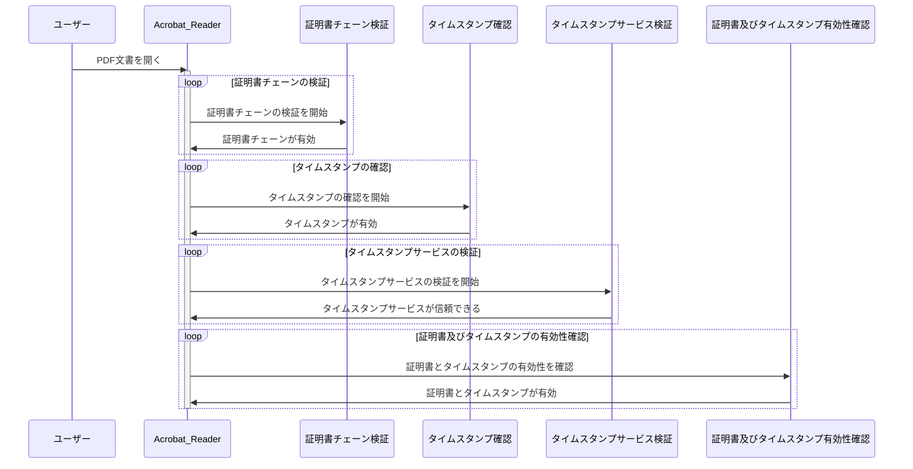
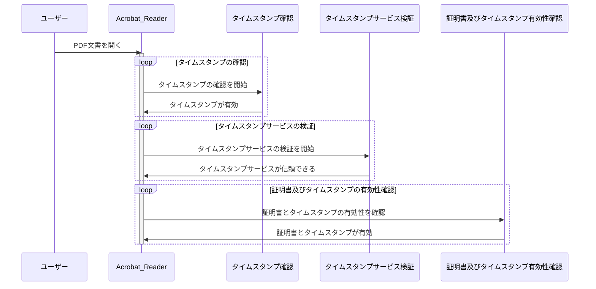

# PDF にタイムスタンプを施す

## 

## 検証プロセス

### 認証プロセスに必要な証明書の条件

- デジタル署名の証明書チェーン（ルート証明書や中間証明書等の連鎖）は、ローカルの証明書ストアや、オンラインの証明書リポジトリに載っているものが必要です。
- タイムスタンプのTSAの署名についての証明書チェーンは、PDFビューアが持っている[信頼できるTSAのリスト](https://helpx.adobe.com/jp/acrobat/using/trusted-identities.html#:~:text=Acrobat%20と%20Reader%20は,Adobe%20がホストする%20Web%20ページにアクセスし、30%20日ごとに信頼済みのルート証明書の一覧をダウンロードします%E3%80%82)に載っているTSAを利用する必要がある。

### Adobe Acrobat Reader でのタイムスタンプ検証
Adobe Acrobat Readerは、不可視署名フィールドに施した、デジタル署名にタイムスタンプを施した状態での検証を行う際に、以下のような一般的なロジックを使用しています。

1. **証明書チェーンの検証**: 最初に、署名されたPDF文書内のデジタル署名に使用された証明書チェーンを検証します。これには、ルート証明書から始まり、証明書チェーンを構成する中間証明書などが含まれます。このプロセスにより、各証明書の有効性と信頼性が確認されます。

2. **タイムスタンプの確認**: 次に、不可視署名フィールドに施されたタイムスタンプを確認します。このタイムスタンプには、署名が行われた時間や日付が含まれています。Adobe Acrobat Readerは、このタイムスタンプが信頼できるタイムスタンプサービスによって署名されたものであることを確認します。

3. **タイムスタンプサービスの検証**: タイムスタンプが信頼できるサービスによって署名されていることを確認します。一般的に、Adobe Acrobat Readerは、信頼できるタイムスタンプ認証局（TSA）が使用されていることを確認します。これにより、署名が文書が作成された後に行われたことが証明されます。

4. **証明書とタイムスタンプの有効性**: 最終的に、署名に使用された証明書(1. のプロセス)とタイムスタンプ(2, 3 のプロセス)の両方が有効であることを確認します。これにより、PDF文書の完全性と信頼性が確保されます。

以上のプロセスを経て、Adobe Acrobat Readerはタイムスタンプの検証を行い、その結果を通知します。不可視署名フィールドにタイムスタンプを施した状態での検証が成功すると、文書の信頼性が確認されます。

### 証明書チェーンの検証:  ルート証明書や中間証明書はどこに存在するのか？

PDFビューアは、通常、証明書チェーンの検証に必要なルート証明書や中間証明書をいくつかの方法で取得します。具体的な方法は、PDFビューアの実装や設定によって異なりますが、一般的には以下のような手段があります。

この段階では、PDF文書に含まれるデジタル署名の証明書チェーンが検証されます。つまり、PDF文書に埋め込まれた不可視署名フィールドに施されたデジタル署名に使用された証明書が検証されます。これには、ルート証明書から中間証明書、そして最終的にPDF文書に含まれる署名に使用された証明書が含まれます。

1. **ローカルな証明書ストア**:
    - PDFビューアは、OSによって提供されるローカルな証明書ストアから証明書を取得します。多くの場合、OSは信頼されたルート証明書を提供し、PDFビューアはそれを使用して証明書チェーンを検証します。

2. **オンラインの証明書リポジトリ**:
    - 一部のPDFビューアは、オンラインの証明書リポジトリから証明書をダウンロードして使用します。これにより、PDFビューアは動的に証明書を取得し、最新の証明書情報を使用して証明書チェーンを検証できます。

3. **通信による取得**:
    - PDFビューアは、必要に応じて証明書をインターネット経由で取得することもあります。これは、OSやビューアがローカルな証明書ストアに必要な証明書を持っていない場合に行われることがあります。

4. **キャッシュ**:
    - 一部のPDFビューアは、過去に検証された証明書情報をキャッシュして再利用することがあります。これにより、同じ証明書が再度検証される場合に、証明書情報を再度取得する必要がなくなります。

PDFビューアがどの方法を使用して証明書を取得するかは、ビューアの設定や実装に依存します。一般的に、PDFビューアは複数の方法を組み合わせて使用し、証明書チェーンの検証を行います。

### タイムスタンプサービスの検証: Adobe Acrobat Readerはどのように信頼できるTSAによって署名されたものか確認するのか？

Adobe Acrobat Readerは、タイムスタンプの確認を行う際に、以下の手順を通じて信頼できるタイムスタンプサービス認証局（TSA）によって署名されたものかを確認します。

ここでは、不可視署名フィールドに施されたデジタル署名に含まれるタイムスタンプが検証されます。具体的には、タイムスタンプが信頼できるタイムスタンプサービス（TSA）によって署名されているかどうかが検証されます。これには、TSAの証明書チェーンの検証が含まれ、最終的にはタイムスタンプの有効性が確認されます。

1. **信頼されたタイムスタンプサービスのリスト**:
    - Acrobat Readerは、信頼されたタイムスタンプサービスのリストを持っています。このリストには、信頼できるTSAのリストが含まれています。

2. **タイムスタンプの取得**:
    - PDF文書に含まれるタイムスタンプ情報を取得します。

3. **TSAの証明書チェーン検証**:
    - 取得したタイムスタンプに含まれるTSAの証明書チェーンを検証します。これには、TSAの証明書が信頼されたルート証明書によって署名されているかどうかの確認が含まれます。

4. **TSAの証明書の有効性チェック**:
    - 検証された証明書チェーンを使用して、TSAの証明書の有効性をチェックします。証明書が有効期限内であり、信頼されたルート証明書によって署名されていることを確認します。

5. **タイムスタンプの正当性確認**:
    - 最終的に、信頼されたTSAによって署名されたタイムスタンプであることを確認します。これにより、PDF文書の署名が正当であることが証明されます。

Acrobat Readerは、これらの手順を通じて、PDF文書に含まれるタイムスタンプが信頼できるものであるかどうかを確認します。このようにして、文書が作成された時間や日付が信頼できるものであることを確保します。

### 不可視署名フィールドにタイムスタンプのみを施した時の Adobe Acrobat Readerが 行う検証ロジック

しくみs・サインハンコでは、現行以下のようにデジタル署名及びタイムスタンプを行います。

- サイン、チェック、押印
  - 可視署名フィールドに デジタル署名
- 承認
  - 不可視署名フィールドに デジタル署名
  - 不可視署名フィールドに タイムスタンプ

ですので、先にあげた検証ロジックは、 **不可視署名フィールドにデジタル署名を行い、その署名にタイムスタンプを施した** パターンでしたので、以下に **不可視署名フィールドにタイムスタンプのみを施した時の Adobe Acrobat Readerが 行う検証ロジック** を掲載します。

（いずれにせよ、独立してデジタル署名を行なっているので、上記の検証ロジックと同じようにデジタル署名の証明書検証とかは行いますが、以下はタイムスタンプのみを対象にした場合をあらためて提示します。）

ここでの **タイムスタンプサービスの検証** の詳細は、先の **3. タイムスタンプサービスの検証: Adobe Acrobat Readerはどのように信頼できるTSAによって署名されたものか確認するのか？** と同じです。

