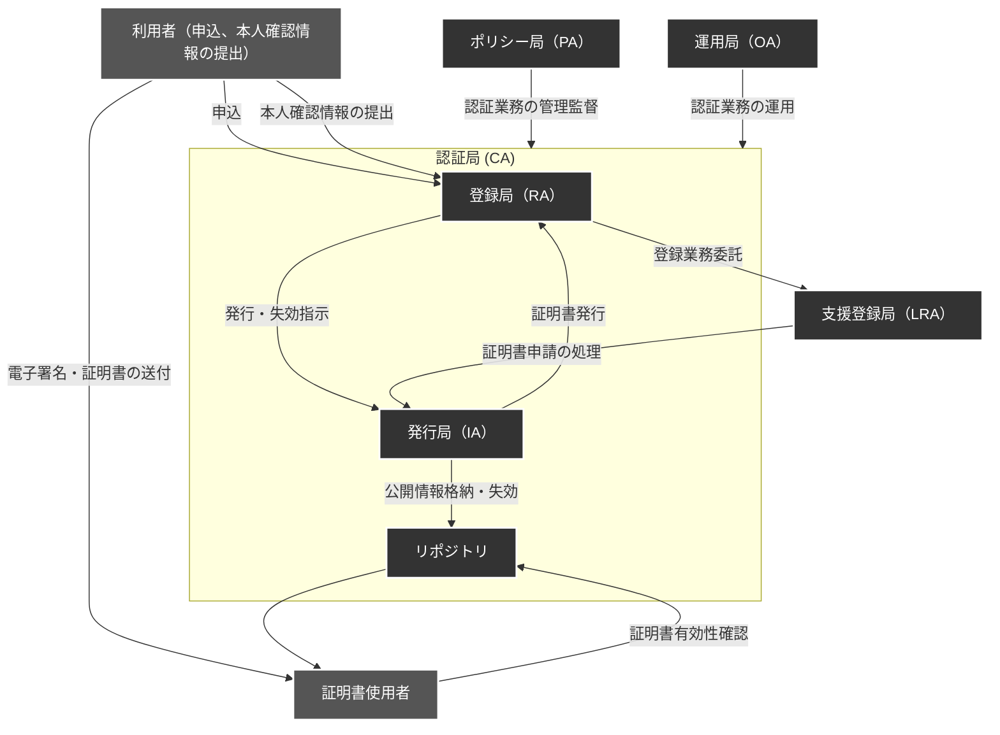
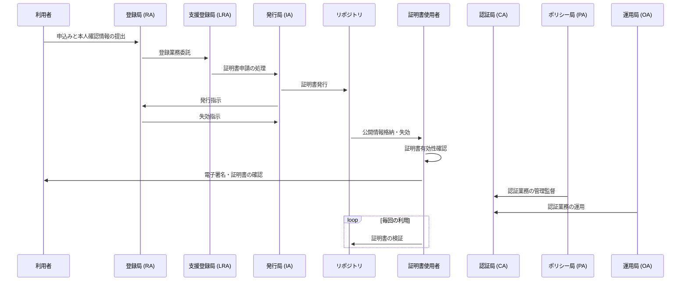

# 認証局(Certificate Authority:CA)
PKIの仕組みでは、信頼できる第三者機関(Trusted Third Party:TTP)が、公開鍵の正当性を保証します。この第三者機関を 認証局（Certificate Authority, CA）と呼びます。

## 認証局の役割
認証局は、電子証明書を発行しその電子証明書によって公開鍵の真正性を保証します。

[電子証明書](PublicKeyCertificate.md)には、公開鍵の他に証明書の発行者（CA自体）、有効期限、証明書の所有者の情報などが含まれており、これらの情報を基にデジタルデータの安全な交換が可能になります。

## 認証局の仕事

また認証局は、証明書の管理も行います。  
認証局は次ようなことを行います。

- 鍵ペアを作成する（利用者自身が作成する場合もある）
- 公開鍵の登録の際に、本人を認証する
- 証明書の作成
- 証明書を破棄する

認証局の仕事のうち、`公開鍵の登録と本人の認証登録局`を行う、`登録局(RA: registration authority)`という機関に分担させる場合もあります。

### 鍵ペアの作成

利用者の鍵ペアの作成は、以下の２通りあります。

- PKI の利用者が行う
- 認証局が行なう

認証局が行う場合は、鍵ペアを作成したのち、その私有鍵を利用者に送ります。  
これには [RFC7292](https://datatracker.ietf.org/doc/html/rfc7292)という規格で行い[PKCS#12](./PKCS.md#pkcs12)というファイルフォーマットを利用します。

### 証明書の登録

利用者が鍵ペアを作った場合、利用者は認証局に証明書の作成依頼を行います。  
この時、[RFC2986](https://datatracker.ietf.org/doc/html/rfc2986) という規格で行います。[RFC 2986](https://datatracker.ietf.org/doc/html/rfc2986) では、[PKCS#10](./PKCS.md#pkcs10) として知られる証明書リクエストの構文仕様が定義されています。

### 証明書の破棄と CRL

利用者が以下の理由などで証明書を無効にしたい場合、認証局は証明書を破棄して無効にする必要があります。

- 利用者が私有鍵を紛失した
- 利用者の私有鍵が漏洩した
- （退職等で）利用者の私有鍵の利用権限がなくなった

証明書のコピーが利用者の手元に残っている場合があり、デジタルデータの証明書は、リポジトリから削除しただけでは破棄したことになはならないので、このような仕組みを取ります。

証明書を破棄する場合は、RFC 5280 に定められた、証明書破棄リスト(CRL: certificate revocation list)を作成します。CRL は破棄された証明書のシリアル番号の一覧で、そのシリアル番号は、証明書の中に記載されているものです。

利用者は最新の CRL を確認して、証明書が有効かどうかを確認する必要があります。

### 認証局(CA)の公開鍵証明書は誰が保証する？

利用者の公開鍵証明書は、認証局のデジタル署名を施して作成します。
この認証局の公開鍵証明書は他の認証局が発行し保証します。

#### ルート CA

ルート CA（Certificate Authority）は、PKI（Public Key Infrastructure）における最上位の認証局です。ルート CA は、信頼される中心的な認証局であり、他のすべての証明書発行者や CA がその信頼性を基準としています。主な特徴は次の通りです。

1. **信頼性と信頼鎖の基盤**: ルート CA は信頼性が非常に高い認証局であり、その証明書は通常、ブラウザやオペレーティングシステムなどの信頼されたルートストアに含まれています。他の CA は、そのルート CA の証明書を信頼して、それに基づいて自身の証明書を発行します。これにより、証明書の信頼鎖（chain of trust）が確立されます。

2. **証明書発行の責任**: ルート CA は自己署名証明書を持ち、自己署名証明書を使用して自身を証明することができます。そのため、ルート CA は自身の信頼性に関して外部機関に依存する必要がありません。また、ルート CA は証明書を直接発行することもありますが、通常は中間 CA に証明書発行を委任します。

3. **セキュリティと物理的保護**: ルート CA の私有鍵は非常に重要であり、適切に保護する必要があります。通常、ルート CA の私有鍵はハードウェアセキュリティモジュール（HSM）などの厳格な物理的および論理的な保護手段で保管されます。これにより、私有鍵が不正にアクセスされたり盗まれたりするリスクが最小限に抑えられます。

4. **更新と信頼性の維持**: ルート CA の証明書の有効期限が切れると、その信頼性は失われます。そのため、ルート CA は定期的に自己署名証明書を更新し、その証明書の信頼性を維持します。証明書の更新時には、新しい証明書が適切にディストリビューションされる必要があります。

ルート CA は PKI の中心的な要素であり、その信頼性とセキュリティはインターネット上での通信や電子取引の安全性に大きく影響します。

## リポジトリ(Repository)

リポジトリは、証明証と CRL を保村しておき、PKI の利用者が証明書を入手できるようにしたデーターベースのことです。証明書ディレクトリと呼ばれることもあります。

## 構成

公開鍵認証基盤（PKI）での認証局（CA）利用にはのさまざまな要素とその関連プロセスがあります。

### 図の説明

- **利用者（Applicant）**:
  - 申込みと本人確認情報の提出を行います。
  - 電子署名や証明書の送付も行うことを示しています。

- **証明書使用者（User）**:
  - 証明書の有効性を確認し、公開情報をリポジトリから受け取ります。

- **認証局（CA）内のエンティティ**:
  - **登録局（RA）**:
    - 利用者からの申込みと本人確認情報を受け取り、証明書の発行や失効の指示を発行局（IA）に送ります。
    - 支援登録局（LRA）に登録業務を委託します。
  - **発行局（IA）**:
    - 証明書の発行を担当し、公開情報の格納と失効をリポジトリで管理します。
  - **リポジトリ**:
    - 公開情報と失効情報を管理し、証明書使用者に提供します。

- **支援登録局（LRA）**:
  - 地域や組織固有の登録業務を担当し、証明書申請の処理を発行局（IA）に提供します。

- **ポリシー局（PA）** と **運用局（OA）**:
  - PAは認証業務の管理監督を行い、OAは認証業務の日常運用を担当します。両者は認証局（CA）に対してそれぞれの業務を行います。

##

