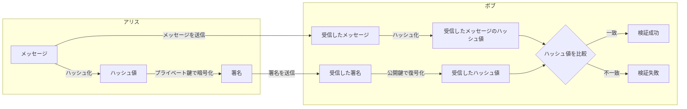
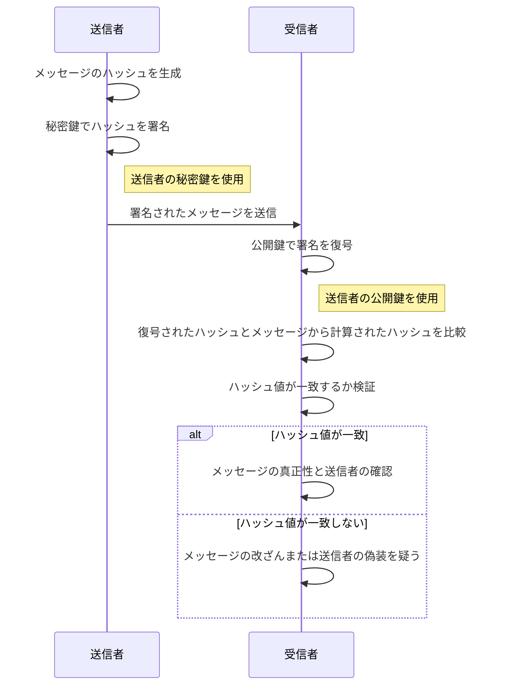

# デジタル署名

デジタル署名を使うことで、改ざんやなりすましを検出し、否認を防止することができます。  
そして、デジタル署名をすることで、このメッセージを書いたのは誰か？を保証します。

## デジタル署名とは

デジタル署名は、電子データや文書の信頼性と完全性を確保するための技術です。主な目的は、以下の点を実現することです：

1. **認証（Authentication）**: 送信者が本人であることを確認します。
2. **完全性の保証（Integrity）**: データや文書が変更されていないことを確認します。
3. **非改ざん性/否認防止 （Non-repudiation）**: 送信者がメッセージを否認できないようにします。

デジタル署名は、公開鍵暗号学の技術を使用しています。具体的には、送信者が秘密鍵で文書を署名し、受信者は送信者の公開鍵を使用して署名を検証します。このプロセスにより、文書の改ざんや送信者のなりすましを防ぐことができます。

デジタル署名は、電子メール、電子契約、オンライン取引、電子文書管理などのさまざまな分野で広く利用されています。法的効力を持つ場合もありますが、その確実性は国や地域によって異なりますので、重要な取引や文書においては、地域の法律や規制に準拠することが重要です。

## デジタル署名が保証するもの

デジタル署名を行うことで、以下のようにその文書やデータを「誰が」作ったのかと、「何を」つまりデジタル署名を行った文書やデータを保証するもの

### 「誰が」を保証する

デジタル署名を行った署名する個人または組織（送信者）であること間違い無いことを証明します。

### 「何を」を保証する

デジタル署名を施した、対象の文書及びデータが改竄されていないことを証明します。

## デジタル署名のプロセス

この例ではアリス署名をし、ボブがその署名を検証します。



### シーケンス図



1. **送信者**は　**「自分の秘密鍵を使用してメッセージのハッシュ（要約）を暗号化」** し、これがデジタル署名となります。
2. 送信者はメッセージと共にこの署名を受信者に送ります。
3. **受信者**はメッセージと共に送信者から受け取ったデジタル署名を、**送信者の公開鍵を使用して復号**します。これにより、署名として暗号化されたハッシュ値が得られます。
4. 受信者は**メッセージからハッシュ値を再計算**し、復号されたハッシュ値と比較します。
5. 両者のハッシュ値が一致する場合、メッセージが**改ざんされていないことが確認**されます。
6. また、ハッシュ値が一致することによって、送信者が自身の秘密鍵で署名したことが**証明されるため、送信者の身元が確認**されます。

## 署名の作成と署名の検証

プライベート鍵でメッセージを暗号化するすることが署名の作成です。
その暗号文を公開鍵で復号することが証明の検証に値します。

ただし、この暗号化の対象となるメッセージとは、対象の文書そのものではなく、そのメッセージダイジェスト（ハッシュ値）のことを指します。

- `署名用の鍵`:
  - 署名をする人のみ持つ
- `検証用の鍵`:
  - 署名を検証する人なら誰でも持つことができる

## デジタル署名で解決できない問題

- 利用する公開鍵が、`本物の公開鍵であるか？`
  - 公開鍵を`なりすまし`されていないか？
  - `公開鍵の第三者による証明が必要`

この問題を解決する手段の一つとして、公開鍵基盤（PKI: Public Key Infrastructure）の利用が最も一般的な手法です。

## デジタル署名の具体例

デジタル署名のプロセスには、メッセージの署名とその署名の検証の二つの主要なステップが含まれます。ここでは OpenSSL を使用して、これらのステップを実行する具体的なコマンドを説明します。

### 1. 秘密鍵での署名生成

まず、秘密鍵を使用してメッセージ（またはファイル）のデジタル署名を生成します。この例では、RSA 鍵ペアがすでに生成されていると仮定します。

- **秘密鍵で署名を生成**:

  ```bash
  openssl dgst -sha256 -sign private_key.pem -out signature.bin message.txt
  ```

  このコマンドは、`message.txt` の内容を SHA-256 でハッシュ化し、そのハッシュを`private_key.pem`で署名して、結果を`signature.bin`に保存します。

### 2. 公開鍵での署名検証

次に、公開鍵を使用して署名が正しいかどうかを検証します。これにより、メッセージが署名者によって送信され、途中で改ざんされていないことを確認できます。

- **公開鍵で署名を検証**:

  ```bash
  openssl dgst -sha256 -verify public_key.pem -signature signature.bin message.txt
  ```

  このコマンドは、`message.txt` のハッシュを再計算し、`signature.bin`に含まれる署名がこのハッシュに対して`public_key.pem`により正しく生成されたものかを検証します。検証が成功すれば、「Verified OK」というメッセージが表示されます。

### 注意点

- デジタル署名では、メッセージの完全性と署名者の認証が保証されますが、秘密鍵の安全性が非常に重要です。秘密鍵が漏洩すると、署名の信頼性が失われます。
- `openssl dgst` コマンドは多くのハッシュアルゴリズムに対応しており、SHA-256 の他にも SHA-512 などが使用できます。

以上のコマンドを使用することで、OpenSSL を利用した効率的かつ安全なデジタル署名プロセスを実行することができます。

## デジタル署名の用途

- セキュリティ情報のアナウンス
- ソフトウェアのダウンロード
- 公開鍵の証明書
- SSL/TLS
