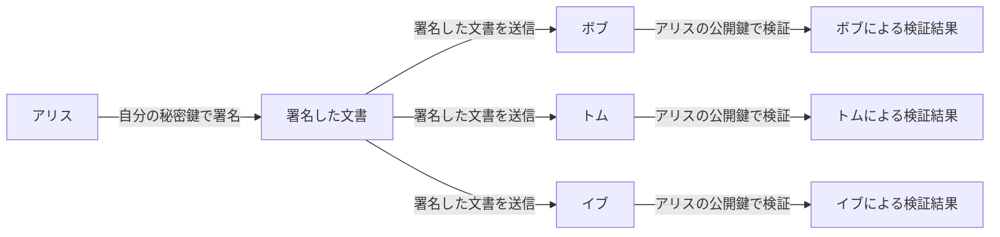
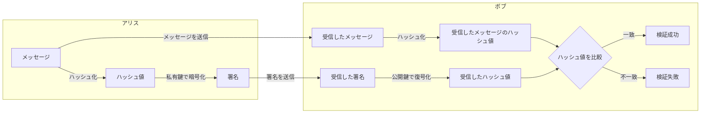
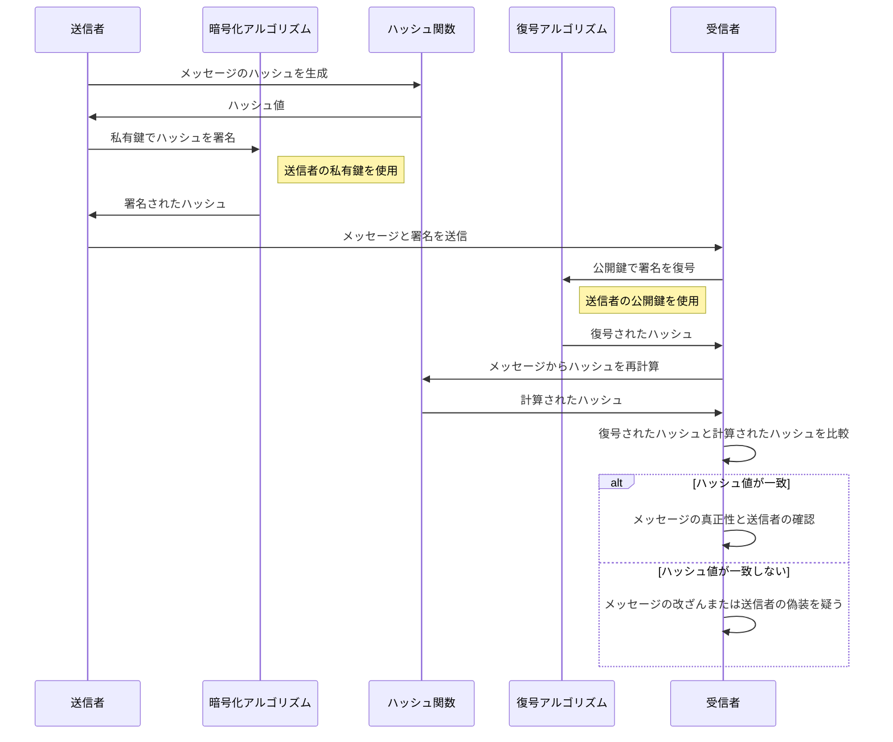

# デジタル署名
デジタル署名は、文書やメッセージが改ざんされていないことを確認し、送信者が本人であることを証明するために使用されます。  
また、デジタル署名をすることで、このメッセージを書いたのは誰か？を保証します。

## デジタル署名の目的
デジタル署名は、電子データや文書の信頼性と完全性を確保するための技術です。  
**メッセージの真正性と送信者の身元を証明すること**を目的としています。

この目的を実現するため、以下の3つが条件となります。

1. **認証（Authentication）**:  
送信者が本人であることを確認できること。
2. **完全性の保証（Integrity）**:  
データや文書が変更されていないこと。
3. **非改ざん性/否認防止 （Non-repudiation）**:  
送信者がメッセージを否認できないこと。

## デジタル署名が保証するもの
デジタル署名を行うことで、以下のようにその文書やデータを「誰が」作ったのかと、「何を」つまりデジタル署名を行った文書やデータを保証します。

### 「誰が」を保証する
デジタル署名を行った署名する個人または組織（送信者）であること間違い無いことを証明します。

### 「何を」を保証する
デジタル署名を施した、対象の文書及びデータが改竄されていないことを証明します。

## デジタル署名における鍵の役割
デジタル署名の利用では、公開鍵暗号の暗号化の手法とは逆に、自分の私有鍵でメッセージダイジェスト（ハッシュ値）を暗号化することで、公開鍵を持っている誰もが解読することが可能にします。

|鍵の種類|所有者|役割|目的|利用方法|
|---|---|---|---|---|
|秘密鍵|署名する本人|署名生成|デジタル署名を通じてデータの完整性と認証を提供|データのメッセージダイジェスト（ハッシュ値）に対して秘密鍵を使用して暗号化し署名を生成し、この署名を公開鍵を持つ人なら誰でも検証できるようにします。これにより、データが送信者によって署名され、その後改ざんされていないことが証明されます。|
|公開鍵|公開鍵を知っている誰でも|署名を検証|データの完整性と送信者の認証を確認|デジタル署名を公開鍵を使って復号し得られたデータのメッセージダイジェスト（ハッシュ値）と、同じハッシュ関数を用いて取得したデータのメッセージダイジェスト（ハッシュ値）算出し、署名内のハッシュ値と算出したハッシュ値とを比較して検証します。これにより、データが改ざんされずに送信されたことと、正当な送信者から来たことが確認されます|

デジタル署名の利用では、自分の私有鍵を使用してメッセージのハッシュ（要約）を暗号化し、公開鍵を持っている誰もが解読することが可能です。 ただし暗号化は本人は私有鍵を持っている本人しかできません。

### 署名と検証フローでの鍵の扱い



> [!NOTE] ここでのポイントは
> - 署名を行えるのは、私有鍵を持っている送信者のみです。
> - 署名を検証できるのは、送信者の公開鍵を持っているどの誰もが署名の検証を行えます。
## デジタル署名で解決できない問題

- 利用する公開鍵が、`本物の公開鍵であるか？`
  - 公開鍵を`なりすまし`されていないか？
  - `公開鍵の第三者による証明が必要`

この問題を解決する手段の一つとして、[公開鍵認証基盤(PKI)](PublicKeyCryptographyInfrastructure.md)の利用が最も一般的な手法です。

## デジタル署名と検証プロセス
デジタル署名は、公開鍵暗号学の技術を使用しています。  
- 送信者が私有鍵で文書を署名
- 受信者は送信者の公開鍵を使用して署名を検証

このプロセスにより、文書の改ざんや送信者のなりすましを防ぐことができます。

### フロー図
次の例ではアリス署名をし、ボブがその署名を検証します。



### シーケンス図


### プロセス全体の説明

1. ハッシュ生成:  
**送信者（アリス）** は、送信するメッセージからハッシュ値を生成するために **ハッシュ関数** を使用します。このハッシュ値は、メッセージの一意的なデジタル指紋として機能し、メッセージの完整性を保証するのに役立ちます。
2. デジタル署名の生成:  
アリスは次に、生成したハッシュ値を自分の **私有鍵** を使用して暗号化するために **暗号化アルゴリズム** を使用します。このプロセスによってデジタル署名が作成され、これがメッセージの認証と非否認防止の役割を果たします。
3. メッセージと署名の送信:  
アリスは署名されたハッシュと元のメッセージを一緒に **受信者（ボブ）** に送信します。この送信プロセスは、メッセージと署名の両方が改ざんから守られるようにセキュアなチャネルを通じて行われることが理想的です。
4. デジタル署名の復号:  
ボブは受け取ったデジタル署名をアリスの **公開鍵** を使用して復号するために **復号アルゴリズム** を使用します。復号化された結果として、元のハッシュ値が明らかになります。
5. ハッシュ値の比較:  
ボブは自身で受け取ったメッセージから **ハッシュ関数** を再度使用してハッシュ値を計算し、この新たに計算したハッシュ値と復号されたハッシュ値を比較します。
6. メッセージの検証:  
   - ハッシュ値が一致する場合、メッセージが改ざんされていないことが確認され、アリスが真の送信者であることが証明されます。これにより、メッセージの真正性とアリスの認証が確立されます。
   - ハッシュ値が一致しない場合は、メッセージが改ざんされたか、送信者が偽装されている可能性があります。この場合、ボブは警戒し、適切な対応を取る必要があります。

## デジタル署名の実践例
デジタル署名のプロセスには、メッセージの署名とその署名の検証の二つの主要なステップが含まれます。  
以下のコマンドを使用することで、OpenSSL を利用した効率的かつ安全なデジタル署名プロセスを実行することができます。

### 1. 私有鍵での署名生成
まず、私有鍵を使用してメッセージ（またはファイル）のデジタル署名を生成します。この例では、RSA 鍵ペアがすでに生成されていると仮定します。

```bash
openssl dgst -sha256 -sign private_key.pem -out signature.bin message.txt
```

このコマンドは、`message.txt` の内容を SHA-256 でハッシュ化し、そのハッシュを`private_key.pem`で署名して、結果を`signature.bin`に保存します。

### 2. 公開鍵での署名検証
次に、公開鍵を使用して署名が正しいかどうかを検証します。これにより、メッセージが署名者によって送信され、途中で改ざんされていないことを確認できます。

```bash
openssl dgst -sha256 -verify public_key.pem -signature signature.bin message.txt
```

このコマンドは、`message.txt` のハッシュを再計算し、`signature.bin`に含まれる署名がこのハッシュに対して`public_key.pem`により正しく生成されたものかを検証します。検証が成功すれば、「Verified OK」というメッセージが表示されます。


> [!CAUTION] 注意点
> - デジタル署名では、メッセージの完全性と署名者の認証が保証されますが、私有鍵の安全性が非常に重要です。  
> 私有鍵が漏洩すると署名の信頼性が失われます。
> - `openssl dgst` コマンドは多くのハッシュアルゴリズムに対応しており、SHA-256 の他にも SHA-512 などが使用できます。


## デジタル署名の用途
デジタル署名は、電子メール、電子契約、オンライン取引、電子文書管理などのさまざまな分野で広く利用されています。法的効力を持つ場合もありますが、その確実性は国や地域によって異なりますので、重要な取引や文書においては、地域の法律や規制に準拠することが重要です。

- セキュリティ情報のアナウンス
- ソフトウェアのダウンロード
- 公開鍵の証明書
- SSL/TLS

## デジタル署名を証跡とすると有効な行為

デジタル署名は、行為の真正性、完全性、および発行者の不可否認性を保証するための技術であり、特定の行為に対する証跡として非常に効果的です。以下の行為はデジタル署名による証跡として記録することに特に適しています。

|行為|説明|
|---|---|
| 契約の締結 |デジタル署名を用いて契約の合法性と有効性を保証し、契約当事者がその内容に同意し、その契約が改ざんされていないことを確認できます。|
| 法的誓約の履行 |法的な誓約や宣誓の際にデジタル署名を使用することで、履行者がその内容に確実に同意したことを証明し、後からの否認を防ぐことができます。|
| 同意の確認 |プライバシーポリシーへの同意や重要な手続きに関する同意など、デジタル署名を用いることで、同意が確実に行われたことと、その内容が改ざんされていないことが保証されます。|
| 法的文書の発行 |裁判所の決定や法的通知など、公式性が要求される法的決定をデジタル署名で保証し、その真正性と信頼性を維持します。|
| 知的財産の保護 |著作権や特許申請のプロセスでデジタル署名を用いることで、提出内容の確実性を保証し、不正コピーと改ざんから保護します。|
| 医療情報の管理 |電子医療記録の作成や更新時にデジタル署名を施すことで、患者のプライバシーを保護し、情報の完全性を維持します。|
| 政府への申請の提出 |税金申告やビザ申請など、政府への申請においてデジタル署名を使用することで、提出者の身元と申告内容の正確性が保証されます。|
| 教育証明の認証 |成績証明書や卒業証書の発行にデジタル署名を使用することで、発行された証明の真正性と発行元の確認が可能になります。|

これらの行為は、その性質上、真正性、不可否認性、および完全性が非常に重要であり、デジタル署名はこれらの要件を満たすための効果的な手段です。デジタル署名を適用することで、これらの行為が正当であり、法的な紛争や不正使用を防ぐための堅固な基盤が提供されます。

## デジタル署名が有効期限以降は検証できなくなるのか？

一応、以下MTG時に疑問が上がってい他ので、回答を記載します。

過去に署名された PDF ファイルのデジタル署名について、その有効期限が過ぎた後も検証可能かどうかは、PDF がどのように署名されているかによるそうです。


### タイムスタンプが施されていれば、署名自体が署名時に有効であった場合は検証は可能

一般的に、デジタル署名に使用される証明書の有効期限が切れても、署名自体が署名時に有効であった場合（証明書が有効で、適切な認証局によって発行されていた場合）、署名の検証は引き続き可能です。

この時、タイムスタンプ自体の有効期限が切れていても、署名された時点で有効であった記録（タイムスタンプが証明する証明書の有効性）が保持されていれば、文書の署名は依然として有効と見なされることが一般的です。


### PAdES 形式で署名すれば、署名に検証情報を付与するので検証が可能

PAdES では、署名に関連するすべての検証データ（証明書、失効情報、タイムスタンプなど）を文書に含めることができ、これにより長期間にわたって署名を検証することが可能です。

[長期署名についてはこちらを参照](LongTermSignature.md)

