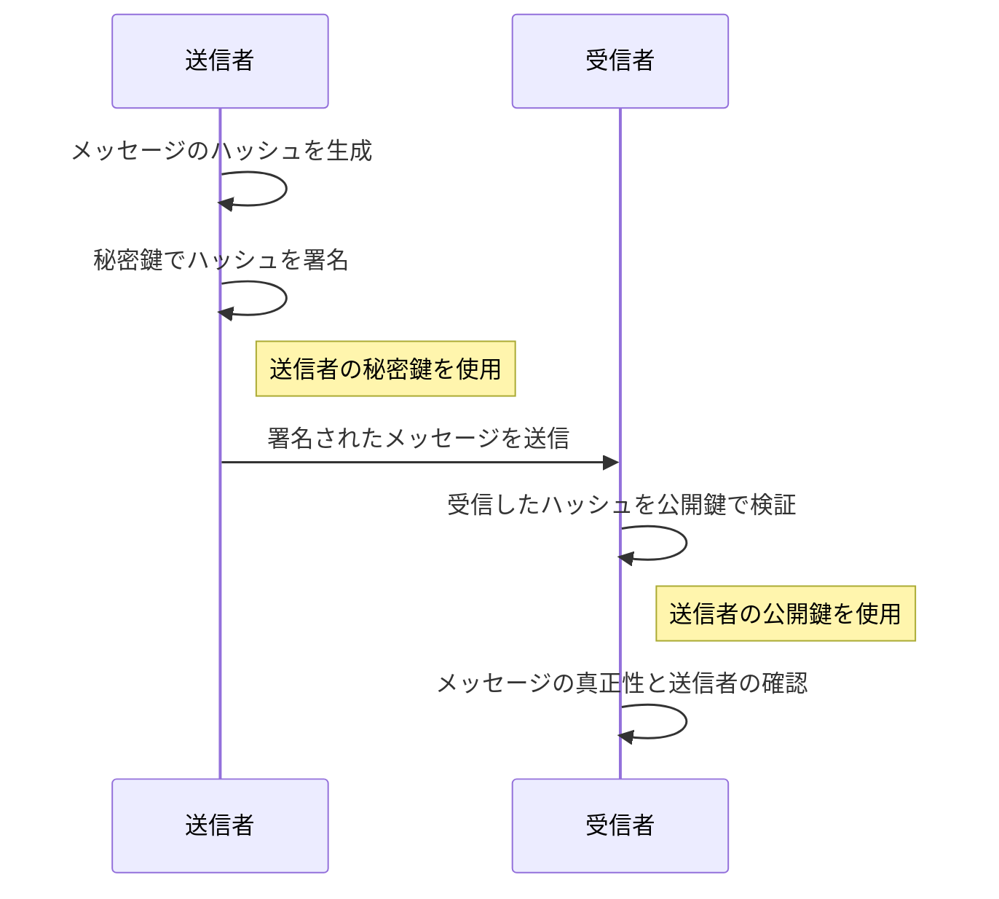
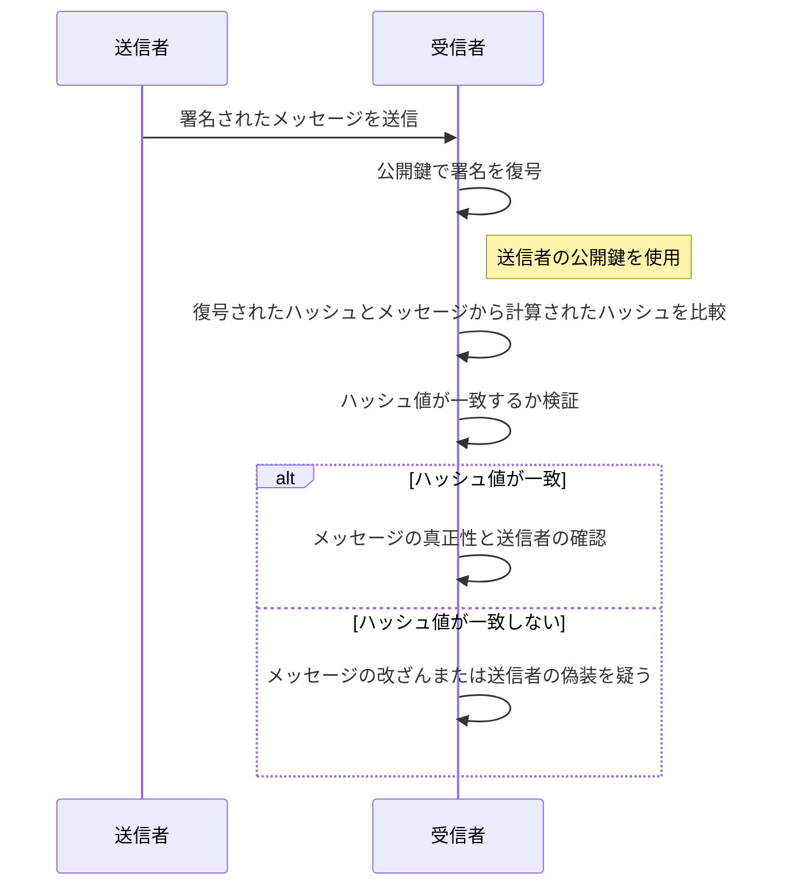

# デジタル署名

デジタル署名を使うことで、改ざんやなりすましを検出し、否認を防止することができます。  
そして、デジタル署名をすることで、このメッセージを書いたのは誰か？を保証します。

## デジタル署名とは

デジタル署名は、電子データや文書の信頼性と完全性を確保するための技術です。主な目的は、以下の点を実現することです：

1. **認証（Authentication）**: 送信者が本人であることを確認します。
2. **完全性の保証（Integrity）**: データや文書が変更されていないことを確認します。
3. **非改ざん性/否認防止 （Non-repudiation）**: 送信者がメッセージを否認できないようにします。

デジタル署名は、公開鍵暗号学の技術を使用しています。具体的には、送信者が秘密鍵で文書を署名し、受信者は送信者の公開鍵を使用して署名を検証します。このプロセスにより、文書の改ざんや送信者のなりすましを防ぐことができます。

デジタル署名は、電子メール、電子契約、オンライン取引、電子文書管理などのさまざまな分野で広く利用されています。法的効力を持つ場合もありますが、その確実性は国や地域によって異なりますので、重要な取引や文書においては、地域の法律や規制に準拠することが重要です。

## デジタル署名が保証するもの

デジタル署名を行うことで、以下のようにその文書やデータを「誰が」作ったのかと、「何を」つまりデジタル署名を行った文書やデータを保証するもの

### 「誰が」を保証する

デジタル署名を行った署名する個人または組織（送信者）であること間違い無いことを証明します。

### 「何を」を保証する

デジタル署名を施した、対象の文書及びデータが改竄されていないことを証明します。

## デジタル署名のプロセス

### 署名のプロセス

1. **送信者**は　**「自分の秘密鍵を使用してメッセージのハッシュ（要約）を暗号化」** し、これがデジタル署名となります。
2. 送信者はメッセージと共にこの署名を受信者に送ります。
3. **受信者**は送信者の公開鍵を使用して署名を復号し、得られたハッシュ値をメッセージから計算したハッシュ値と比較します。
4. 両者のハッシュ値が一致すれば、メッセージが改ざんされていないことが確認でき、また送信者が自身の秘密鍵を使用したことが証明されます。

このように公開鍵暗号方式は、暗号化によって情報の秘密保持を、デジタル署名によって情報の真正性と送信者の認証を行う重要なツールとなっています。

### 検証のプロセス

1. **受信者**はメッセージと共に送信者から受け取ったデジタル署名を、**送信者の公開鍵を使用して復号**します。これにより、署名として暗号化されたハッシュ値が得られます。
2. 受信者は**メッセージからハッシュ値を再計算**し、復号されたハッシュ値と比較します。
3. 両者のハッシュ値が一致する場合、メッセージが**改ざんされていないことが確認**されます。
4. また、ハッシュ値が一致することによって、送信者が自身の秘密鍵で署名したことが**証明されるため、送信者の身元が確認**されます。

このシーケンス図において、公開鍵を用いた署名の復号とハッシュ値の比較がメッセージの信頼性と送信者の確認を行う重要な手順として描かれています。

## 署名の作成と署名の検証

プライベート鍵でメッセージを暗号化するすることが署名の作成です。
その暗号文を公開鍵で復号することが証明の検証に値します。

ただし、この暗号化の対象となるメッセージとは、対象の文書そのものではなく、そのメッセージダイジェスト（ハッシュ値）のことを指します。

- `署名用の鍵`:
  - 署名をする人のみ持つ
- `検証用の鍵`:
  - 署名を検証する人なら誰でも持つことができる

## 公開鍵暗号とデジタル署名の鍵の使い方

|              | プライベート（秘密）鍵   | 公開鍵                         |
| ------------ | ------------------------ | ------------------------------ |
| 公開鍵暗号   | 受信者が複合化に使う     | 送信者たちが暗号化に使う       |
| デジタル署名 | 署名者が署名の作成に使う | 検証者たちが署名の検証に使う   |
| 鍵の書流者   | 個人が持つ               | 必要な人は誰でも持っていて良い |
