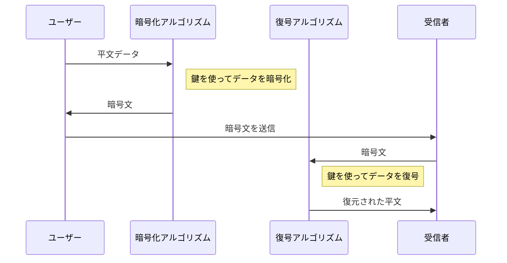
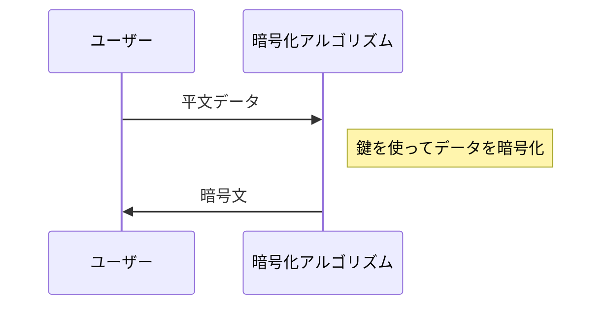
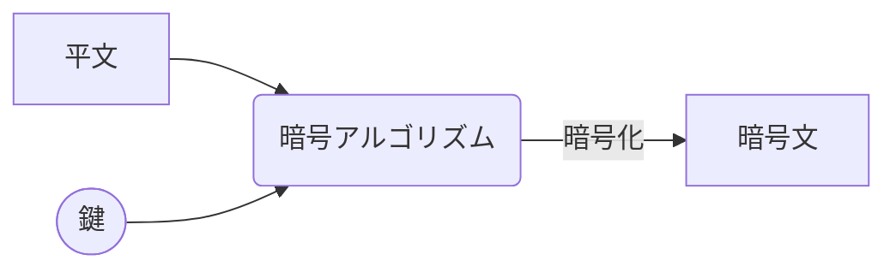
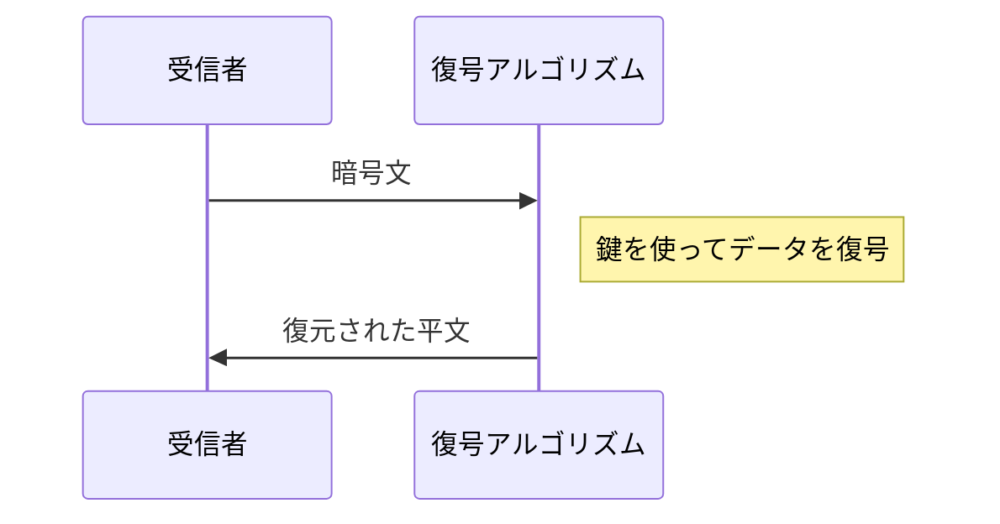
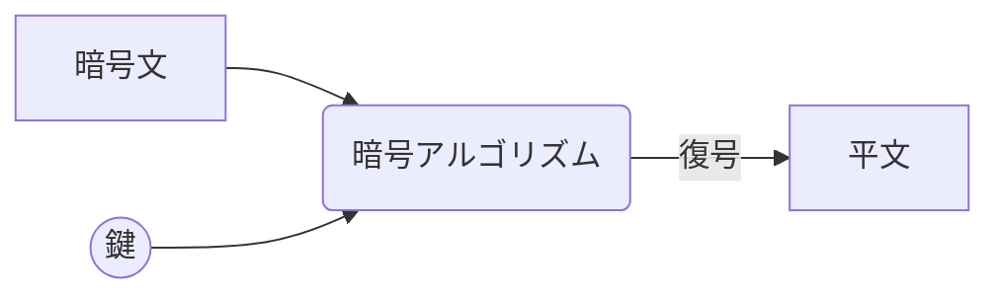

# 暗号（Encryption）と復号（Decryption）
デジタル署名やタイムスタンプの説明の前に、前提知識としてデジタル署名やタイムスタンプの生成・検証に利用される技術として、暗号（Encryption）と復号（Decryption）について記します。  

暗号と復号は、情報の変換についてのプロセスを意味します。  

暗号化（Encryption）と復号化（Decryption）は、データを安全に送受信するために使用される、情報の変換を行うことで情報の機密性を確保し、不正アクセスから情報を保護するために重要なプロセスです。

## 暗号化（Encryption）
暗号化は、平文（読み取り可能なデータ）を暗号文（読み取り不能なデータ）に変換するプロセスです。  
この変換には、一定の規則（アルゴリズム）と鍵（Key）が使用されます。  
鍵はこの変換プロセスにおいて非常に重要な役割を果たし、鍵がなければデータは安全に暗号化されません。  

### シーケンス図

### フロー図

### 暗号化の目的
**不正な第三者がデータを盗聴したとしても、内容を理解できないようにすること**を目的としています。

## 復号(化)（Decryption）
復号は暗号化の逆プロセスで、暗号文を平文に戻します。  
これも同様に特定のアルゴリズムと鍵を使用します。  
正しい鍵とアルゴリズムを使用した場合にのみ、元の平文を正確に復元することができます。  

### シーケンス図

### フロー図

### 復号化の目的
**正当な受信者のみが、受信した暗号化されたデータの内容を読むことができるようにすること**が目的です。

