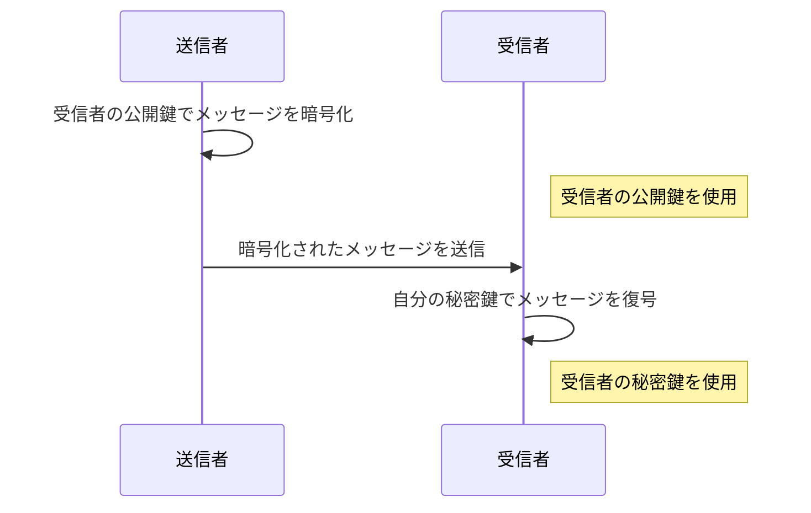
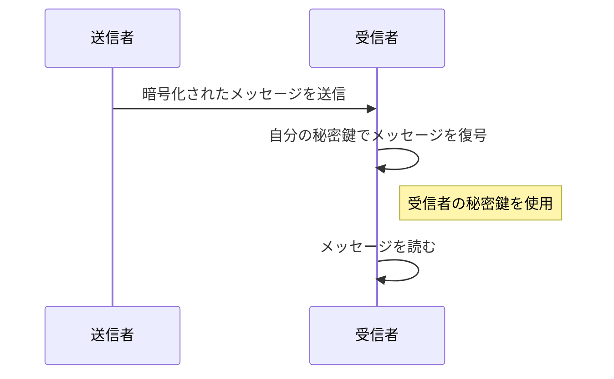
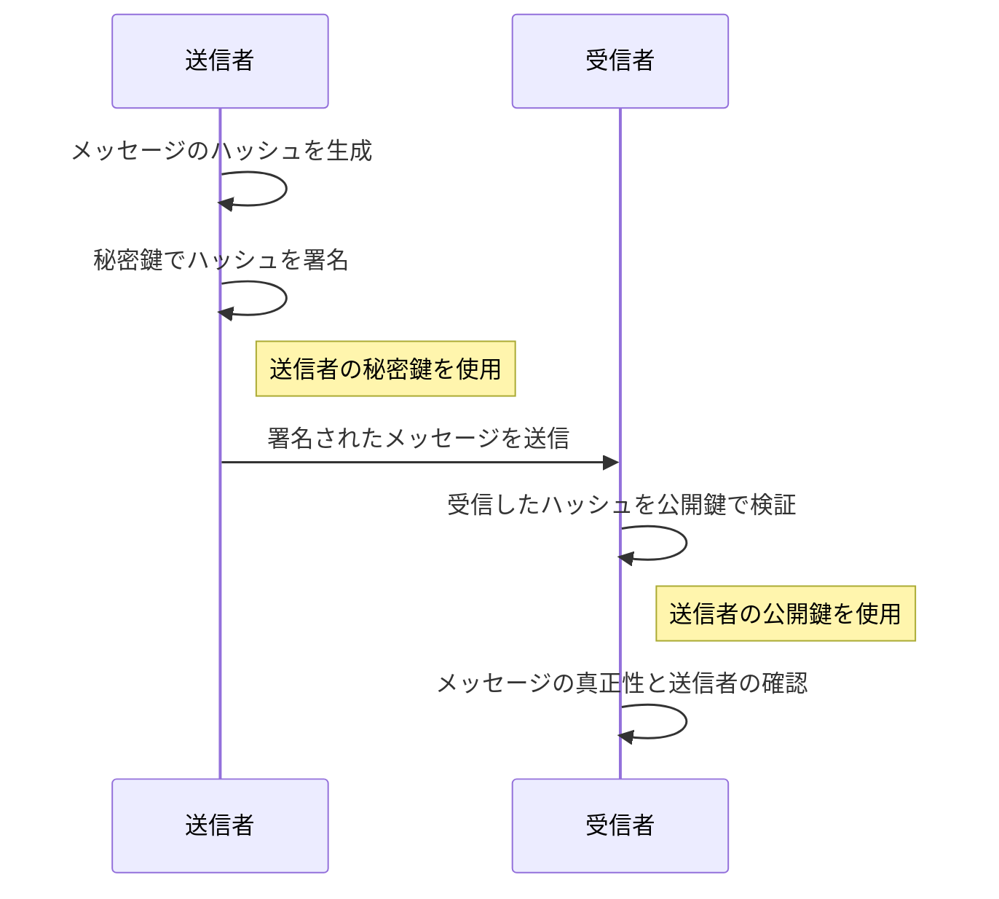
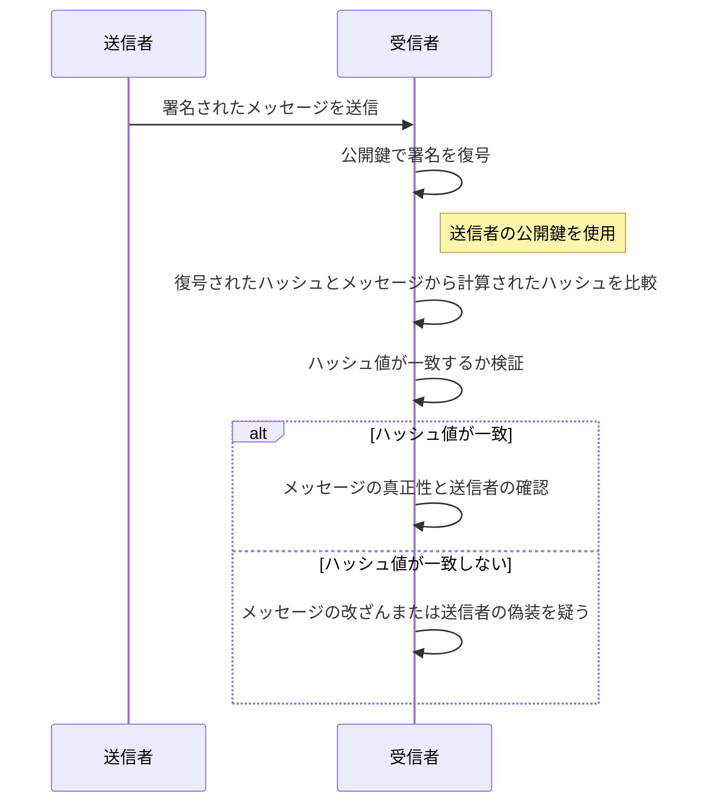

# 暗号化とデジタル署名

公開鍵暗号方式は、セキュリティが必要な通信で広く使用されている技術です。この方式では、主に「暗号化」と「デジタル署名」の 2 つの用途で利用されます。ここではそれぞれについて簡単に説明します。

## 暗号化

公開鍵暗号化では、各ユーザーは「公開鍵」と「秘密鍵」という二つの鍵を持ちます。公開鍵は他人と共有することができる鍵で、秘密鍵は個人が秘密に保持する鍵です。

### 暗号化の目的と主体

メッセージは安全に受信者に送信され、第三者による読取りが防がれます。

- 目的: メッセージを安全に送信し、第三者に読まれることを防ぐ。
- 主体: 任意の人が受信者の公開鍵を用いて暗号化を実行し、受信者のみが自身の秘密鍵でメッセージを解読できる。

#### 利用する鍵と主体が可能なこと

- 使用する鍵: 受信者の公開鍵で暗号化。
- 解読できる人: その秘密鍵を持っている受信者のみ。
- 実行できる人: 公開鍵を知っている誰でも。

### 暗号化のプロセス



1. **送信者**が、**「受信者の公開鍵を使用してメッセージを暗号化」** します。
2. この暗号化されたメッセージは、インターネットを介して**受信者**に送られます。
3. 受信者は自分の秘密鍵を使ってメッセージを復号します。

この方法で、公開鍵を持っているどの誰もがメッセージを暗号化して送ることができますが、そのメッセージを読むことができるのは秘密鍵を持っている受信者のみです。

### 複合化のプロセス

受信者が自分の秘密鍵を使って暗号化されたメッセージを復号し、元のメッセージを取り戻すプロセスを示しています。



このシーケンス図では、次のステップが含まれています:

1. 送信者が受信者に暗号化されたメッセージを送信します。
2. 受信者が自分の秘密鍵を使ってそのメッセージを復号します。
3. 受信者が復号されたメッセージを読みます。

ここでのポイントは、暗号化されたメッセージを送信してから、それを受信者がどのように安全に復号して読むかというプロセスです。

### 暗号化の具体例

OpenSSL を使用して公開鍵暗号方式でファイルやデータを暗号化・復号するプロセスは、公開鍵と秘密鍵のペアを使います。ここでは具体的なコマンド例を通じて、ファイルの暗号化と復号の手順を説明します。

#### 1. 鍵ペアの生成

まず、RSA 鍵ペア（公開鍵と秘密鍵）を生成します。以下のコマンドを使用して、2048 ビットの RSA 鍵を生成できます。

```bash
openssl genpkey -algorithm RSA -out private_key.pem -pkeyopt rsa_keygen_bits:2048
openssl rsa -pubout -in private_key.pem -out public_key.pem
```

このコマンドは、秘密鍵を`private_key.pem`に、対応する公開鍵を`public_key.pem`に保存します。

#### 2. 公開鍵を使用した暗号化

次に、公開鍵`public_key.pem`を使用してファイルを暗号化します。例えば`example.txt`というファイルを暗号化するには、次のコマンドを使用します。

```bash
openssl rsautl -encrypt -inkey public_key.pem -pubin -in example.txt -out encrypted.dat
```

このコマンドは`example.txt`の内容を暗号化し、その結果を`encrypted.dat`に保存します。

#### 3. 秘密鍵を使用した復号

最後に、秘密鍵`private_key.pem`を使用して暗号化されたファイル`encrypted.dat`を復号します。

```bash
openssl rsautl -decrypt -inkey private_key.pem -in encrypted.dat -out decrypted.txt
```

このコマンドは`encrypted.dat`を復号し、元の内容を`decrypted.txt`に保存します。

#### 注意点

- `openssl rsautl`コマンドは比較的小さいデータサイズの暗号化に適しています。例えば、2048 ビット（256 バイト）の RSA 鍵を使用する場合、通常、最大で 245 バイト程度のデータしか暗号化できません。ファイルサイズが大きい場合は、データを分割するか、または AES などの対称鍵暗号方式でファイルを暗号化し、その鍵を公開鍵で暗号化するハイブリッド方式を検討してください。
- この例ではシンプルな RSA 暗号を使用していますが、実際のセキュリティ要件に応じて適切な設定やオプションを選択することが重要です。

これらのコマンドを利用することで、OpenSSL を使った基本的な公開鍵暗号化と復号のプロセスを実行できます。

#### 大きなファイルの暗号化

`openssl rsautl` は小さなデータの暗号化に適していますが、大きなファイルを暗号化する必要がある場合は、ハイブリッド暗号化アプローチが一般的です。この方法では、RSA を使用して対称鍵暗号化の鍵（例えば、AES 鍵）を暗号化し、その対称鍵でファイル全体を暗号化します。

##### 例：ハイブリッド暗号化の使用

1. **対称鍵の生成とファイル暗号化**:

   ```bash
   openssl rand -base64 32 > aes_key.bin
   openssl enc -aes-256-cbc -in largefile.txt -out largefile.enc -pass file:aes_key.bin
   ```

2. **対称鍵の RSA 暗号化**:

   ```bash
   openssl rsautl -encrypt -inkey public_key.pem -pubin -in aes_key.bin -out encrypted_key.bin
   ```

3. 送信されるのは `largefile.enc` と `encrypted_key.bin` の 2 つのファイルです。受信者は RSA で暗号化された鍵を復号してから、その鍵を使用してファイルを復号します。

以上の方法で、`openssl rsautl` の容量制限を回避しつつ、大きなファイルも安全に暗号化・転送することが可能です。

## デジタル署名

デジタル署名は、文書やメッセージが改ざんされていないことを確認し、送信者が本人であることを証明するために使用されます。

### 署名の目的と主体

メッセージが改ざんされずに送信されたこと、およびそのメッセージが特定の送信者によって送られたことを保証します。

- 目的: メッセージの真正性と送信者の身元を証明する。
- 主体: 送信者が自分の秘密鍵を使ってメッセージの署名を行い、誰でも送信者の公開鍵で署名の検証が可能。

#### 利用する鍵と主体が可能なこと

- 使用する鍵: 自分の秘密鍵を使用してメッセージのハッシュを暗号化（署名を生成）。
- 解読できる人: その公開鍵を知っている誰でも（署名を検証）。
- 実行できる人: 秘密鍵を持っている本人のみ。

以下のように解釈してもよろしいですか？

暗号化の利用では、受信者の公開鍵で暗号化する。よってこの秘密鍵を持っている受信者しか解読できない。暗号化は公開鍵を持っている人なら誰でも暗号化できる。

一方、デジタル署名の利用では、自分の秘密鍵を使用してメッセージのハッシュ（要約）を暗号化し、公開鍵を持っている誰もが解読することが可能です。ただし暗号化は本人は秘密鍵を持っている本人しかできない。

### 署名のプロセス



1. **送信者**は　**「自分の秘密鍵を使用してメッセージのハッシュ（要約）を暗号化」** し、これがデジタル署名となります。
2. 送信者はメッセージと共にこの署名を受信者に送ります。
3. **受信者**は送信者の公開鍵を使用して署名を復号し、得られたハッシュ値をメッセージから計算したハッシュ値と比較します。
4. 両者のハッシュ値が一致すれば、メッセージが改ざんされていないことが確認でき、また送信者が自身の秘密鍵を使用したことが証明されます。

このように公開鍵暗号方式は、暗号化によって情報の秘密保持を、デジタル署名によって情報の真正性と送信者の認証を行う重要なツールとなっています。

### 検証のプロセス



1. **受信者**はメッセージと共に送信者から受け取ったデジタル署名を、**送信者の公開鍵を使用して復号**します。これにより、署名として暗号化されたハッシュ値が得られます。
2. 受信者は**メッセージからハッシュ値を再計算**し、復号されたハッシュ値と比較します。
3. 両者のハッシュ値が一致する場合、メッセージが**改ざんされていないことが確認**されます。
4. また、ハッシュ値が一致することによって、送信者が自身の秘密鍵で署名したことが**証明されるため、送信者の身元が確認**されます。

このシーケンス図において、公開鍵を用いた署名の復号とハッシュ値の比較がメッセージの信頼性と送信者の確認を行う重要な手順として描かれています。

### デジタル署名の具体例

デジタル署名のプロセスには、メッセージの署名とその署名の検証の二つの主要なステップが含まれます。ここでは OpenSSL を使用して、これらのステップを実行する具体的なコマンドを説明します。

#### 1. 秘密鍵での署名生成

まず、秘密鍵を使用してメッセージ（またはファイル）のデジタル署名を生成します。この例では、RSA 鍵ペアがすでに生成されていると仮定します。

- **秘密鍵で署名を生成**:

  ```bash
  openssl dgst -sha256 -sign private_key.pem -out signature.bin message.txt
  ```

  このコマンドは、`message.txt` の内容を SHA-256 でハッシュ化し、そのハッシュを`private_key.pem`で署名して、結果を`signature.bin`に保存します。

#### 2. 公開鍵での署名検証

次に、公開鍵を使用して署名が正しいかどうかを検証します。これにより、メッセージが署名者によって送信され、途中で改ざんされていないことを確認できます。

- **公開鍵で署名を検証**:

  ```bash
  openssl dgst -sha256 -verify public_key.pem -signature signature.bin message.txt
  ```

  このコマンドは、`message.txt` のハッシュを再計算し、`signature.bin`に含まれる署名がこのハッシュに対して`public_key.pem`により正しく生成されたものかを検証します。検証が成功すれば、「Verified OK」というメッセージが表示されます。

#### 注意点

- デジタル署名では、メッセージの完全性と署名者の認証が保証されますが、秘密鍵の安全性が非常に重要です。秘密鍵が漏洩すると、署名の信頼性が失われます。
- `openssl dgst` コマンドは多くのハッシュアルゴリズムに対応しており、SHA-256 の他にも SHA-512 などが使用できます。

以上のコマンドを使用することで、OpenSSL を利用した効率的かつ安全なデジタル署名プロセスを実行することができます。
