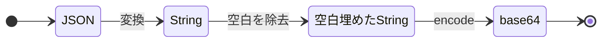
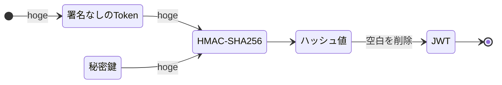

# JWTとは
JWT（JSON Web Token）は、Webアプリケーション間で情報を安全に伝送するためのコンパクトでURLセーフな手段です。このトークンは、主に認証や情報交換に使用されます。

- https://datatracker.ietf.org/doc/html/rfc7519
- https://jwt.io

## 構成

JWTはヘッダー、ペイロード、そして署名の3つの部分から構成されています。

|要素|説明|
|---|---|
|header|トークンのタイプ（JWT）と使用される署名アルゴリズム（例えば、HMAC SHA256やRSA）を宣言するJSONオブジェクト|
|payload|トークンに含まれるクレーム（主張）を表すJSONオブジェクトです。これにはユーザーの識別情報や有効期限などが含むことが一般的です。|
|signature|ヘッダーとペイロードを秘密鍵や公開鍵を用いて暗号化し、トークンの完全性と認証を保証します。|

## フォーマット
`xxxxx.yyyyy.zzzzz`といった、ヘッダー、ペイロード、署名の3つの要素をそれぞれ以下のようにピリオド（`.`）で区切って表現します。
またそれぞれのピリオド（`.`）で区切られたJSONオブジェクトは、JWTはBase64URLアルゴリズムを使ってエンコードされた文字列として表現されます。

```
<ヘッダー>.<ペイロード>.<ヘッダーとペイロードをピリオドで繋いで署名したもの>
```


## ヘッダー

署名アルゴリズムとトークンのタイプを定義します。  
具体的には以下のようなJSONになります。

```json
{ 
    "alg": "HS256", 
    "typ": "JWT"
}
```

ヘッダーは通常、JWTであるトークンの種類と、HMAC SHA256やRSAなどの署名アルゴリズムの2つの部分で構成されています。
トークンのタイプは他にもJWE(JSON Web Encryption)と言うものがあり、これは暗号化まで仕様として定義しているようです。

## ペイロード

トークンの2番目の部分は、クレームを含むペイロードです。  

```json
{
  "sub": "1234567890",
  "name": "John Doe",
  "iat": 1516239022
}
```
### クレーム

クレームは、エンティティ（通常はユーザー）および追加データに関するステートメントです。  
クレームには、登録クレーム、パブリッククレーム、プライベートクレームの3種類があります。

https://www.iana.org/assignments/jwt/jwt.xhtml

#### 予約クレーム（Registered Claim Names）
IANAの”JSON Web Token Claims”に登録された、一般的な用途で利用されることを想定されたClaimです。 基本的にこれらのClaimの利用は任意ですが、JWTを発行する際には可能な限り含めておいたほうが良いと思います。

|クレーム|説明|
|---|---|
|iss|JWT発行者：アプリケーション名やドメイン名などの文字列やURLが一般的|
|sub|JWT発行者から払い出されたユーザ識別子。文字列またはURI。同じIssuer内でユニーク、または全世界でユニークであることが必要|
|aud|JWTの想定利用者:値として文字列かURI、またはそれらの配列。発行する側は相手を識別する文字列か、自分向けに発行されたものか？を検証用に用いる|
|iat|JWTを発行した時刻を示す|
|nbf|JWTが有効になる日時を示す|
|exp|JWTの有効期限(失効する日時) UNIX時刻など|
|jti|JWTのユニーク性を担保するID値。“jti”の存在は、同じJWTを使い回すことを抑制することを目的にしています。 JWTの発行ごとに、UUIDを設定するなど|
|typ|typヘッダパラメータと同じ値空間および同じ規則が適用される|

#### パブリッククレーム（Public Claim Names）
IANA “JSON Web Token Claims”にPublic Claimのサブセットとして、登録されているClaimを言います。主に汎用的な用途のClaimを衝突する可能性を（仕様的な意味で）排除する目的で利用されます。

- [iana JSON Web Token Claims](https://www.iana.org/assignments/jwt/jwt.xhtml)

|クレーム|説明|
|---|---|
|name|フルネーム|
|email|優先メールアドレス|
|auth_time|認証が発生した期間|
|email_verified|メール確認済み|
|at_hash|アクセストークンのハッシュ値|

#### プライベートクレーム（Private Claim Names）

このClaimは、JWTのIssuerとAudienceの間で取り決めされた仕様に応じて何でも定義することができ、 Private ClaimはRegistered ClaimやPublic Claimで予約された以外の名前を使うことができます。 JWTをアクセストークンとして利用する場合は、大抵Private Claimを利用することにあんる。


## 署名
JWT（JSON Web Token）の署名部分は、トークンの安全性を保証するための重要な要素です。　　
署名は、トークンが改ざんされていないことを確認し、トークンが正当な発行者によって生成されたことを保証します。

署名はJWTの真正性と完全性を保証するために非常に重要です。署名がなければ、悪意のある第三者がトークンの内容を改ざんし、異なるユーザーとしてシステムにアクセスすることが可能になります。署名により、このような改ざんを検出し、セキュリティを保つことができます。

### JWTの署名のプロセス
JWTの署名プロセスは以下の手順で行われます。

1. **ヘッダーとペイロードのエンコード**:  
まず、ヘッダーとペイロードはそれぞれJSON形式からBase64URL形式にエンコードされます。  
このエンコードはデータをURLやHTTP環境で安全に送信できることを目的用途として変換します。

2. **データの結合**:  
エンコードされたヘッダーとペイロードをピリオド（`.`）で連結します。  
例: `encodedHeader.encodedPayload`

3. **署名の生成**:  
連結した文字列に対して指定されたアルゴリズムを使用して署名を生成します。  
署名には通常、秘密鍵（または公開鍵/秘密鍵ペアの秘密鍵）が用いられます。  
ヘッダーで指定されたアルゴリズムに従ってハッシュが計算され、それに秘密鍵が適用されることで署名が生成されます。

   - **対称鍵アルゴリズム（例：HS256）**: 秘密鍵を使用して署名を生成し、同じ鍵を使用して署名を検証します。
   - **非対称鍵アルゴリズム（例：RS256）**: 秘密鍵を使用して署名を生成し、対応する公開鍵を使用して署名を検証します。

4. **JWTの完成**:  
最終的に、署名もBase64URLエンコードされ、既にエンコードされたヘッダーとペイロードの後にピリオドで連結されます。形式は次のようになります。  
例: `encodedHeader.encodedPayload.encodedSignature`


## エンコード

### JSONをBase64エンコーディング

### HMAC-SHA256より、JWTを生成


### Base64でエンコードする
```
echo -n '{"alg":"HS256","typ":"JWT"}' | base64
```

#### テキストファイルをBase64でエンコードする
```
base64 -i inputfile -o outputfile
```

#### エンコード結果
```
eyJhbGciOiJIUzI1NiIsInR5cCI6IkpXVCJ9
```

## デコード
### Base64でデコードする
```
echo -n 'eyJhbGciOiJIUzI1NiIsInR5cCI6IkpXVCJ9' | base64 -D
```

#### テキストファイルをbase64コマンドでデコードする
```
base64 -d -i inputfile -o outputfile
```
#### テキストファイルをnkfコマンドでデコードする
```
base64 -d -i inputfile -o outputfile
```
```
echo 'eyJhbGciOiJIUzI1NiIsInR5cCI6IkpXVCJ9' |nkf -WmB
```

#### デコード結果
```
{"alg":"HS256","typ":"JWT"}
```

## 秘密鍵で署名生成
: openssl dgstコマンド
HMAC: 'secret'


```
echo -n 'eyJhbGciOiJIUzI1NiIsInR5cCI6IkpXVCJ9.eyJuYW1laWQiOiIwOGRhZjhmYS1hMjcxLTRjMmQtODM3OC01Yjk0NWE4ZmMxYzYiLCJuYW1lIjoiYWRtaW5pc3RyYXRvciIsInBvbGljaWVzIjoiU0VSVklDRV9BQ0NPVU5USU5HX01BTkFHRVIiLCJ0b2tlbl90eXBlIjoiUmVmcmVzaCBUb2tlbiIsInNlY3VyaXR5X3N0YW1wIjoiWVBRTzdIQjRBUDVHRUdYQTQ1RkdONzRRVDQ3T0dBMjMiLCJpc3MiOiJodHRwOi8vbG9jYWxob3N0OjUwMDAiLCJzdWIiOiIwOGRhZjhmYS1hMjcxLTRjMmQtODM3OC01Yjk0NWE4ZmMxYzYiLCJhdWQiOlsiYWRtaW5pc3RyYXRvciIsImh0dHA6Ly9sb2NhbGhvc3Q6NTAwMCJdLCJåpYXQiOjE2NzQwMDg4ODYsIm5iZiI6MTY3NDAwODg4NiwiZXhwIjoxNjc0MDk1Mjg2fQ' | \
openssl dgst -binary -sha256 -hmac 'secret' | \
base64
```
## JWT の利用例（ユーザー認証）

JWTは、ログイン後のユーザーセッションを管理するために使用されます。  

以下にユーザーがWebサイトにログインし、そのセッションでAPIリクエストを認証するためにJWTを使用するケースを例としてあげます。

### ベアラー認証

通常は、ベアラー認証を通じてHTTPヘッダーのAuthorizationにてJWTを送信します。

```
Authorization: Bearer <jwt token>
```
### ベアラー認証の動作方法

1. **ユーザー認証**: ユーザーがユーザーネームとパスワードを使ってログインすると、サーバーはその認証情報を検証します。
2. **JWTの発行**: 認証が成功すると、サーバーはユーザーの識別情報やアクセス権限などのクレームを含むJWTを生成し、それをユーザーに返します。
3. **トークンの送信**: ユーザーはその後のリクエストで、JWTをHTTPリクエストの`Authorization`ヘッダーに`Bearer`スキームを使用して含めます。形式は通常`Authorization: Bearer <token>`となります。
4. **トークンの検証**: サーバーはリクエストを受信するたびに、JWTの署名を検証し、有効期限などのクレームを確認して、リクエストが正当なものであるかを判断します。

### セキュリティ上の注意点

- **HTTPSの使用**: JWTは、`Authorization`ヘッダーを介してクライアントからサーバーに送信されます。このトークンは重要な認証情報を含むため、通信はHTTPSを通じて暗号化されるべきです。これにより、中間者攻撃によるトークンの盗聴や改ざんを防ぎます。
- **トークンの保存**: クライアント側では、JWTを安全に保存する必要があります。ブラウザ環境では、トークンをローカルストレージやセッションストレージに保管する方法が一般的ですが、クロスサイトスクリプティング（XSS）攻撃に対するリスクがあるため、セキュリティ対策を適切に行う必要があります。

ベアラー認証によるJWTの利用は、そのシンプルさと強力なセキュリティ機能により、現代のウェブアプリケーションやAPIで広く採用されています。