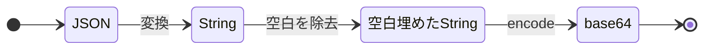
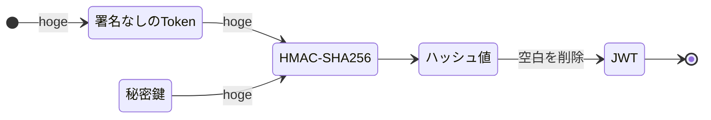

# JWTとは

- https://datatracker.ietf.org/doc/html/rfc7519

## 構成

JWTは主に３つの要素で構成されている。

|要素|説明|
|---|---|
|header|２つの要素で構成されている―使用されている署名アルゴリズムとTokenの種類|
|payload|JSONデータのcontentsとオブジェクトをふくむ|
|signature|JSONのpayloadの完全性を検証するために使用できる、暗号化アルゴリズムによって生成される文字列|

この3つの要素をそれぞれ以下のようにピリオドで区切って表現する。

## フォーマット
```
<ヘッダー>.<ペイロード>.<ヘッダーとペイロードをピリオドで繋いで署名したもの>
```

## ヘッダー

署名アルゴリズムとトークンのタイプを定義します。具体的には以下のようなJSONになります。

```
{ 
    “alg”: “HS256”, 
    “typ”: “JWT”
}
```

これは署名アルゴリズムはHS256、トークのタイプがJSON Web Tokenであることを表しています。トークンのタイプは他にもJWE(JSON Web Encryption)と言うものがあり、これは暗号化まで仕様として定義しているようです。

JWTは署名部以外はbase64にてエンコードしているが暗号化されていません。あくまで通信が暗号化されたSSL通信上での利用を想定してます。

## ペイロード

### クレーム

https://www.iana.org/assignments/jwt/jwt.xhtml

#### 予約クレーム（Registered Claim Names）
IANAの”JSON Web Token Claims”に登録された、一般的な用途で利用されることを想定されたClaimです。 基本的にこれらのClaimの利用は任意ですが、JWTを発行する際には可能な限り含めておいたほうが良いと思います。

|クレーム|説明|
|---|---|
|iss|JWT発行者：アプリケーション名やドメイン名などの文字列やURLが一般的|
|sub|JWT発行者から払い出されたユーザ識別子。文字列またはURI。同じIssuer内でユニーク、または全世界でユニークであることが必要|
|aud|JWTの想定利用者:値として文字列かURI、またはそれらの配列。発行する側は相手を識別する文字列か、自分向けに発行されたものか？を検証用に用いる|
|iat|JWTを発行した時刻を示す|
|nbf|JWTが有効になる日時を示す|
|exp|JWTの有効期限(失効する日時) UNIX時刻など|
|jti|JWTのユニーク性を担保するID値。“jti”の存在は、同じJWTを使い回すことを抑制することを目的にしています。 JWTの発行ごとに、UUIDを設定するなど|
|typ|typヘッダパラメータと同じ値空間および同じ規則が適用される|

#### パブリッククレーム（Public Claim Names）
IANA “JSON Web Token Claims”にPublic Claimのサブセットとして、登録されているClaimを言います。主に汎用的な用途のClaimを衝突する可能性を（仕様的な意味で）排除する目的で利用されます。

- [iana JSON Web Token Claims](https://www.iana.org/assignments/jwt/jwt.xhtml)

|クレーム|説明|
|---|---|
|name|フルネーム|
|email|優先メールアドレス|
|auth_time|認証が発生した期間|
|email_verified|メール確認済み|
|at_hash|アクセストークンのハッシュ値|

#### プライベートクレーム（Private Claim Names）

このClaimは、JWTのIssuerとAudienceの間で取り決めされた仕様に応じて何でも定義することができ、 Private ClaimはRegistered ClaimやPublic Claimで予約された以外の名前を使うことができます。 JWTをアクセストークンとして利用する場合は、大抵Private Claimを利用することにあんる。


## 署名

.....


## エンコード

### JSONをBase64エンコーディング

### HMAC-SHA256より、JWTを生成


### Base64でエンコードする
```
echo -n '{"alg":"HS256","typ":"JWT"}' | base64
```

#### テキストファイルをBase64でエンコードする
```
base64 -i inputfile -o outputfile
```

#### エンコード結果
```
eyJhbGciOiJIUzI1NiIsInR5cCI6IkpXVCJ9
```

## デコード
### Base64でデコードする
```
echo -n 'eyJhbGciOiJIUzI1NiIsInR5cCI6IkpXVCJ9' | base64 -D
```

#### テキストファイルをbase64コマンドでデコードする
```
base64 -d -i inputfile -o outputfile
```
#### テキストファイルをnkfコマンドでデコードする
```
base64 -d -i inputfile -o outputfile
```
```
echo 'eyJhbGciOiJIUzI1NiIsInR5cCI6IkpXVCJ9' |nkf -WmB
```

#### デコード結果
```
{"alg":"HS256","typ":"JWT"}
```

## 秘密鍵で署名生成
: openssl dgstコマンド
HMAC: 'secret'


```
echo -n 'eyJhbGciOiJIUzI1NiIsInR5cCI6IkpXVCJ9.eyJuYW1laWQiOiIwOGRhZjhmYS1hMjcxLTRjMmQtODM3OC01Yjk0NWE4ZmMxYzYiLCJuYW1lIjoiYWRtaW5pc3RyYXRvciIsInBvbGljaWVzIjoiU0VSVklDRV9BQ0NPVU5USU5HX01BTkFHRVIiLCJ0b2tlbl90eXBlIjoiUmVmcmVzaCBUb2tlbiIsInNlY3VyaXR5X3N0YW1wIjoiWVBRTzdIQjRBUDVHRUdYQTQ1RkdONzRRVDQ3T0dBMjMiLCJpc3MiOiJodHRwOi8vbG9jYWxob3N0OjUwMDAiLCJzdWIiOiIwOGRhZjhmYS1hMjcxLTRjMmQtODM3OC01Yjk0NWE4ZmMxYzYiLCJhdWQiOlsiYWRtaW5pc3RyYXRvciIsImh0dHA6Ly9sb2NhbGhvc3Q6NTAwMCJdLCJåpYXQiOjE2NzQwMDg4ODYsIm5iZiI6MTY3NDAwODg4NiwiZXhwIjoxNjc0MDk1Mjg2fQ' | \
openssl dgst -binary -sha256 -hmac 'secret' | \
base64
```
