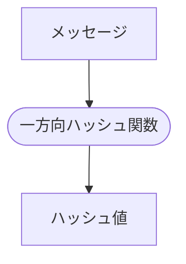

# 一方向ハッシュ関数(one-way hash function）
一方向ハッシュ関数は、ファイルやデータの正真性（完全性）を確認するために用いられる関数です。  
この関数を使用して、ファイルの「指紋」を生成します。
この指紋は、ハッシュ値と呼ばれ、ファイルやデータの内容が改ざんされていないかどうかを検証する際に利用されます。  
例えば、2つのメッセージが等しいかどうかを調べるのに、メッセージを直接比較するのではなく、メッセージの指紋を比較する方法として用います。

## 主な特徴

- **入力（メッセージ）**：  
テキスト、画像、バイナリデータなど、任意のデータを入力として受け付けます。このデータはビット列として扱われます。

- **出力（ハッシュ値）**：  
入力データに基づいて計算された固定長の値。例えば、SHA-256 ハッシュ関数を使用した場合、出力は 256 ビット（32 バイト）の長さとなります。

## プロセス
メッセージが一方向ハッシュ関数を通じてハッシュ値に変換されるプロセスを示しています。どのような形式のデータでも、この関数によって一定の長さのハッシュ値が生成され、データの完全性を保証するために利用されます。


一方向ハッシュ関数はその計算速度の速さと、微小な入力の変化に対して出力が大きく変わる「アバランシュ効果(初期の状態が少しでも変わると、結果が著しく変わってしまう効果)」により、セキュリティ分野で広く信頼されています。

## 一方向ハッシュ関数の性質
一方向ハッシュ関数は以下のような性質により、データの検証、保護、認証のための基盤技術として、多くのセキュリティシステムで中核的な役割を果たしています。

### 1. 任意長のメッセージから固定長のハッシュ値を算出する
一方向ハッシュ関数は、どんな長さのデータでも受け取り、それを一定の長さを持つハッシュ値に変換します。この性質は、大量のデータや非常に短いデータであっても、ハッシュ値の長さが常に一定であることを保証します。これにより、データベースのインデックス作成、デジタル署名の生成、データの整合性検証など、多岐にわたる用途で利用することが可能です。

### 2. ハッシュ値を高速に計算できる
一方向ハッシュ関数は、計算が非常に高速であることが求められます。この性質は、大量のデータに対してリアルタイムでハッシュ値を生成する必要がある場面で特に重要です。例えば、ネットワーク通信のセキュリティを確保するために送信データのハッシュ値を素早く計算し、受信側で同様のハッシュ値を計算して整合性を確認するといったプロセスがあります。

### 3. メッセージが異なればハッシュ値も異なる
理想的な一方向ハッシュ関数では、たとえ入力データが微妙に異なるだけでも、出力されるハッシュ値は大きく異なるべきです（この性質を「アバランシュ効果」と言います）。これにより、オリジナルのデータを推測することが困難になり、セキュリティが強化されます。また、異なるメッセージから同じハッシュ値が生成されることを「衝突」といい、強力なハッシュ関数ではこの衝突の確率を極めて低く抑える必要があります。

### 4. 一方向性を持つ
ハッシュ値からメッセージを逆算できないという性質を持ちます。
例えば、パスワードなど元に戻すことで知られる可能性がないことなどに用いるときに重要な性質です。

## 一方向ハッシュ関数の利用プロセス
一方向ハッシュ関数を利用してデータの正真性を確認するプロセスを示します。


1. **データのハッシュ化**
   - 元のデータは一方向ハッシュ関数を通じてハッシュ化されます。
   - この関数はデータから固定長のハッシュ値を生成します。

2. **データとハッシュ値の保存**
   - 元のデータはデータストレージに保存されます。
   - 生成されたハッシュ値は別途、ハッシュ値ストレージに保存されます。

3. **データの検証プロセス**
   - 検証時には、データストレージからデータが取り出され（"チェックするデータ"）、再びハッシュ関数を用いてハッシュ化されます。
   - 同時に、ハッシュ値ストレージから元のハッシュ値（"保存されたハッシュ値"）が取り出されます。

4. **ハッシュ値の比較**
   - 新たに生成されたハッシュ値（"保存されたデータのハッシュ値"）と元のハッシュ値を比較します。
   - この比較は比較検証ステップで行われます。

5. **検証結果の出力**
   - 比較の結果、両者が一致すればデータは変更されていないと判断され、検証結果として正の結果が出力されます。
   - 一致しない場合は、データが何らかの形で改ざんされた可能性があると報告されます。

このプロセスにより、データの正真性が保証され、データの安全性が向上します。一方向ハッシュ関数の使用は、セキュリティが重要視される多くのシステムで重要な役割を果たします。

## 一方向ハッシュ関数の具体的な実例
現在最もポピュラーなハッシュ関数の一つは **SHA-256** を使用して任意のデータ（例えば文字列）のハッシュ値を生成するコマンドラインベースの例を示します。

### コマンドラインでのSHA-256ハッシュ生成例

```sh
% echo -n "Your Data Here" | openssl dgst -sha256
SHA2-256(stdin)= c83498500bac545738a3e40dc99c608549e151e330c28a8be8566aeea98afece
```

## 用いられるケース

- ソフトウェアの改ざん検出
- パスワードを元にした暗号化
- メッセージ認証コード
- デジタル署名
- 擬似乱数生成期
- ワンタイムパスワード

## 代表的な一方向ハッシュ関数

- MD4、MD5
- SHA-1、SHA-256、SHA-384、SHA-512
- SHA-3
- RIPEMD-160
