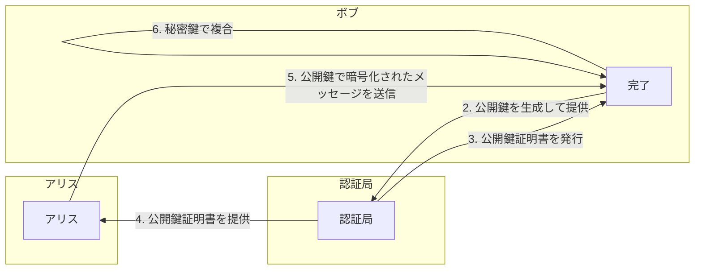
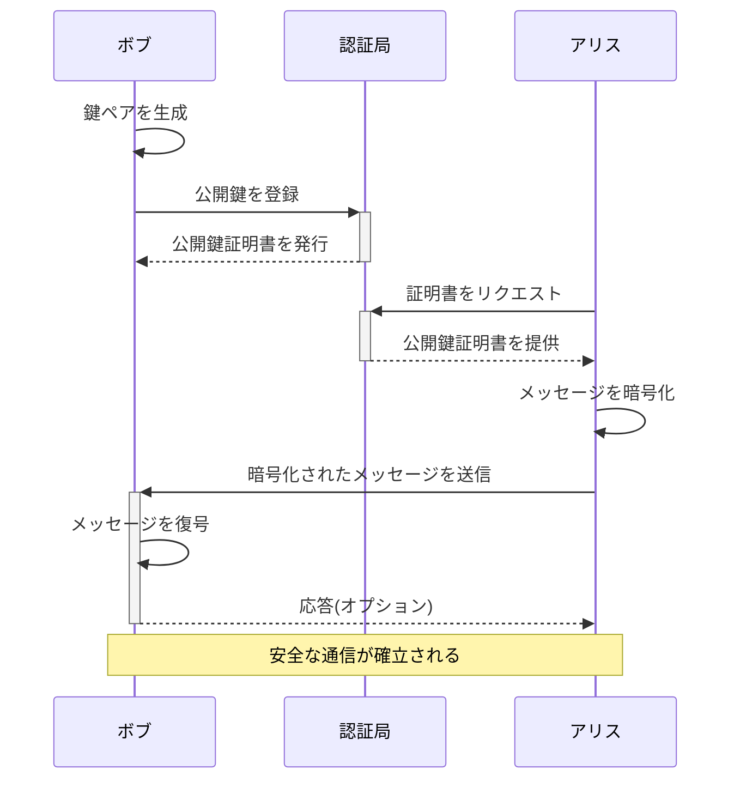
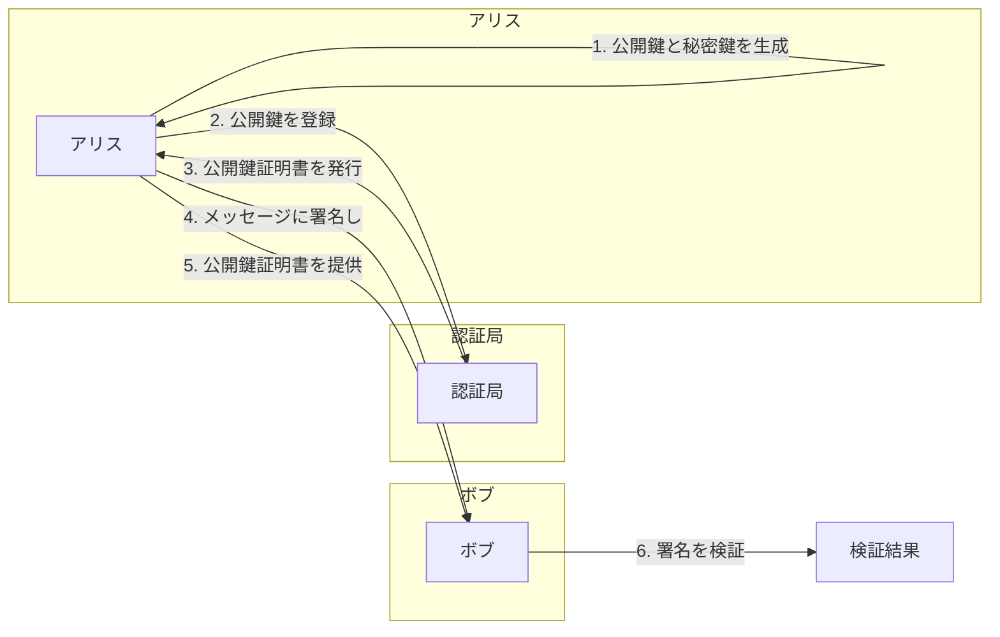
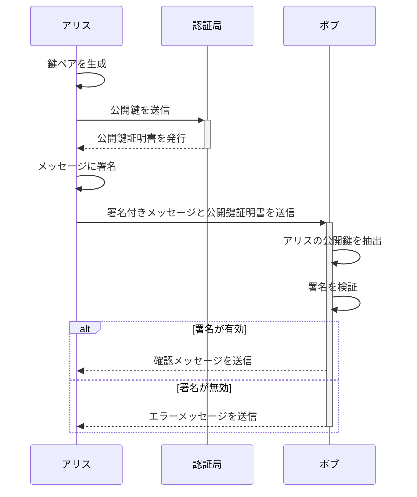

# 公開鍵証明書(PKC: Public-key Certificate)

## 公開鍵証明書とは

公開鍵証明書とは、認証局（CA: Certification Authority）が発行している証明書で以下の情報が記載されていおり、「確かにこの公開鍵はこの人のものである」と証明するものである。

- 登録者の名前や所属、メールアドレス等の個人情報
- 登録者の公開鍵
- 認証局（CA）のデジタル署名

## 証明書を利用するシナリオ（暗号文を送信する）

公開鍵証明書を利用するプロセスを明確に示すために、構成図を用いて説明します。この図は、ボブが鍵ペアを作成し、その公開鍵を認証局に登録するところから、アリスが証明書を使って暗号文を送り、ボブがそれを複合するまでのプロセスを示しています。

### 構成図

この構成図は以下のプロセスを説明しています：

1. **ボブ**は自分の鍵ペア（公開鍵と秘密鍵）を生成します。
2. **ボブ**は自分の公開鍵を**認証局**に送り、登録を依頼します。
3. **認証局**はボブの公開鍵に対してデジタル署名を施した証明書を発行し、ボブに返します。
4. **アリス**は認証局からボブの証明書（公開鍵含む）を取得します。
5. **アリス**はその公開鍵を使ってメッセージを暗号化し、ボブに送信します。
6. **ボブ**は自分の秘密鍵を使用して、受け取った暗号文を複合します。

この図を通じて、認証局がボブの公開鍵をどのように扱うか、そしてアリスがその公開鍵をどのように利用するかが一目でわかるようになっています。

###　シーケンス図

公開鍵証明書を利用した通信のプロセスをシーケンス図で表現します。この図は、ボブが鍵ペアを生成し、公開鍵を認証局に登録して証明書を取得することから始まります。その後、アリスが認証局から証明書を取得し、その公開鍵でメッセージを暗号化してボブに送信、ボブが秘密鍵でメッセージを復号するまでの流れを示しています。

### シーケンス図の説明:

1. **ボブ**は自分の鍵ペア（公開鍵と秘密鍵）を生成します。
2. **ボブは公開鍵を認証局に登録**: ボブが自分の公開鍵を認証局に送り、証明書の発行を依頼します。
3. **認証局はボブに公開鍵証明書を発行**: 認証局はボブの公開鍵に対してデジタル署名を行い、公開鍵証明書をボブに返します。
4. **アリスは認証局から証明書をリクエスト**: アリスが認証局からボブの公開鍵証明書をリクエストします。
5. **認証局はアリスに公開鍵証明書を提供**: 認証局からアリスにボブの公開鍵証明書が提供されます。
6. **アリスはメッセージを暗号化**: アリスは証明書内の公開鍵を使用してメッセージを暗号化します。
7. **アリスは暗号化されたメッセージをボブに送信**: 暗号化されたメッセージはボブに送信されます。
8. **ボブはメッセージを復号**: ボブは自分の秘密鍵を使用してメッセージを復号します。
9. **オプションでボブはアリスに応答**: 応答が必要な場合、ボブはアリスに対して何らかの形で応答を送ることができます。

このシーケンス図を通じて、公開鍵証明書を利用した通信の手順と関連するアクションが明確に示されています。

## 証明書を利用するシナリオ（デジタル署名）

### 構成図

デジタル署名を使用するプロセスを示す構成図を Mermaid で作成しました。この図はアリスがメッセージにデジタル署名を行い、ボブがその署名を検証するプロセスを示しています。認証局が公開鍵証明書を発行する役割も示されています。

### 構成図の説明:

1. **アリス**は公開鍵と秘密鍵のペアを生成します。
2. **アリス**は認証局に公開鍵を登録します。
3. **認証局**はアリスの公開鍵を検証し、公開鍵証明書を発行してアリスに返します。
4. **アリス**は自身の秘密鍵を使用してメッセージに署名し、署名されたメッセージとともに公開鍵証明書をボブに送信します。
5. **ボブ**は受け取った公開鍵証明書を使用してアリスの公開鍵を確認し、その公開鍵で署名を検証します。
6. **検証結果**：ボブは署名が正しいかどうかを検証し、メッセージの真正性と完全性を確認します。

### シーケンス図

アリスがメッセージにデジタル署名を行い、ボブがその署名を検証するプロセスを示すシーケンス図を作成しました。この図では、認証局が公開鍵証明書を発行し、アリスがそれを使用してメッセージに署名し、ボブが署名を検証する過程を詳細に表現しています。

### シーケンス図の説明:

1. **鍵ペアの生成**は公開鍵と秘密鍵のペアを生成します。
2. **公開鍵の送信**: アリスは自分の公開鍵を認証局に送信します。
3. **公開鍵証明書の発行**: 認証局はアリスの公開鍵を受け取り、それにデジタル署名を施して公開鍵証明書を発行し、アリスに戻します。
4. **メッセージの署名**: アリスは自身の秘密鍵を使用してメッセージにデジタル署名します。
5. **署名付きメッセージの送信**: アリスは署名付きメッセージと公開鍵証明書をボブに送信します。
6. **公開鍵の抽出と署名の検証**: ボブはアリスから受け取った公開鍵証明書からアリスの公開鍵を抽出し、その公開鍵でメッセージの署名を検証します。
7. **署名の検証結果に応じたアクション**: もし署名が有効であれば、ボブはアリスに確認メッセージを送信します。署名が無効であれば、エラーメッセージを送信します。

## 証明書の標準規格

公開鍵証明書の標準規格として最も一般的に用いられるのは「X.509」という規格です。  
X.509 証明書は、インターネットセキュリティで広く採用されており、SSL/TLS などのプロトコルで暗号化通信を安全に行うために使用されています。

### X.509 証明書の主要な要素

1. **バージョン**: X.509 証明書のバージョン番号です。現在は主にバージョン 3 が使用されています。
2. **シリアルナンバー**: 証明書を一意に識別するための番号です。
3. **署名アルゴリズム**: 証明書の署名に使用された暗号アルゴリズムです。
4. **発行者名**: 証明書を発行した認証局(CA)の名前です。
5. **有効期間**: 証明書の有効開始日と有効終了日です。
6. **被保証者名**: 証明書の主題（被保証者）の名前、つまり証明書の所有者です。
7. **公開鍵情報**: 証明書の所有者の公開鍵と、それに関連する情報です。
8. **発行者の独自識別子 (オプション)**: 発行者の一意性を確保するための識別子です（バージョン 2 および 3 で使用）。
9. **被保証者の独自識別子 (オプション)**: 被保証者の一意性を確保するための識別子です（バージョン 2 および 3 で使用）。
10. **拡張部分 (オプション)**: さまざまな拡張機能（たとえば、利用制限、キーユース、ポリシー情報等）を証明書に含めることができます。

### X.509 証明書の使用

X.509 証明書は、Web サーバーやメールサーバーなど、インターネット上のさまざまなサービスでクライアントとサーバー間の身元確認やデータの暗号化に使用されます。SSL/TLS プロトコルでの安全な通信を確立するために、クライアント（たとえば Web ブラウザ）はサーバーから証明書を受け取り、その証明書が信頼できる認証局によって発行されたものであるかを確認します。

X.509 証明書は、その堅牢性と標準化されたフォーマットにより、デジタル認証の基盤として広く採用されています。この規格を通じて、ユーザーは暗号化された通信の信頼性とセキュリティを保証されます。
