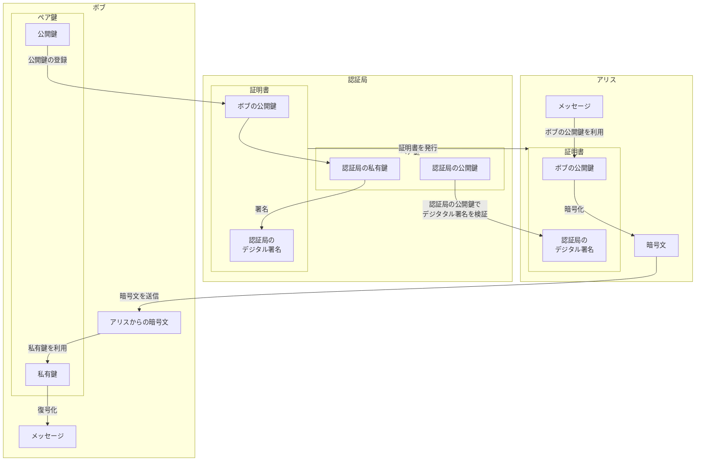
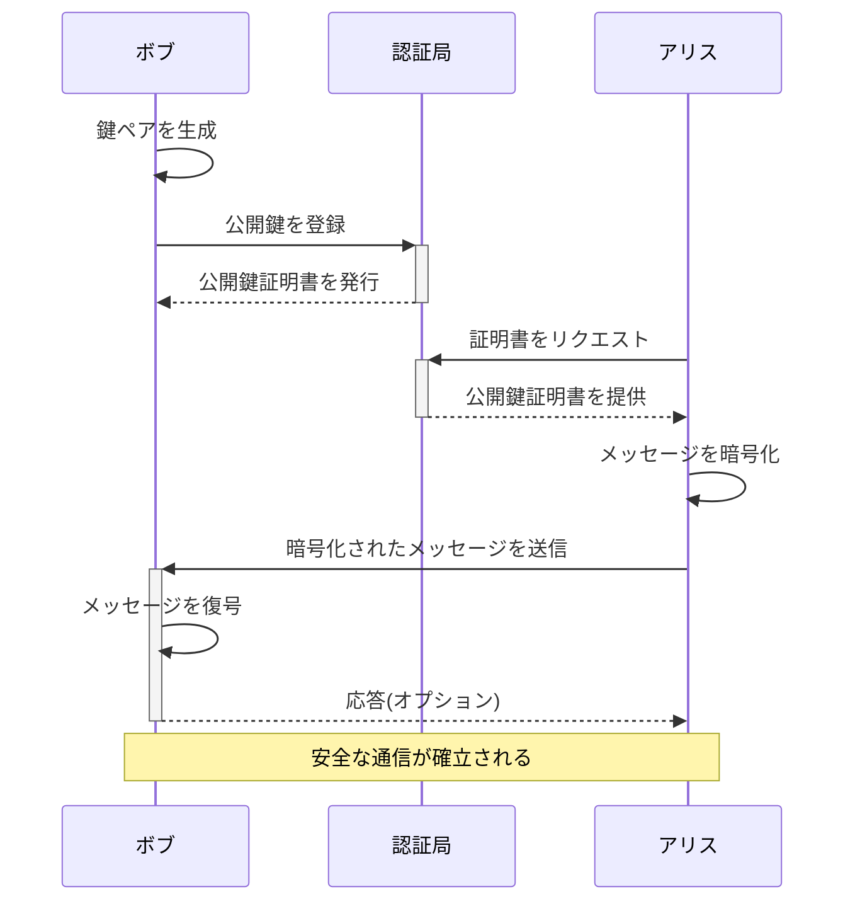
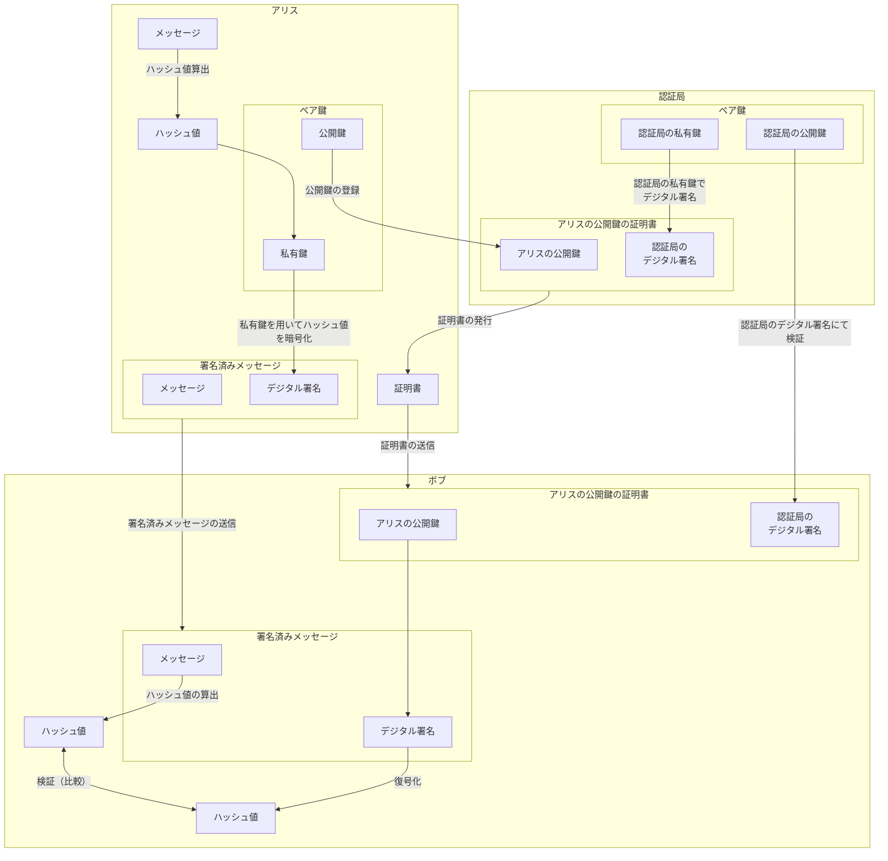
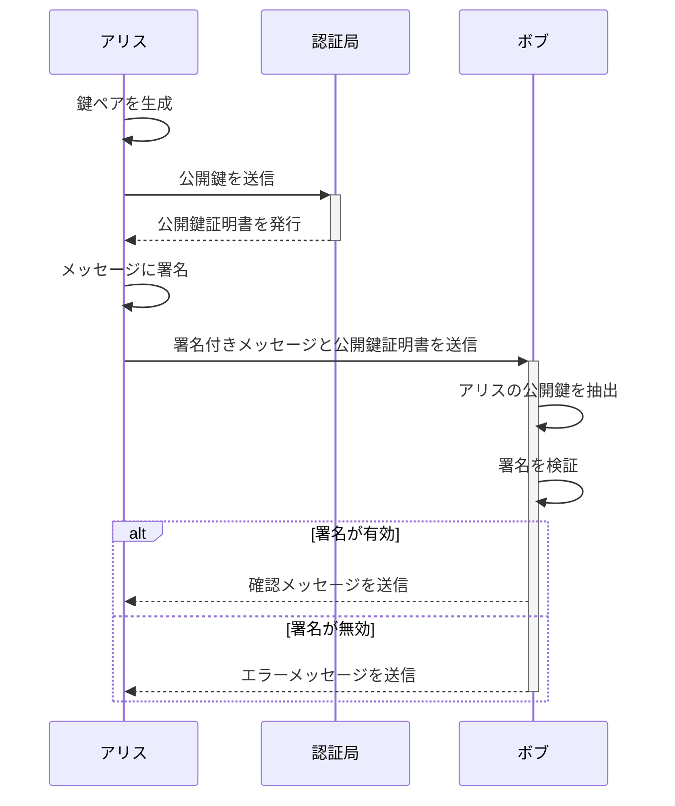

# 公開鍵証明書(PKC: Public-key Certificate)

公開鍵が正しいものかどうかを証明するものが証明書です。  
公開鍵へ（信用できる）第三者のデジタル署名を施すことにより、公開鍵が正しいものと証明します。

## 公開鍵証明書とは

公開鍵証明書とは、認証局（CA: Certification Authority）が発行している証明書で以下の情報が記載されていおり、「確かにこの公開鍵はこの人のものである」と証明するものである。これにより、通信の暗号化、データの完整性の確認、デジタル署名を通じた認証などが行えます。

- 登録者の名前や所属、メールアドレス等の個人情報
- 登録者の公開鍵
- 認証局（CA）のデジタル署名

## 証明書を利用するシナリオ（暗号文を送信する）

公開鍵証明書を利用するプロセスを明確に示すために、構成図を用いて説明します。この図は、ボブが鍵ペアを作成し、その公開鍵を認証局に登録するところから、アリスが証明書を使って暗号文を送り、ボブがそれを複合するまでのプロセスを示しています。

### 構成図

1. **ボブ**:

   - **鍵ペア生成(公開鍵 & 私有鍵)**: ボブは自分の鍵ペアを生成します。
   - **私有鍵で複合**: ボブは受け取った暗号文を自分の私有鍵で複合します。
   - **複合した元の文書**: 複合された文書が出力されます。

2. **認証局**:

   - **公開鍵証明書を発行**: 認証局はボブの公開鍵と認証局のデジタル署名を含む証明書を発行します。

3. **アリス**:
   - **文書を暗号化**: アリスはボブの公開鍵を使って元の文書を暗号化し、ボブに送信します。

###　シーケンス図

公開鍵証明書を利用した通信のプロセスをシーケンス図で表現します。この図は、ボブが鍵ペアを生成し、公開鍵を認証局に登録して証明書を取得することから始まります。その後、アリスが認証局から証明書を取得し、その公開鍵でメッセージを暗号化してボブに送信、ボブが私有鍵でメッセージを復号するまでの流れを示しています。

### シーケンス図の説明:

1. **ボブ**は自分の鍵ペア（公開鍵と私有鍵）を生成します。
2. **ボブは公開鍵を認証局に登録**: ボブが自分の公開鍵を認証局に送り、証明書の発行を依頼します。
3. **認証局はボブに公開鍵証明書を発行**: 認証局はボブの公開鍵に対してデジタル署名を行い、公開鍵証明書をボブに返します。
4. **アリスは認証局から証明書をリクエスト**: アリスが認証局からボブの公開鍵証明書をリクエストします。
5. **認証局はアリスに公開鍵証明書を提供**: 認証局からアリスにボブの公開鍵証明書が提供されます。
6. **アリスはメッセージを暗号化**: アリスは証明書内の公開鍵を使用してメッセージを暗号化します。
7. **アリスは暗号化されたメッセージをボブに送信**: 暗号化されたメッセージはボブに送信されます。
8. **ボブはメッセージを復号**: ボブは自分の私有鍵を使用してメッセージを復号します。
9. **オプションでボブはアリスに応答**: 応答が必要な場合、ボブはアリスに対して何らかの形で応答を送ることができます。

このシーケンス図を通じて、公開鍵証明書を利用した通信の手順と関連するアクションが明確に示されています。

## 証明書を利用するシナリオ（デジタル署名）

### 構成図

アリスがメッセージにデジタル署名を行い、ボブがその署名を検証するプロセスを示しています。認証局が公開鍵証明書を発行する役割も示されています。

1. **アリス**:

   - **鍵ペア生成(公開鍵 & 私有鍵)**: アリスは自分の鍵ペアを生成します。
   - **公開鍵の登録**: 認証局に公開鍵を登録します。
   - **メッセージのハッシュ値を算出**: メッセージのハッシュ値を算出します。
   - **メッセージにデジタル署名**: ハッシュ値を私有鍵で暗号化しデジタル署名を行い、メッセージに添付します。

2. **認証局**:

   - **公開鍵証明書を発行**: 認証局はアリスの公開鍵と認証局のデジタル署名を含む証明書を発行します。

3. **ボブ**:
   - **メッセージのハッシュ値を算出**: ボブはアリスからの署名済みメッセージからメッセージを取り出し、そのハッシュ値を算出します。
   - **アリスのデジタル署名を復号**: アリスの公開鍵の証明書の公開鍵より、アリスののデジタル署名の複合し得たハッシュ値を得ます。
   - **検証**: メッセージから算出したハッシュ値と、デジタル署名から得たハッシュ値が一致していることを確認し検証します。

### シーケンス図

アリスがメッセージにデジタル署名を行い、ボブがその署名を検証するプロセスを示すシーケンス図を作成しました。この図では、認証局が公開鍵証明書を発行し、アリスがそれを使用してメッセージに署名し、ボブが署名を検証する過程を詳細に表現しています。

### シーケンス図の説明:

1. **鍵ペアの生成**は公開鍵と私有鍵のペアを生成します。
2. **公開鍵の送信**: アリスは自分の公開鍵を認証局に送信します。
3. **公開鍵証明書の発行**: 認証局はアリスの公開鍵を受け取り、それにデジタル署名を施して公開鍵証明書を発行し、アリスに戻します。
4. **メッセージの署名**: アリスは自身の私有鍵を使用してメッセージにデジタル署名します。
5. **署名付きメッセージの送信**: アリスは署名付きメッセージと公開鍵証明書をボブに送信します。
6. **公開鍵の抽出と署名の検証**: ボブはアリスから受け取った公開鍵証明書からアリスの公開鍵を抽出し、その公開鍵でメッセージの署名を検証します。
7. **署名の検証結果に応じたアクション**: もし署名が有効であれば、ボブはアリスに確認メッセージを送信します。署名が無効であれば、エラーメッセージを送信します。

## 証明書の標準規格

公開鍵証明書の標準規格として最も一般的に用いられるのは「X.509」という規格です。  
X.509 証明書は、インターネットセキュリティで広く採用されており、SSL/TLS などのプロトコルで暗号化通信を安全に行うために使用されています。

### X.509 証明書の主要な要素

1. **バージョン**: X.509 証明書のバージョン番号です。現在は主にバージョン 3 が使用されています。
2. **シリアルナンバー**: 証明書を一意に識別するための番号です。
3. **署名アルゴリズム**: 証明書の署名に使用された暗号アルゴリズムです。
4. **発行者名**: 証明書を発行した認証局(CA)の名前です。
5. **有効期間**: 証明書の有効開始日と有効終了日です。
6. **被保証者名**: 証明書の主題（被保証者）の名前、つまり証明書の所有者です。
7. **公開鍵情報**: 証明書の所有者の公開鍵と、それに関連する情報です。
8. **発行者の独自識別子 (オプション)**: 発行者の一意性を確保するための識別子です（バージョン 2 および 3 で使用）。
9. **被保証者の独自識別子 (オプション)**: 被保証者の一意性を確保するための識別子です（バージョン 2 および 3 で使用）。
10. **拡張部分 (オプション)**: さまざまな拡張機能（たとえば、利用制限、キーユース、ポリシー情報等）を証明書に含めることができます。

### X.509 証明書の仕様

X.509 証明書は、Web サーバーやメールサーバーなど、インターネット上のさまざまなサービスでクライアントとサーバー間の身元確認やデータの暗号化に使用されます。SSL/TLS プロトコルでの安全な通信を確立するために、クライアント（たとえば Web ブラウザ）はサーバーから証明書を受け取り、その証明書が信頼できる認証局によって発行されたものであるかを確認します。

X.509 証明書は、その堅牢性と標準化されたフォーマットにより、デジタル認証の基盤として広く採用されています。この規格を通じて、ユーザーは暗号化された通信の信頼性とセキュリティを保証されます。

### X.509 証明書の構造

<table>
  <tr>
    <td rowspan="16">証明書</td>
    <td rowspan="14">署名前証明書</td>
    <td colspan="2">バージョン（Version）</td>
  </tr>
  <tr>
    <td colspan="2">シリアル番号</td>    
  </tr>
  <tr>
    <td colspan="2">アルゴリズム識別子</td>    
  </tr>
  <tr>
    <td colspan="2">発行者</td>    
  </tr>
  <tr>
    <td rowspan="2">有効期限</td>
    <td>開始時刻</td>
  </tr>
  <tr>
    <td>終了時刻</td>    
  </tr>
  <tr>
    <td colspan="2">主体者</td>    
  </tr>
  <tr>
    <td rowspan="2">主体者公開鍵情報</td>
    <td>アルゴリズム</td>
  </tr>
  <tr>
    <td>主体者公開鍵</td>    
  </tr>
  <tr>
    <td colspan="2">発行者ユニーク識別番号</td>    
  </tr>
  <tr>
    <td colspan="2">主体者ユニーク識別番号</td>    
  </tr>
  <tr>
    <td rowspan="3">拡張領域</td>
    <td>識別子</td>
  </tr>
  <tr>
    <td>重要度</td>    
  </tr>
  <tr>
    <td>拡張値</td>    
  </tr>
  <tr>
    <td colspan="3">署名アルゴリズム</td>    
  </tr>
  <tr>
    <td colspan="3">署名値</td>    
  </tr>
</table>

#### 構造の説明

<table>
  <tr>
    <th>証明書のセクション</th>
    <th>サブセクション</th>
    <th>詳細</th>
  </tr>
  <tr>
    <td rowspan="3">署名前証明書</td>
    <td>バージョン（Version）</td>
    <td>証明書のバージョン番号（例：Version 3）</td>
  </tr>
  <tr>
    <td>シリアル番号（Serial Number）</td>
    <td>証明書の一意の識別子</td>
  </tr>
  <tr>
    <td>アルゴリズム識別子（Signature Algorithm ID）</td>
    <td>証明書の署名に使用されたアルゴリズム</td>
  </tr>
  <tr>
    <td rowspan="2">発行者（Issuer）</td>
    <td>名前</td>
    <td>証明書を発行した認証局（CA）の名前</td>
  </tr>
  <tr>
    <td>発行者ユニーク識別番号（Optional）</td>
    <td>X.509バージョン2以降で使用可能な識別子</td>
  </tr>
  <tr>
    <td rowspan="2">有効期限（Validity）</td>
    <td>開始時刻（Not Before）</td>
    <td>証明書の有効開始日時</td>
  </tr>
  <tr>
    <td>終了時刻（Not After）</td>
    <td>証明書の有効終了日時</td>
  </tr>
  <tr>
    <td rowspan="3">主体者（Subject）</td>
    <td>名前</td>
    <td>証明書の所有者の識別情報</td>
  </tr>
  <tr>
    <td>主体者公開鍵情報（Public Key Info）</td>
    <td>公開鍵とそのアルゴリズム</td>
  </tr>
  <tr>
    <td>主体者ユニーク識別番号（Optional）</td>
    <td>X.509バージョン2以降で使用可能な識別子</td>
  </tr>
  <tr>
    <td rowspan="3">拡張領域（Extensions）</td>
    <td>識別子（Identifier）</td>
    <td>拡張の一意の識別子</td>
  </tr>
  <tr>
    <td>重要度（Critical）</td>
    <td>この拡張がクリティカルであるかどうか</td>
  </tr>
  <tr>
    <td>拡張値（Value）</td>
    <td>拡張に含まれる具体的な情報または値</td>
  </tr>
  <tr>
    <td>署名アルゴリズム（Signature Algorithm）</td>
    <td colspan="2">証明書の署名に使用されたアルゴリズムの詳細</td>
  </tr>
  <tr>
    <td>署名値（Signature）</td>
    <td colspan="2">認証局（CA）によるデジタル署名</td>
  </tr>
</table>

## 公開鍵証明書のライフサイクルの自動化

SCEP、EST、ACME は主に証明書の発行と管理に焦点を当てたプロトコルで、証明書の発行、更新、管理を自動化するために設計されています。これらは特に以下のようなシナリオで使用されます：

1. **証明書発行手続きの自動化**:

   - これらのプロトコルは、公開鍵証明書を要求し、取得する過程を自動化します。例えば、新しいデバイスやサービスがデプロイされたときに、証明書を自動的に取得し、セキュリティを確保するための初期セットアップを行います。

2. **公開鍵を利用したいエンドユーザーやシステムの支援**:
   - 公開鍵を使用するエンドユーザー（暗号化の場合は送信者、デジタル署名の場合は受信者）やシステムは、これらのプロトコルを通じて、必要に応じて自動的に公開鍵証明書を取得または更新することができます。例えば、ウェブサーバが SSL/TLS 証明書を自動的に取得して安全な通信を保証するために ACME プロトコルを利用する場合などです。

### 各プロトコルの特徴と利用シナリオ

- **SCEP (Simple Certificate Enrollment Protocol)**:

  - 主にネットワークデバイスやモバイルデバイスが多い環境で使われます。CA からの証明書の自動発行と更新が行えるため、大規模な IT インフラストラクチャでの管理を容易にします。

- **EST (Enrollment over Secure Transport)**:

  - EST は HTTPS を利用して証明書の要求を安全に行います。これは SCEP のより安全な代替として開発され、特に企業環境やセキュリティが重視される環境での使用が推奨されます。

- **ACME (Automated Certificate Management Environment)**:
  - ウェブサーバなどのインターネット向けサービスで広く使用されています。特に、Let's Encrypt などの CA では、ACME を使用して無料の SSL/TLS 証明書を提供し、ウェブのセキュリティを大幅に向上させています。

これらのプロトコルは、公開鍵証明書のライフサイクルを自動化し、証明書の取得から更新、時には取り消しまでを効率的に管理するために重要な役割を果たしています。エンドユーザーやシステムはこれらのプロトコルを利用して、必要なセキュリティ認証を自動的に処理し、運用の効率化とセキュリティの向上を図ることができます。
