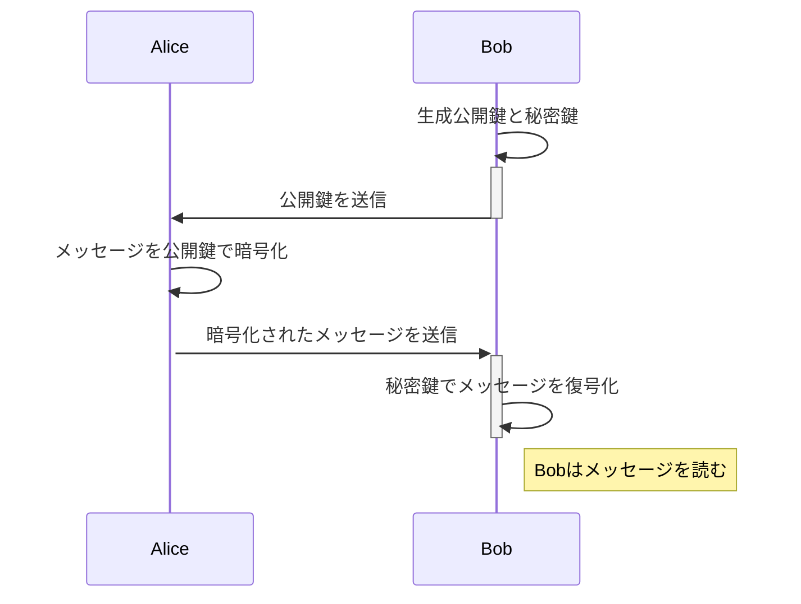

# 公開鍵暗号(public-key cryptography)

鍵配送問題を解決するために考案されてた、公開鍵暗号について記載します。

## 公開鍵暗号とは

送信者が`暗号化の鍵`を使って暗号化し、受信者が`複合化の鍵`を利用して複合します。
この 2 つの鍵を 1 つのペアとして`暗号化の鍵（公開鍵）`と`複合化の鍵（秘密鍵）`を分けて利用します。

### 鍵のペア

- `公開鍵`: `暗号化の鍵`は一般に公開することができるので、`公開鍵(public key)`と呼びます。
- `秘密鍵`: `複合化の鍵`は絶対に公開してはいけないため、`秘密鍵(プライベート鍵: private key)`といいます。

## 　鍵配送問題とは

（暗号化及び復号化を同じかにで行う）対称暗号によって暗号化すると以下の点において問題が生じます。

- 鍵の事前共有: 鍵を盗まれないように事前に送信者及び受信者両方に鍵を配布し共有しておかならない。
- 鍵の管理: 送信者及び受信者双方で鍵が漏洩しないように管理しなければいけない。

### 鍵配送問題を解決

暗号化において、鍵配送問題を以下の条件により解決を行なったものが公開鍵暗号です。

- 送信者が必要なのは`暗号化の鍵`だけである
- 受信者が必要なのは`複合化の鍵`だけである
- 盗聴者に知られて困るのは`複合化の鍵`である
- `暗号化の鍵`は盗聴者に知られてもかまわない

つまり、受信者が最初から`複合化の鍵`を手元においておき、送信者が`暗号化の鍵`を手に入れることができた場合に鍵配送問題は解決します。

### 公開鍵暗号でも解決できない問題

入手した`暗号化の鍵（公開鍵）`が本当に正しい`暗号化の鍵（公開鍵）`かを判別する必要がある。
`公開鍵の認証`が必要が出てくる。

## 暗号のプロセス

この例では、Alice が Bob にメッセージを暗号化して送信するプロセスを描いています。


### シーケンス図



この図は以下のステップを表しています：

1. **公開鍵と秘密鍵の生成**：Bob は公開鍵と秘密鍵のペアを生成します。
2. **公開鍵の送信**：Bob はその公開鍵を Alice に送信します。
3. **メッセージの暗号化**：Alice は Bob から受け取った公開鍵を使ってメッセージを暗号化します。
4. **暗号化されたメッセージの送信**：Alice はその暗号化されたメッセージを Bob に送信します。
5. **メッセージの復号化**：Bob は自分の秘密鍵を使って受け取ったメッセージを復号化します。
6. **メッセージの読取り**：復号化後、Bob はメッセージを読むことができます。

## 暗号化の具体例

OpenSSL を使用して公開鍵暗号方式でファイルやデータを暗号化・復号するプロセスは、公開鍵と秘密鍵のペアを使います。ここでは具体的なコマンド例を通じて、ファイルの暗号化と復号の手順を説明します。

### 1. 鍵ペアの生成

まず、RSA 鍵ペア（公開鍵と秘密鍵）を生成します。以下のコマンドを使用して、2048 ビットの RSA 鍵を生成できます。

```bash
openssl genpkey -algorithm RSA -out private_key.pem -pkeyopt rsa_keygen_bits:2048
openssl rsa -pubout -in private_key.pem -out public_key.pem
```

このコマンドは、秘密鍵を`private_key.pem`に、対応する公開鍵を`public_key.pem`に保存します。

### 2. 公開鍵を使用した暗号化

次に、公開鍵`public_key.pem`を使用してファイルを暗号化します。例えば`example.txt`というファイルを暗号化するには、次のコマンドを使用します。

```bash
openssl rsautl -encrypt -inkey public_key.pem -pubin -in example.txt -out encrypted.dat
```

このコマンドは`example.txt`の内容を暗号化し、その結果を`encrypted.dat`に保存します。

### 3. 秘密鍵を使用した復号

最後に、秘密鍵`private_key.pem`を使用して暗号化されたファイル`encrypted.dat`を復号します。

```bash
openssl rsautl -decrypt -inkey private_key.pem -in encrypted.dat -out decrypted.txt
```

このコマンドは`encrypted.dat`を復号し、元の内容を`decrypted.txt`に保存します。

### 注意点

- `openssl rsautl`コマンドは比較的小さいデータサイズの暗号化に適しています。例えば、2048 ビット（256 バイト）の RSA 鍵を使用する場合、通常、最大で 245 バイト程度のデータしか暗号化できません。ファイルサイズが大きい場合は、データを分割するか、または AES などの対称鍵暗号方式でファイルを暗号化し、その鍵を公開鍵で暗号化するハイブリッド方式を検討してください。
- この例ではシンプルな RSA 暗号を使用していますが、実際のセキュリティ要件に応じて適切な設定やオプションを選択することが重要です。

これらのコマンドを利用することで、OpenSSL を使った基本的な公開鍵暗号化と復号のプロセスを実行できます。

### 大きなファイルの暗号化

`openssl rsautl` は小さなデータの暗号化に適していますが、大きなファイルを暗号化する必要がある場合は、ハイブリッド暗号化アプローチが一般的です。この方法では、RSA を使用して対称鍵暗号化の鍵（例えば、AES 鍵）を暗号化し、その対称鍵でファイル全体を暗号化します。

#### 例：ハイブリッド暗号化の使用

1. **対称鍵の生成とファイル暗号化**:

   ```bash
   openssl rand -base64 32 > aes_key.bin
   openssl enc -aes-256-cbc -in largefile.txt -out largefile.enc -pass file:aes_key.bin
   ```

2. **対称鍵の RSA 暗号化**:

   ```bash
   openssl rsautl -encrypt -inkey public_key.pem -pubin -in aes_key.bin -out encrypted_key.bin
   ```

3. 送信されるのは `largefile.enc` と `encrypted_key.bin` の 2 つのファイルです。受信者は RSA で暗号化された鍵を復号してから、その鍵を使用してファイルを復号します。

以上の方法で、`openssl rsautl` の容量制限を回避しつつ、大きなファイルも安全に暗号化・転送することが可能です。
