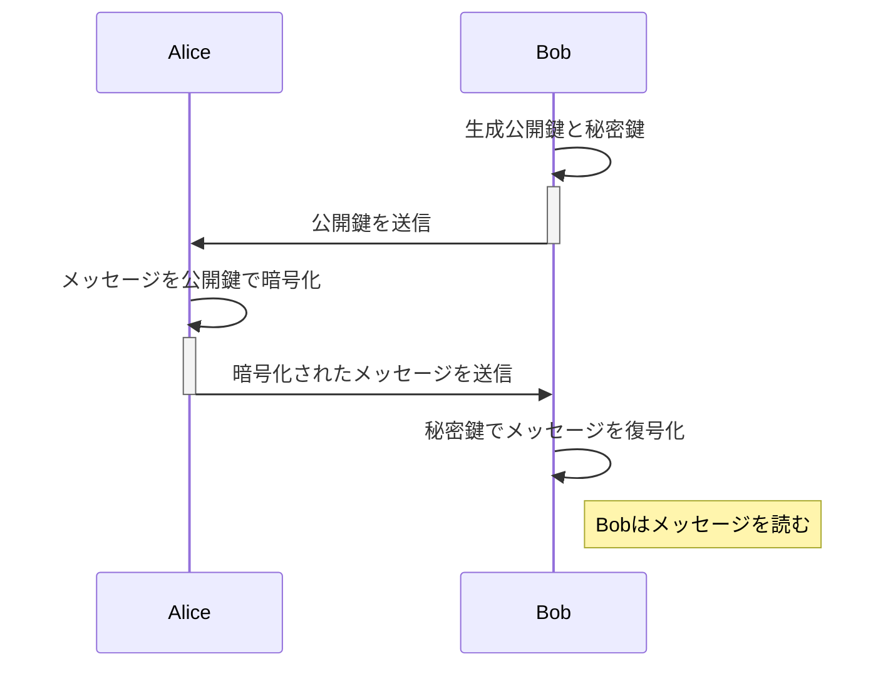

# 公開鍵暗号(public-key cryptography)

## 公開鍵暗号とは

送信者が`暗号化の鍵`を使って暗号化し、受信者が`複合化の鍵`を利用して複合します。
この 2 つの鍵を 1 つのペアとして`暗号化の鍵（公開鍵）`と`複合化の鍵（秘密鍵）`を分けて利用します。

### 鍵のペア

- `公開鍵`: `暗号化の鍵`は一般に公開することができるので、`公開鍵(public key)`と呼びます。
- `秘密鍵`: `複合かの鍵`は絶対に公開してはいけないため、`秘密鍵(プライベート鍵: private key)`といいます。

### 鍵配送問題を解決

暗号化において、鍵配送問題を以下の条件により解決を行なったものが公開鍵暗号です。

- 送信者が必要なのは`暗号化の鍵`だけである
- 受信者が必要なのは`複合化の鍵`だけである
- 盗聴者に知られて困るのは`複合化の鍵`である
- `暗号化の鍵`は盗聴者に知られてもかまわない

つまり、受信者が最初から`複合化の鍵`を手元においておき、送信者が`暗号化の鍵`を手に入れることができた場合に鍵配送問題は解決します。

### 公開鍵暗号でも解決できない問題

入手した`暗号化の鍵（公開鍵）`が本当に正しい`暗号化の鍵（公開鍵）`かを判別する必要がある。
`公開鍵の認証`が必要が出てくる。

## 暗号化のプロセス

公開鍵暗号方式での暗号化のプロセスを表す Mermaid のシーケンス図を以下に示します。この例では、Alice が Bob にメッセージを暗号化して送信するプロセスを描いています。

この図は以下のステップを表しています：

1. **公開鍵と秘密鍵の生成**：Bob は公開鍵と秘密鍵のペアを生成します。
2. **公開鍵の送信**：Bob はその公開鍵を Alice に送信します。
3. **メッセージの暗号化**：Alice は Bob から受け取った公開鍵を使ってメッセージを暗号化します。
4. **暗号化されたメッセージの送信**：Alice はその暗号化されたメッセージを Bob に送信します。
5. **メッセージの復号化**：Bob は自分の秘密鍵を使って受け取ったメッセージを復号化します。
6. **メッセージの読取り**：復号化後、Bob はメッセージを読むことができます。

この図は Mermaid 形式で記述されており、適切なツールやプラグインを使用すると、視覚的な図として表示することができます。
