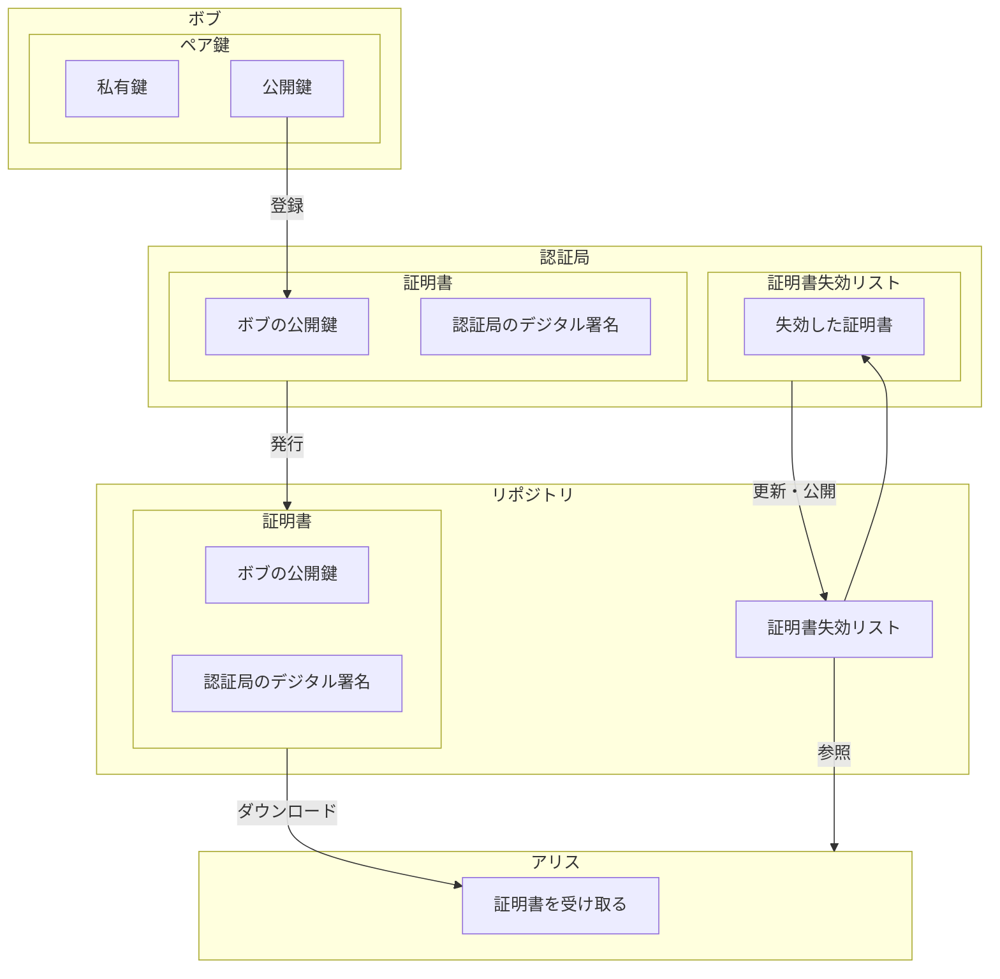
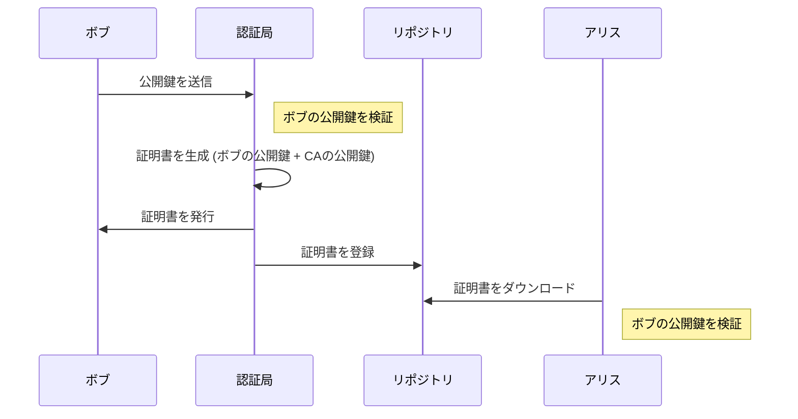

# 公開鍵認証基盤（PKI）

証明書を誰が発行するのか？私有鍵が漏洩したときに証明書を無効にするにはどうするのか？など、公開鍵を効率的に運用するために定められた規格や仕様の総称です。  
PKI 自体は単同区の規格や仕様を指すものではありません。

## 公開鍵認証基盤（PKI: Public Key Infrastructure） とは

公開鍵認証基盤（PKI：Public Key Infrastructure）は、デジタル認証と暗号化技術を用いたセキュリティフレームワークです。インターネット上でのデータの安全な送受信、デジタル署名の確認、暗号化された通信の確立などを可能にする重要な技術です。具体的には、以下の要素から構成されます：

### 主要な要素

1. **公開鍵と私有鍵**

   - 公開鍵と私有鍵のペアを使用します。公開鍵は誰でもアクセス可能で、データの暗号化やデジタル署名の検証に使用されます。対照的に、私有鍵はユーザーのみが保持し、データの復号や自身のデジタル署名の作成に使われます。

2. **認証局（CA：Certificate Authority）**

   - デジタル証明書を発行する信頼された機関です。認証局は、公開鍵の所有者の身元を証明し、その公開鍵をデジタル証明書に結びつけて発行します。これにより、通信相手は公開鍵の正当性を信頼できます。

3. **デジタル証明書**

   - 公開鍵とその所有者の識別情報を含むデジタルファイルです。証明書は認証局によって署名されており、その公開鍵が特定の個人または組織に属していることを証明します。

4. **証明書失効リスト（CRL：Certificate Revocation List）**

   - 発行されたが、有効期限前に失効した証明書のリストです。証明書が失効する理由には、私有鍵の漏洩、組織の変更、その他のセキュリティ上の問題があります。

5. **証明書リポジトリ**
   - 証明書や証明書失効リストなどの情報を保存し、公開するシステムです。これにより、利用者は証明書の検証を行う際に必要なデータを参照できます。

### 構成図

### 図の説明

- **ボブ (Bob)**: ボブは自分の公開鍵と私有鍵のペアを持っています。公開鍵は認証局に登録されます。
- **認証局 (Auth)**: 認証局はボブの公開鍵に基づいてデジタル証明書を発行し、デジタル署名を行います。また、認証局は証明書失効リスト（CRL）を管理し、失効した証明書の情報を更新します。
- **リポジトリ (Repository)**: リポジトリは認証局から発行された証明書と証明書失効リストを保管し、アリスなどの利用者がアクセスできるようにします。
- **アリス (Alice)**: アリスはリポジトリからボブの証明書をダウンロードし、通信の正当性を確認するために使用します。また、アリスは証明書失効リストを参照して、ダウンロードした証明書が失効していないことを確認します。

この図は、PKI システム内での各コンポーネントの関係と、それらがどのように連携して機能するかを視覚的に示しています。これにより、セキュリティが強化され、信頼性の高いデジタル認証が可能になります。

### 機能と利点

- **暗号化**: PKI はデータを安全に暗号化し、第三者によるデータの閲覧や改ざんを防ぎます。
- **デジタル署名**: 文書や電子メールの真正性と改ざん防止を保証します。
- **セキュリティプロトコルのサポート**: SSL/TLS などのセキュリティプロトコルで使用され、安全なウェブ通信を保証します。
- **認証**: ユーザーやデバイスが正当であることを確認し、不正アクセスを防ぎます。

PKI は、金融機関、政府機関、ヘルスケア業界など、セキュリティが極めて重要なあらゆる分野で利用されています。

## PKI 利用プロセス

1. **ボブから認証局への公開鍵送信**: ボブは自分の公開鍵を認証局に送信します。
2. **認証局による証明書の生成**: 認証局はボブの公開鍵を受け取り、それを検証した後、ボブの公開鍵と認証局の公開鍵を含むデジタル証明書を生成します。
3. **証明書の発行と登録**: 認証局はボブに証明書を発行し、同時にこの証明書をリポジトリに登録します。
4. **アリスによる証明書のダウンロードと検証**: アリスはリポジトリから証明書をダウンロードし、その証明書に含まれるボブの公開鍵を使用して、ボブからの情報やデータが信頼できるものであるかを検証します。

## 利用者

PKI の利用者には、私有鍵の利用者（自分の公開鍵を登録したい人）と、公開鍵の利用者（登録されている公開鍵を使いたい人）の２種類が存在する。

### 私有鍵の利用者

- 鍵ペアを作成する（認証局が作成する場合もある）
- 認証局への手続き

  - 認証局に公開鍵を登録する
  - 認証局から証明書を発行してもらう
  - 必要が生じたら認証局に登録した公開鍵を無効にしてもらう

- 受信した暗号文を複合する
- メッセージにデジタル署名を行う

### 公開鍵の利用者

- 最新の CRL を確認して、証明書が有効かどうかを確認する
- メッセージを暗号化して私有鍵の持ち主に送信する
- デジタル署名の検証を行う

## 認証局(CA: Certification Authority)

認証局とは、証明書の管理を行う機関のことです。  
認証局についての詳しくは[こちらを参照](CertificationAuthority.md)願います。

- 鍵ペアを作成する（利用者自身が作成する場合もある）
- 公開鍵の登録の際に、本人を認証する
- 証明書の作成
- 証明書を破棄する

認証局の仕事のうち、`公開鍵の登録と本人の認証登録局`を行う、`登録局(RA: registration authority)`という期間に分担させる場合もあります。

### 鍵ペアの作成

利用者の鍵ペアの作成は、以下の２通りあります。

- PKI の利用者が行う
- 認証局が行なう

認証局が行う場合は、鍵ペアを作成したのち、その私有鍵を利用者に送ります。これには RFC7292(PKCS#12)という規格で行います。
