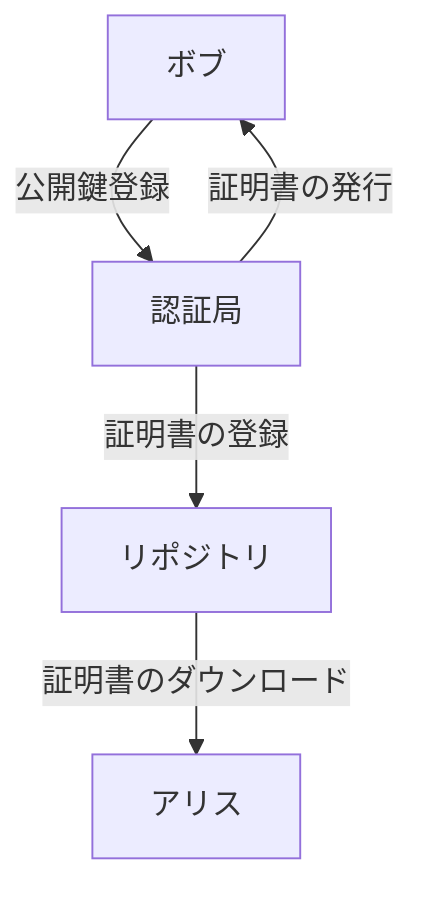
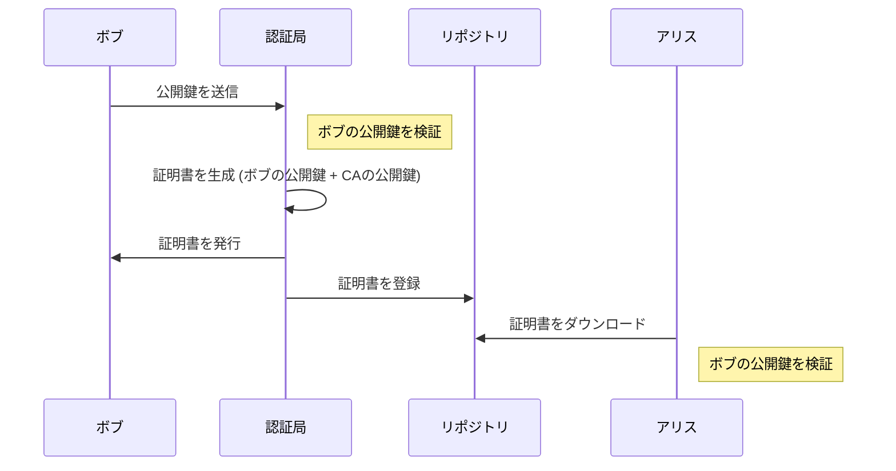

# 公開鍵認証基盤（PKI）

公開鍵を効率的に運用するために定められた規格や仕様の総称で。PKI 自体は単同区の規格や仕様を指すものではない。

## 公開鍵認証基盤（PKI: Public Key Infrastructure） とは

## PKI の構成要素

- 利用者: PKI を利用する人
- 認証局: 証明書を発行する人
- リポジトリ: 証明書を保管しているデータベース

### 構成図

この図は、以下の各要素間の基本的なインタラクションを示しています：

1. **ボブ** - 利用者ボブが認証局に対して公開鍵リクエストを行い、認証局からデジタル証明書を受け取ります。
2. **認証局 (CA)** - 利用者からのリクエストに基づき、デジタル証明書を発行し、リポジトリにその証明書を登録します。
3. **リポジトリ** - 公開された証明書を保存し、利用者が証明書の検証を行う際に参照します。
4. **アリス** - 利用者アリスが検証のために証明書のリポジトリから証明書をダウンロードします。

これにより、利用者アリスはリポジトリに格納された証明書を用いて他の利用者の公開鍵が信頼できるかどうかを確認することができます。また、認証局は利用者ボブの公開鍵と身元を結び付ける重要な役割を担います。

## PKI 利用プロセス

1. **ボブから認証局への公開鍵送信**: ボブは自分の公開鍵を認証局に送信します。
2. **認証局による証明書の生成**: 認証局はボブの公開鍵を受け取り、それを検証した後、ボブの公開鍵と認証局の公開鍵を含むデジタル証明書を生成します。
3. **証明書の発行と登録**: 認証局はボブに証明書を発行し、同時にこの証明書をリポジトリに登録します。
4. **アリスによる証明書のダウンロードと検証**: アリスはリポジトリから証明書をダウンロードし、その証明書に含まれるボブの公開鍵を使用して、ボブからの情報やデータが信頼できるものであるかを検証します。

## 利用者

## 認証局（CA: Certification Authority)

認証局とは、証明書の管理を行う機関のことです。  
認証局は次ようなことを行います。

- 鍵ペアを作成する（利用者自身が作成する場合もある）
- 公開鍵の登録の際に、本人を認証する
- 証明書の作成
- 証明書を破棄する

### 認証局の仕事

#### 鍵ペアの作成

#### 証明書の登録

#### 証明書の破棄と CRL

認証局の`公開鍵の登録`と`本人の認証`を登録局(RA: Registration Authority)という機関に分担させる場合もあり、この場合は認証曲は`証明書の発行`に注力を注げる。

### 階層になった証明書

## リポジトリ(Repository)

リポジトリは、証明証を保村しておき、PKI の利用者が証明書を入手できるようにしたデーターベースのことです。
