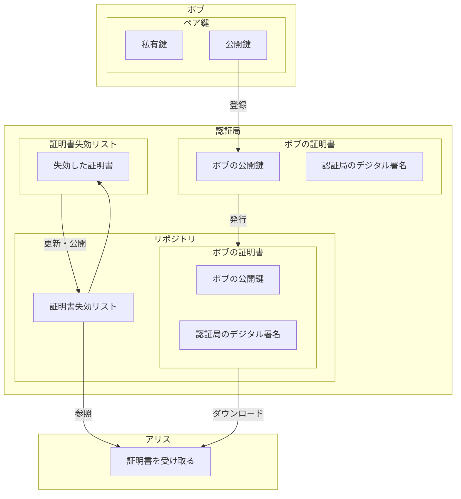
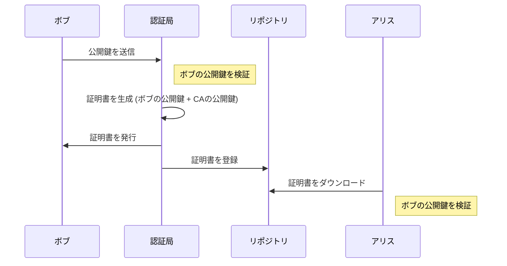

# 公開鍵認証基盤（Public Key Infrastructure:PKI）
公開鍵認証基盤（PKI：Public Key Infrastructure）は、デジタル認証と暗号化技術を用いたセキュリティフレームワークです。インターネット上でのデータの安全な送受信、デジタル署名の確認、暗号化された通信の確立などを可能にする重要な技術です。
PKI自体は規格や仕様を指すものではなく、証明書を誰が発行するのか？私有鍵が漏洩したときに証明書を無効にするにはどうするのか？など、公開鍵を効率的に運用するために定められた規格や仕様の総称です。  

## 公開鍵認証基盤の役割
公開鍵認証基盤（PKI）の役割は、公開鍵の正当性を保証すること

## 公開鍵認証基盤の機能
公開鍵認証基盤（PKI）の役割は公開鍵の正当性を保証する、つまり証明書を発行し以下のような機能を提供することで、通信の安全性を総合的に向上させます。

### 1. 認証
PKIの最も基本的な役割は、通信する当事者の身元を確認し認証することです。デジタル証明書を通じて、個人、サーバー、または組織が本当に主張している通りの正当なものであるかどうかを確認できます。これにより、インターネット上での身元詐欺やなりすましを防ぎます。

### 2. データの暗号化
公開鍵と秘密鍵を用いた暗号化を通じて、データを安全に送受信します。公開鍵を用いてデータを暗号化すると、そのデータは秘密鍵を持つ受信者のみが解読できます。これにより、送信中のデータの機密性が保たれ、第三者によるデータの盗聴や改ざんを防ぎます。

### 3. デジタル署名
デジタル署名は、データが送信された後に第三者によって改ざんされていないことを保証し、データの完整性を確認する手段です。また、署名は送信者の秘密鍵で生成されるため、署名を通じて送信者の身元も認証されます（非否認性）。

### 4. タイムスタンプ
デジタルタイムスタンプを使用することで、デジタルデータが特定の時点で存在していたことを証明できます。これは、契約や合意がいつ成立したかを証明する際など、法的な文書や商取引において非常に重要です。

### 5. 証明書の管理とリボケーション
PKIでは、デジタル証明書のライフサイクル全体（発行、更新、無効化）の管理も重要な役割を担います。証明書が不正に使用されたり、鍵が漏洩したりした場合には、その証明書を無効にすることができます（リボケーション）。これにより、セキュリティを迅速に回復し、リスクを最小限に抑えることが可能です。

これらの役割を通じて、PKIはデジタルエコノミーの基盤となる信頼とセキュリティを提供します。公開鍵と秘密鍵のペア、デジタル証明書、そして認証局の信頼性が組み合わさることで、インターネット上で安全かつ信頼性の高い通信が可能になります。

## 公開鍵認証基盤の構成要素

公開鍵認証基盤（PKI）での主要な構成要素を以下に挙げます。

1. **公開鍵と私有鍵**  
公開鍵と私有鍵のペアを使用します。公開鍵は誰でもアクセス可能で、データの暗号化やデジタル署名の検証に使用されます。対照的に、私有鍵はユーザーのみが保持し、データの復号や自身のデジタル署名の作成に使われます。

2. **認証局（Certificate Authority:CA）**  
デジタル証明書を発行する信頼された機関です。認証局は、公開鍵の所有者の身元を証明し、その公開鍵をデジタル証明書に結びつけて発行します。これにより、通信相手は公開鍵の正当性を信頼できます。

3. **デジタル証明書**  
公開鍵とその所有者の識別情報を含むデジタルファイルです。証明書は認証局によって署名されており、その公開鍵が特定の個人または組織に属していることを証明します。

4. **証明書失効リスト（Certificate Revocation List:CRL）**  
発行されたが、有効期限前に失効した証明書のリストです。証明書が失効する理由には、私有鍵の漏洩、組織の変更、その他のセキュリティ上の問題があります。

5. **証明書リポジトリ**  
証明書や証明書失効リストなどの情報を保存し、公開するシステムです。これにより、利用者は証明書の検証を行う際に必要なデータを参照できます。

### 構成図

## 公開鍵認証基盤のフロー
公開鍵認証基盤（PKI）での運用フローを以下に挙げます。

### フロー図

### 図の説明

- **ボブ (Bob)**: ボブは自分の公開鍵と私有鍵のペアを持っています。公開鍵は認証局に登録されます。
- **認証局 (Auth)**: 認証局はボブの公開鍵を受け取り検証した後、ボブの公開鍵に基づいてデジタル証明書を発行しデジタル署名を行います。また、認証局は証明書失効リスト（CRL）を管理し、失効した証明書の情報を更新します。
- **リポジトリ (Repository)**: リポジトリは認証局から発行された証明書と証明書失効リストを保管し、アリスなどの利用者がアクセスできるようにします。
- **アリス (Alice)**: アリスはリポジトリからボブの証明書をダウンロードし、通信の正当性を確認するために使用します。また、アリスは証明書失効リストを参照して、ダウンロードした証明書が失効していないことを確認します。

この図は、PKI システム内での各コンポーネントの関係と、それらがどのように連携して機能するかを視覚的に示しています。これにより、セキュリティが強化され、信頼性の高いデジタル認証が可能になります。

## 公開鍵認証基盤の利用者

PKI の利用者には、私有鍵の利用者（自分の公開鍵を登録したい人）と、公開鍵の利用者（登録されている公開鍵を使いたい人）の２種類が存在する。

### 私有鍵の利用者

- 鍵ペアを作成する（認証局が作成する場合もある）
- 認証局への手続き

  - 認証局に公開鍵を登録する
  - 認証局から電子証明書を発行してもらう
  - 必要が生じたら認証局に登録した公開鍵を無効にしてもらう

- 受信した暗号文を複合する
- メッセージにデジタル署名を行う

### 公開鍵の利用者

- 最新の CRL を確認して、証明書が有効かどうかを確認する
- メッセージを暗号化して私有鍵の持ち主に送信する
- デジタル署名の検証を行う

## [認証局(Certification Authority:CA)](./CertificationAuthority.md)

認証局とは、電子証明書の管理を行う機関のことです。  
この電子証明書によって公開鍵の真正性を保証します。

認証局は次ようなことを行います。

- 鍵ペアを作成する（利用者自身が作成する場合もある）
- 公開鍵の登録の際に、本人を認証する
- 電子証明書の作成
- 証明書を破棄する

認証局についての詳しくは[こちらを参照](./CertificationAuthority.md)願います。

## リポジトリ(Repository)

リポジトリとは、証明書を配布・保管するサービスや組織を指します。
認証局(CA)とは異なる役割を持つものの、一般的に同じ組織内で管理されることが多いです。
また公開方法については、一般的にディレクトリサーバーが利用されることが多い。

### リポジトリの役割
次の2つをユーザに公開することが役割です。

- [証明書(Public-key Certificate:PKC)](./PublicKeyCertificate.md)の配布
- 証明書の失効リスト(Certificate Revocation List: CRL)の発行
