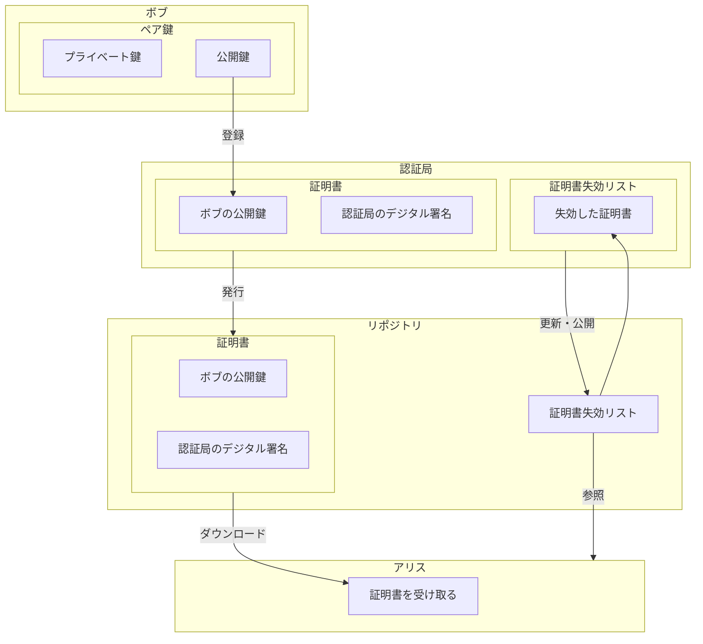
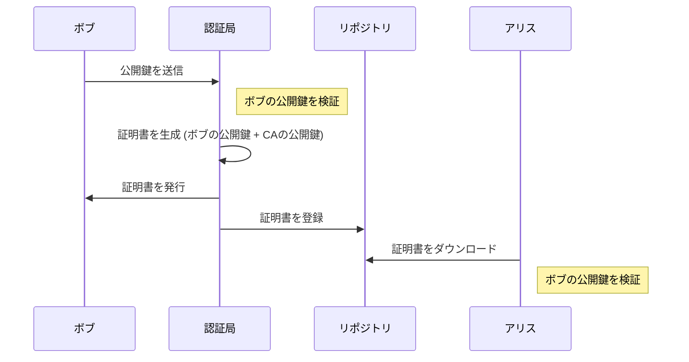

# 公開鍵認証基盤（PKI）

証明書を誰が発行するのか？プライベート鍵が漏洩したときに証明書を無効にするにはどうするのか？など、公開鍵を効率的に運用するために定められた規格や仕様の総称です。  
PKI 自体は単同区の規格や仕様を指すものではありません。

## 公開鍵認証基盤（PKI: Public Key Infrastructure） とは

公開鍵認証基盤（PKI：Public Key Infrastructure）は、デジタル認証と暗号化技術を用いたセキュリティフレームワークです。インターネット上でのデータの安全な送受信、デジタル署名の確認、暗号化された通信の確立などを可能にする重要な技術です。具体的には、以下の要素から構成されます：

### 主要な要素

1. **公開鍵と秘密鍵**

   - 公開鍵と秘密鍵のペアを使用します。公開鍵は誰でもアクセス可能で、データの暗号化やデジタル署名の検証に使用されます。対照的に、秘密鍵はユーザーのみが保持し、データの復号や自身のデジタル署名の作成に使われます。

2. **認証局（CA：Certificate Authority）**

   - デジタル証明書を発行する信頼された機関です。認証局は、公開鍵の所有者の身元を証明し、その公開鍵をデジタル証明書に結びつけて発行します。これにより、通信相手は公開鍵の正当性を信頼できます。

3. **デジタル証明書**

   - 公開鍵とその所有者の識別情報を含むデジタルファイルです。証明書は認証局によって署名されており、その公開鍵が特定の個人または組織に属していることを証明します。

4. **証明書失効リスト（CRL：Certificate Revocation List）**

   - 発行されたが、有効期限前に失効した証明書のリストです。証明書が失効する理由には、秘密鍵の漏洩、組織の変更、その他のセキュリティ上の問題があります。

5. **証明書リポジトリ**
   - 証明書や証明書失効リストなどの情報を保存し、公開するシステムです。これにより、利用者は証明書の検証を行う際に必要なデータを参照できます。

### 構成図

### 図の説明

- **ボブ (Bob)**: ボブは自分の公開鍵とプライベート鍵のペアを持っています。公開鍵は認証局に登録されます。
- **認証局 (Auth)**: 認証局はボブの公開鍵に基づいてデジタル証明書を発行し、デジタル署名を行います。また、認証局は証明書失効リスト（CRL）を管理し、失効した証明書の情報を更新します。
- **リポジトリ (Repository)**: リポジトリは認証局から発行された証明書と証明書失効リストを保管し、アリスなどの利用者がアクセスできるようにします。
- **アリス (Alice)**: アリスはリポジトリからボブの証明書をダウンロードし、通信の正当性を確認するために使用します。また、アリスは証明書失効リストを参照して、ダウンロードした証明書が失効していないことを確認します。

この図は、PKI システム内での各コンポーネントの関係と、それらがどのように連携して機能するかを視覚的に示しています。これにより、セキュリティが強化され、信頼性の高いデジタル認証が可能になります。

### 機能と利点

- **暗号化**: PKI はデータを安全に暗号化し、第三者によるデータの閲覧や改ざんを防ぎます。
- **デジタル署名**: 文書や電子メールの真正性と改ざん防止を保証します。
- **セキュリティプロトコルのサポート**: SSL/TLS などのセキュリティプロトコルで使用され、安全なウェブ通信を保証します。
- **認証**: ユーザーやデバイスが正当であることを確認し、不正アクセスを防ぎます。

PKI は、金融機関、政府機関、ヘルスケア業界など、セキュリティが極めて重要なあらゆる分野で利用されています。

## PKI 利用プロセス

1. **ボブから認証局への公開鍵送信**: ボブは自分の公開鍵を認証局に送信します。
2. **認証局による証明書の生成**: 認証局はボブの公開鍵を受け取り、それを検証した後、ボブの公開鍵と認証局の公開鍵を含むデジタル証明書を生成します。
3. **証明書の発行と登録**: 認証局はボブに証明書を発行し、同時にこの証明書をリポジトリに登録します。
4. **アリスによる証明書のダウンロードと検証**: アリスはリポジトリから証明書をダウンロードし、その証明書に含まれるボブの公開鍵を使用して、ボブからの情報やデータが信頼できるものであるかを検証します。

## 利用者

PKI の利用者には、プライベート鍵の利用者（自分の公開鍵を登録したい人）と、公開鍵の利用者（登録されている公開鍵を使いたい人）の２種類が存在する。

### プライベート鍵の利用者

- 鍵ペアを作成する（認証局が作成する場合もある）
- 認証局への手続き

  - 認証局に公開鍵を登録する
  - 認証局から証明書を発行してもらう
  - 必要が生じたら認証局に登録した公開鍵を無効にしてもらう

- 受信した暗号文を複合する
- メッセージにデジタル署名を行う

### 公開鍵の利用者

- 最新の CRL を確認して、証明書が有効かどうかを確認する
- メッセージを暗号化してプライベート鍵の持ち主に送信する
- デジタル署名の検証を行う

## 認証局(CA: Certification Authority)

認証局とは、証明書の管理を行う機関のことです。  
認証局は次ようなことを行います。

- 鍵ペアを作成する（利用者自身が作成する場合もある）
- 公開鍵の登録の際に、本人を認証する
- 証明書の作成
- 証明書を破棄する

認証局の仕事のうち、`公開鍵の登録と本人の認証登録局`を行う、`登録局(RA: registration authority)`という期間に分担させる場合もあります。

### 鍵ペアの作成

利用者の鍵ペアの作成は、以下の２通りあります。

- PKI の利用者が行う
- 認証局が行なう

認証局が行う場合は、鍵ペアを作成したのち、そのプライベート鍵を利用者に送ります。これには RFC7292(PKCS#12)という規格で行います。

#### RFC 7292

RFC 7292 は、「PKIX Certificate Management over CMS (CMC)」というタイトルの RFC です。この RFC は、PKIX（Public-Key Infrastructure using X.509）証明書管理に関する CMS（Cryptographic Message Syntax）を使用するための標準化されたプロトコルである CMC に関するものです。

具体的には、この RFC は以下の主な内容を含んでいます：

1. CMC プロトコルの概要と目的
2. CMC メッセージの構造とフォーマット
3. CMC メッセージの構築と処理に関する要件とガイドライン
4. CMC のセキュリティの考慮事項と推奨事項

CMC は、PKIX 証明書管理のための標準的なプロトコルであり、証明書の要求、更新、再発行、および取り消しといった証明書関連の操作をサポートします。RFC 7292 は、これらの操作を CMS を使用して行うための手順と規格を定義し、PKIX における証明書管理の標準化に貢献しています。

#### PKCS #12

PKCS #12 は、「Personal Information Exchange Syntax Standard」として知られる、個人情報交換構文の標準です。PKCS #12 は、個人情報（証明書、秘密鍵、および他の秘密データ）を 1 つのファイルにエンコードし、安全に交換するための標準化された形式を定義します。

PKCS #12 ファイルは一般的に「.pfx」または「.p12」の拡張子を持ちます。PKCS #12 ファイルは、以下のようなセキュリティ関連のアプリケーションで使用されます。

1. **証明書のエクスポートとインポート**:
   PKCS #12 は、証明書や秘密鍵を含む個人情報をエクスポートし、別のシステムにインポートするために使用されます。これは、証明書と秘密鍵のセットを 1 つのファイルにまとめ、安全に転送したり、バックアップしたりするのに便利です。

2. **SSL/TLS サーバーの設定**:
   SSL/TLS サーバーは、PKCS #12 ファイルを使用して証明書と秘密鍵を読み込み、サーバーの設定を行います。これにより、サーバー管理者は簡単に証明書と秘密鍵を一緒に管理できます。

3. **デジタル署名**:
   PKCS #12 ファイルは、デジタル署名のための証明書と秘密鍵を格納するために使用されます。これにより、個人がデジタル文書に署名したり、認証したりするのに便利です。

PKCS #12 ファイルは、証明書や秘密鍵といった個人情報をパスワードで保護することができます。これにより、機密情報が安全に保管され、不正なアクセスから保護されます。

### 証明書の登録

利用者が鍵ペアを作った場合、利用者は認証局に証明書の作成依頼を行います。この時、RFC 2986 という規格で行います。

#### RFC 2986

RFC 2986 は、「PKCS #10: Certification Request Syntax Specification Version 1.7」というタイトルの RFC です。PKCS は「Public-Key Cryptography Standards」の略で、公開鍵暗号化の標準化を目的とするシリーズです。RFC 2986 では、PKCS #10 として知られる証明書リクエストの構文仕様が定義されています。

具体的には、RFC 2986 は以下の内容を含んでいます：

1. PKCS #10 の概要と目的
2. 証明書リクエストの構文とフォーマット
3. 証明書リクエストのフィールドや属性の説明
4. 証明書署名要求の生成と処理に関するガイドライン
5. サンプルの証明書リクエストの形式

PKCS #10 は、証明書の発行や更新などの操作を行うために、証明書の申請者が認証局（CA）に送信するリクエストの形式を定義しています。この RFC は、PKCS #10 のバージョン 1.7 に関する標準化された構文仕様を提供し、公開鍵インフラストラクチャ（PKI）における証明書の要求と処理の手順を定義しています。

#### PKCS #10

PKCS #10 は、「Certification Request Syntax Standard」として知られる、証明書リクエストの構文規格です。この標準は、公開鍵インフラストラクチャ（PKI）で使用される証明書リクエストの形式を定義しています。証明書リクエストは、証明書の発行や更新などの操作を行うために、証明書の申請者が認証局（CA）に送信するリクエストの形式を指します。

具体的には、PKCS #10 は以下の内容を定義しています：

1. **証明書リクエストの構文**: 証明書リクエストの構造とフォーマットが定義されています。これには、申請者の公開鍵やサブジェクト情報、署名アルゴリズムなどが含まれます。

2. **証明書リクエストの属性**: 証明書リクエストに付加される追加情報や属性が定義されています。これには、拡張キー使用法や拡張属性などが含まれます。

3. **証明書リクエストの生成と処理**: 証明書リクエストの生成や処理に関する要件やガイドラインが記述されています。これには、署名の生成や証明書リクエストの送信方法などが含まれます。

PKCS #10 フォーマットは一般的に ASN.1（Abstract Syntax Notation One）形式で記述されます。ASN.1 はデータ構造を記述するための標準的な形式であり、PKCS #10 は ASN.1 で定義されたデータ構造を使用しています。

PKCS #10 は、PKI における証明書の要求と処理のための標準的な形式を提供し、証明書の発行や更新などの操作を行うために広く使用されています。

### 証明書の破棄と CRL

利用者が以下の理由などで証明書を無効にしたい場合、認証局は証明書を破棄して無効にする必要があります。

- 利用者がプライベート鍵を紛失した
- 利用者のプライベート鍵が漏洩した
- （退職等で）利用者のプライベート鍵の利用権限がなくなった

証明書のコピーが利用者の手元に残っている場合があり、デジタルデータの証明書は、リポジトリから削除しただけでは破棄したことになはならないので、このような仕組みを取ります。

証明書を破棄する場合は、RFC 5280 に定められた、証明書破棄リスト(CRL: certificate revocation list)を作成します。CRL は破棄された証明書のシリアル番号の一覧で、そのシリアル番号は、証明書の中に記載されているものです。

利用者は最新の CRL を確認して、証明書が有効かどうかを確認する必要があります。

### 認証局(CA)の公開鍵証明書は誰が保証する？

利用者の公開鍵証明書は、認証局のデジタル署名を施して作成します。
この認証局の公開鍵証明書は他の認証局が発行し保証します。

#### ルート CA

ルート CA（Certificate Authority）は、PKI（Public Key Infrastructure）における最上位の認証局です。ルート CA は、信頼される中心的な認証局であり、他のすべての証明書発行者や CA がその信頼性を基準としています。主な特徴は次の通りです。

1. **信頼性と信頼鎖の基盤**: ルート CA は信頼性が非常に高い認証局であり、その証明書は通常、ブラウザやオペレーティングシステムなどの信頼されたルートストアに含まれています。他の CA は、そのルート CA の証明書を信頼して、それに基づいて自身の証明書を発行します。これにより、証明書の信頼鎖（chain of trust）が確立されます。

2. **証明書発行の責任**: ルート CA は自己署名証明書を持ち、自己署名証明書を使用して自身を証明することができます。そのため、ルート CA は自身の信頼性に関して外部機関に依存する必要がありません。また、ルート CA は証明書を直接発行することもありますが、通常は中間 CA に証明書発行を委任します。

3. **セキュリティと物理的保護**: ルート CA の秘密鍵は非常に重要であり、適切に保護する必要があります。通常、ルート CA の秘密鍵はハードウェアセキュリティモジュール（HSM）などの厳格な物理的および論理的な保護手段で保管されます。これにより、秘密鍵が不正にアクセスされたり盗まれたりするリスクが最小限に抑えられます。

4. **更新と信頼性の維持**: ルート CA の証明書の有効期限が切れると、その信頼性は失われます。そのため、ルート CA は定期的に自己署名証明書を更新し、その証明書の信頼性を維持します。証明書の更新時には、新しい証明書が適切にディストリビューションされる必要があります。

ルート CA は PKI の中心的な要素であり、その信頼性とセキュリティはインターネット上での通信や電子取引の安全性に大きく影響します。

## リポジトリ(Repository)

リポジトリは、証明証と CRL を保村しておき、PKI の利用者が証明書を入手できるようにしたデーターベースのことです。証明書ディレクトリと呼ばれることもあります。
