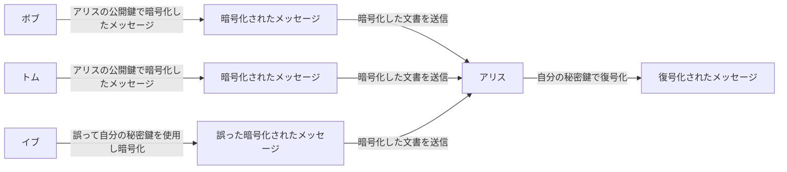
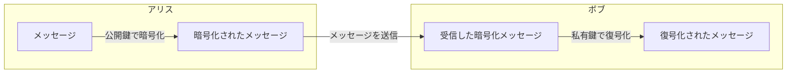
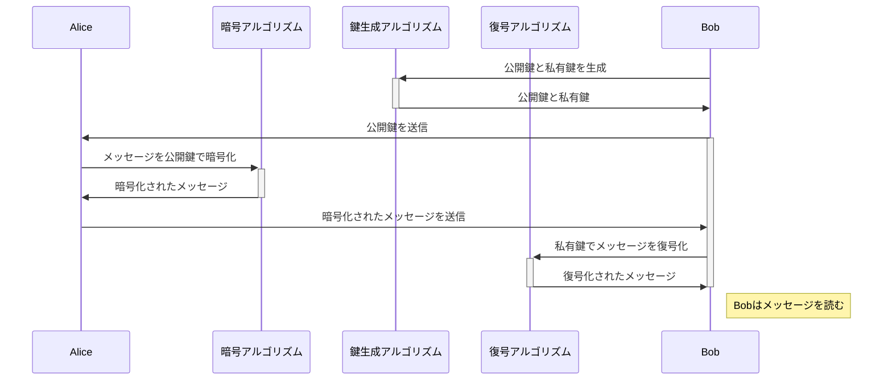

# 公開鍵暗号（Public Key Encryption:PKE）

公開鍵暗号とは[公開鍵暗号方式](VariousCryptographyMethods.md#公開鍵暗号方式public-key-cryptography-pkc)にて、データの暗号化やデジタル署名の生成と検証、認証など、多岐にわたる用途で利用されます。
ここでは公開鍵暗号方式にて、暗号化を行うことについて詳しく説明します。

> ![NOTE]
> 公開鍵暗号方式(Public Key Cryptography)は広い意味でのフレームワークまたは体系を指し、公開鍵暗号(Public Key Encryption)はその中の特定のアクション（データの暗号化と復号）に注目した用語です。

## 公開鍵暗号の目的
公開鍵暗号は、電子データや文書を安全に受信者に送信し、第三者による読取りを防ぐために使用されます。  
任意の人が受信者の公開鍵を用いてメッセージを暗号化し、受信者のみが自身の秘密鍵でメッセージを解読できるようにすることが目的です。

この目的を実現するために必要な条件は以下の通りです。

1. **機密性（Confidentiality）**:  
受信者の公開鍵を使って暗号化されたデータは、受信者自身の秘密鍵でのみ解読可能であること。これにより、データが送信途中で第三者によって読まれるのを防ぎます。

2. **鍵管理（Key Management）**:  
受信者の公開鍵が正確かつ安全に配布され、誰でもアクセスできること。また、秘密鍵は厳重に保護され、受信者のみがアクセスできること。

3. **アクセス制御（Access Control）**:  
秘密鍵の使用が厳格に管理され、無許可のアクセスや秘密鍵の漏洩が防がれるよう適切なセキュリティ措置が講じられていること。

これらの条件は、公開鍵暗号が意図した目的で効果的に機能するために不可欠です。機密性、鍵管理、そしてアクセス制御の確保が、公開鍵暗号システムの安全性と信頼性の基盤となります。

## 公開鍵暗号が保証するもの
公開鍵暗号を使用することで、以下のようにデータや通信のセキュリティを「機密性」と「正当な受信者によるアクセス」の面で保証します。

### 「機密性」を保証する
公開鍵暗号によって暗号化されたデータは、対応する秘密鍵を持つ受信者のみが解読できます。これにより、データが不正アクセスや盗聴から保護され、通信の機密性が確保されます。

### 「正当な受信者によるアクセス」を保証する
公開鍵暗号では、受信者の公開鍵によってのみデータを暗号化することができ、この鍵に対応する秘密鍵を持つ受信者だけがそのデータを復号できます。これにより、送信されたデータにアクセスできるのは正当な受信者だけであることを保証します。

## 公開鍵暗号における鍵の役割
公開鍵暗号化では、各ユーザーは「公開鍵（暗号化鍵）」と「私有鍵（複合化鍵）」という二つの鍵を持ちます。公開鍵は他人と共有することができる鍵で、私有鍵は個人が秘密に保持する鍵です。  

|鍵の種類|利用者|役割|目的|利用方法|
|---|---|---|---|---|
|公開鍵|公開鍵を知っている誰でも|暗号化|情報の機密性を保持|誰でもアクセス可能な公開鍵を用いて情報を暗号化し、その情報を秘密鍵を持つ特定の受信者だけが解読できるようにします|
|秘密鍵|秘密鍵(私有鍵: private key)の所有者|復号化|公開鍵で暗号化された情報を解読|秘密鍵の所有者だけが公開鍵で暗号化されたデータを解読できます。これにより、データの機密性が保たれ、安全に情報を受け取ることができます。|

### 公開鍵暗号フローでの鍵の扱い
送信者が暗号化の鍵（公開鍵）を使って暗号化し、受信者が複合化の鍵（私有鍵）を利用して複合します。  
この 2 つの鍵を 1 つのペアとして暗号化の鍵（公開鍵）と複合化の鍵（私有鍵）を分けて利用します。  
暗号化は公開鍵を持っている人なら誰でも暗号化できますが、私有鍵を持っている受信者しか解読で来ません。



> [!NOTE] ここでのポイントは
> - 公開鍵を持っているどの誰もがメッセージを暗号化して送ることができます。
> - 暗号化されたメッセージを読むことができるのは私有鍵を持っている受信者のみです。


## 鍵配送問題とは
公開鍵暗号方式は鍵配送問題を解決するために考案されました。ではこの鍵配送問題とはなんでしょうか？

（暗号化及び復号化を同じ鍵で行う）対称暗号によって暗号化すると以下の点において問題が生じます。

- 鍵の事前共有: 鍵を盗まれないように事前に送信者及び受信者両方に鍵を配布し共有しておかならない。

- 鍵の管理: 送信者及び受信者双方で鍵が漏洩しないように管理しなければいけない。

### 鍵配送問題を解決

暗号化において、鍵配送問題を以下の条件により解決を行なったものが公開鍵暗号です。

- 送信者が必要なのは暗号化の鍵だけである

- 受信者が必要なのは複合化の鍵だけである

- 盗聴者に知られて困るのは複合化の鍵である

- 暗号化の鍵は盗聴者に知られてもかまわない

つまり、受信者が最初から複合化の鍵を手元においておき、送信者が暗号化の鍵を手に入れることができた場合に鍵配送問題は解決します。

## 公開鍵暗号でも解決できない問題

入手した暗号化の鍵（公開鍵）が本当に正しい暗号化の鍵（公開鍵）かを判別する必要があります。  
そこで、認証済みの公開鍵であることを証明したものを、[公開鍵の証明書(PKC)](PublicKeyCertificate.md)と言います。  
この認証を行こなう仕組みを[公開鍵認証基盤(PKI)](PublicKeyCryptographyInfrastructure.md)

## 暗号と復号のプロセス

この例では、Alice が Bob にメッセージを暗号化して送信するプロセスを描いています。

### フロー図
アリスは公開鍵で暗号化し、ボブは私有鍵で復号します。



### シーケンス図



### プロセス全体の説明

1. **鍵生成アルゴリズム（KeyGen）**:  
ボブは鍵生成アルゴリズムを使用して公開鍵と私有鍵を生成します。このステップはセキュリティの基盤を形成し、通信のセキュリティを保証するために不可欠です。

2. **公開鍵の送信**:  
生成された公開鍵はアリスに送信されます。この公開鍵は、アリスがメッセージをボブへ安全に送信するために使用されます。

3. **暗号アルゴリズム（Encrypt）**:  
アリスはボブから受け取った公開鍵を使って、送信したいメッセージを暗号化します。暗号化プロセスはメッセージの内容を保護し、第三者による不正アクセスを防ぎます。

4. **メッセージの送信**:  
暗号化されたメッセージはボブに送信されます。ß

5. **復号アルゴリズム（Decrypt）**:  
ボブは自分の私有鍵を使用して、受信した暗号化されたメッセージを復号化します。このステップにより、ボブはメッセージの内容を安全に読むことができます。

## 暗号化の具体的な実例

OpenSSL を使用して公開鍵暗号方式でファイルやデータを暗号化・復号するプロセスは、公開鍵と私有鍵のペアを使います。ここでは具体的なコマンド例を通じて、ファイルの暗号化と復号の手順を説明します。

### 1. 鍵ペアの生成
まず、RSA 鍵ペア（公開鍵と私有鍵）を生成します。以下のコマンドを使用して、2048 ビットの RSA 鍵を生成できます。

```sh
openssl genpkey -algorithm RSA -out private_key.pem -pkeyopt rsa_keygen_bits:2048
openssl rsa -pubout -in private_key.pem -out public_key.pem
```

このコマンドは、私有鍵をprivate_key.pemに、対応する公開鍵をpublic_key.pemに保存します。

### 2. 公開鍵を使用した暗号化
次に、公開鍵public_key.pemを使用してファイルを暗号化します。例えばexample.txtというファイルを暗号化するには、次のコマンドを使用します。

```sh
openssl rsautl -encrypt -inkey public_key.pem -pubin -in example.txt -out encrypted.dat
```

このコマンドはexample.txtの内容を暗号化し、その結果をencrypted.datに保存します。

### 3. 私有鍵を使用した復号
最後に、私有鍵private_key.pemを使用して暗号化されたファイルencrypted.datを復号します。

```sh
openssl rsautl -decrypt -inkey private_key.pem -in encrypted.dat -out decrypted.txt
```

このコマンドはencrypted.datを復号し、元の内容をdecrypted.txtに保存します。


> [!CAUTION] 注意点
> - openssl rsautlコマンドは比較的小さいデータサイズの暗号化に適しています。例えば、2048 ビット（256 バイト）の RSA 鍵を使用する場合、通常、最大で 245 バイト程度のデータしか暗号化できません。ファイルサイズが大きい場合は、データを分割するか、または AES などの対称鍵暗号方式でファイルを暗号化し、その鍵を公開鍵で暗号化するハイブリッド方式を検討してください。
> - この例ではシンプルな RSA 暗号を使用していますが、実際のセキュリティ要件に応じて適切な設定やオプションを選択することが重要です。

これらのコマンドを利用することで、OpenSSL を使った基本的な公開鍵暗号化と復号のプロセスを実行できます。

## 大きなファイルを暗号化する実践例（ハイブリッド暗号化の使用）

openssl rsautl は小さなデータの暗号化に適していますが、大きなファイルを暗号化する必要がある場合は、ハイブリッド暗号化アプローチが一般的です。この方法では、RSA を使用して対称鍵暗号化の鍵（例えば、AES 鍵）を暗号化し、その対称鍵でファイル全体を暗号化します。

### 1. 対称鍵の生成とファイル暗号化

```sh
openssl rand -base64 32 > aes_key.bin
openssl enc -aes-256-cbc -in largefile.txt -out largefile.enc -pass file:aes_key.bin
```

### 2. 対称鍵の RSA 暗号化

```sh
openssl rsautl -encrypt -inkey public_key.pem -pubin -in aes_key.bin -out encrypted_key.bin
```

### 3. 暗号化された鍵を復号

```sh
openssl rsautl -decrypt -inkey private_key.pem -in encrypted_key.bin -out decrypted_aes_key.bin
```
### 4. ファイルの復号

```sh
openssl enc -aes-256-cbc -d -in largefile.enc -out largefile_decrypted.txt -pass file:decrypted_aes_key.bin
```

以上の方法で、openssl rsautl の容量制限を回避しつつ、大きなファイルも安全に暗号化・転送することが可能です。


## 公開鍵暗号の用途

公開鍵暗号方式（非対称鍵暗号方式）は、次のような用途に広く利用されます：

1. **データの暗号化と復号**:  
公開鍵を使用してデータを暗号化し、対応する秘密鍵でそのデータを復号します。これにより、第三者がデータを読むことを防ぎます。

2. **セキュアな鍵配布**:  
データを暗号化するための共通鍵（対称鍵）を交換する際に公開鍵暗号方式を利用します。これにより、安全な通信チャンネルを確立できます。

3. **認証プロトコル**:  
ユーザーまたはデバイスの身元を確認するために使用されます。例えば、SSL/TLSなどのセキュアな通信プロトコルで広く使われています。
