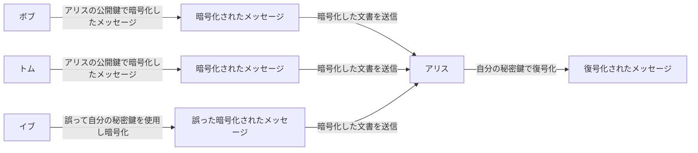
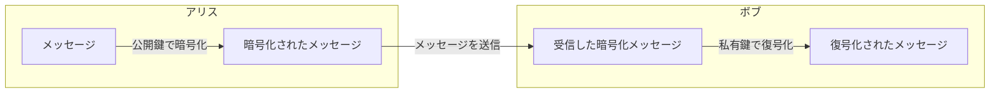
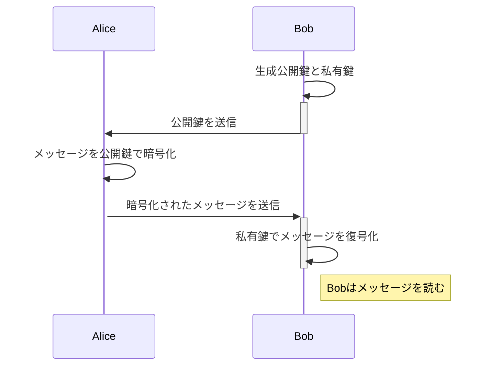

# 公開鍵暗号（Public Key Encryption: PKE）

公開鍵暗号とは[公開鍵暗号方式](VariousCryptographyMethods.md#公開鍵暗号方式public-key-cryptography-pkc)にて、データの暗号化やデジタル署名の生成と検証、認証など、多岐にわたる用途で利用されます。
ここでは公開鍵暗号方式にて、暗号化を行うことについて詳しく説明します。

> ![NOTE]
> 公開鍵暗号方式(Public Key Cryptography)は広い意味でのフレームワークまたは体系を指し、公開鍵暗号(Public Key Encryption)はその中の特定のアクション（データの暗号化と復号）に注目した用語です。

## 公開鍵暗号の目的
公開鍵暗号の目的は、メッセージを安全に受信者に送信し、第三者に読まれることを防ぐことです。  
任意の人が受信者の公開鍵を用いて暗号化を実行し、受信者のみが自身の私有鍵でメッセージを解読できるようにします。

## 暗号での公開鍵暗号の利用手法

暗号化の利用では、受信者の公開鍵で暗号化する。  
よってこの私有鍵を持っている受信者しか解読できない。  
暗号化は公開鍵を持っている人なら誰でも暗号化できる。

### 暗号化と復号に使う鍵と使える人

|使用する鍵|解読できる人|実行できる人|
|---|---|---|
|受信者の公開鍵で暗号化|その私有鍵を持っている受信者のみ|公開鍵を知っている誰でも|

### 公開鍵暗号の利用フロー


> [!NOTE] ここでのポイントは
> - 公開鍵を持っているどの誰もがメッセージを暗号化して送ることができます。
> - 暗号化されたメッセージを読むことができるのは私有鍵を持っている受信者のみです。


## デジタル署名における鍵の役割
送信者が暗号化の鍵（公開鍵）を使って暗号化し、受信者が複合化の鍵（私有鍵）を利用して複合します。  
この 2 つの鍵を 1 つのペアとして暗号化の鍵（公開鍵）と複合化の鍵（私有鍵）を分けて利用します。

|鍵の種類|利用用途|説明|
|---|---|---|
|公開鍵|暗号化|暗号化の鍵は一般に公開することができるので、公開鍵(public key)と呼びます。|
|私有鍵(秘密鍵)|複合化|複合化の鍵は絶対に公開してはいけないため、私有鍵(私有鍵: private key)といいます。|

## 　鍵配送問題とは
公開鍵暗号方式は鍵配送問題を解決するために考案されました。ではこの鍵配送問題とはなんでしょうか？

（暗号化及び復号化を同じ鍵で行う）対称暗号によって暗号化すると以下の点において問題が生じます。

- 鍵の事前共有: 鍵を盗まれないように事前に送信者及び受信者両方に鍵を配布し共有しておかならない。
- 鍵の管理: 送信者及び受信者双方で鍵が漏洩しないように管理しなければいけない。

### 鍵配送問題を解決

暗号化において、鍵配送問題を以下の条件により解決を行なったものが公開鍵暗号です。

- 送信者が必要なのは暗号化の鍵だけである
- 受信者が必要なのは複合化の鍵だけである
- 盗聴者に知られて困るのは複合化の鍵である
- 暗号化の鍵は盗聴者に知られてもかまわない

つまり、受信者が最初から複合化の鍵を手元においておき、送信者が暗号化の鍵を手に入れることができた場合に鍵配送問題は解決します。

### 公開鍵暗号でも解決できない問題

入手した暗号化の鍵（公開鍵）が本当に正しい暗号化の鍵（公開鍵）かを判別する必要がある。
公開鍵の認証が必要が出てくる。

## 暗号のプロセス

この例では、Alice が Bob にメッセージを暗号化して送信するプロセスを描いています。




### シーケンス図



この図は以下のステップを表しています：

1. **公開鍵と私有鍵の生成**：Bob は公開鍵と私有鍵のペアを生成します。
2. **公開鍵の送信**：Bob はその公開鍵を Alice に送信します。
3. **メッセージの暗号化**：Alice は Bob から受け取った公開鍵を使ってメッセージを暗号化します。
4. **暗号化されたメッセージの送信**：Alice はその暗号化されたメッセージを Bob に送信します。
5. **メッセージの復号化**：Bob は自分の私有鍵を使って受け取ったメッセージを復号化します。
6. **メッセージの読取り**：復号化後、Bob はメッセージを読むことができます。

## 暗号化の実践例

OpenSSL を使用して公開鍵暗号方式でファイルやデータを暗号化・復号するプロセスは、公開鍵と私有鍵のペアを使います。ここでは具体的なコマンド例を通じて、ファイルの暗号化と復号の手順を説明します。

### 1. 鍵ペアの生成

まず、RSA 鍵ペア（公開鍵と私有鍵）を生成します。以下のコマンドを使用して、2048 ビットの RSA 鍵を生成できます。

```sh
openssl genpkey -algorithm RSA -out private_key.pem -pkeyopt rsa_keygen_bits:2048
openssl rsa -pubout -in private_key.pem -out public_key.pem
```

このコマンドは、私有鍵をprivate_key.pemに、対応する公開鍵をpublic_key.pemに保存します。

### 2. 公開鍵を使用した暗号化

次に、公開鍵public_key.pemを使用してファイルを暗号化します。例えばexample.txtというファイルを暗号化するには、次のコマンドを使用します。

```sh
openssl rsautl -encrypt -inkey public_key.pem -pubin -in example.txt -out encrypted.dat
```

このコマンドはexample.txtの内容を暗号化し、その結果をencrypted.datに保存します。

### 3. 私有鍵を使用した復号

最後に、私有鍵private_key.pemを使用して暗号化されたファイルencrypted.datを復号します。

```sh
openssl rsautl -decrypt -inkey private_key.pem -in encrypted.dat -out decrypted.txt
```

このコマンドはencrypted.datを復号し、元の内容をdecrypted.txtに保存します。

### 注意点

- openssl rsautlコマンドは比較的小さいデータサイズの暗号化に適しています。例えば、2048 ビット（256 バイト）の RSA 鍵を使用する場合、通常、最大で 245 バイト程度のデータしか暗号化できません。ファイルサイズが大きい場合は、データを分割するか、または AES などの対称鍵暗号方式でファイルを暗号化し、その鍵を公開鍵で暗号化するハイブリッド方式を検討してください。
- この例ではシンプルな RSA 暗号を使用していますが、実際のセキュリティ要件に応じて適切な設定やオプションを選択することが重要です。

これらのコマンドを利用することで、OpenSSL を使った基本的な公開鍵暗号化と復号のプロセスを実行できます。

### 大きなファイルの暗号化

openssl rsautl は小さなデータの暗号化に適していますが、大きなファイルを暗号化する必要がある場合は、ハイブリッド暗号化アプローチが一般的です。この方法では、RSA を使用して対称鍵暗号化の鍵（例えば、AES 鍵）を暗号化し、その対称鍵でファイル全体を暗号化します。

#### 例：ハイブリッド暗号化の使用

1. **対称鍵の生成とファイル暗号化**:


```sh
   openssl rand -base64 32 > aes_key.bin
   openssl enc -aes-256-cbc -in largefile.txt -out largefile.enc -pass file:aes_key.bin
```

2. **対称鍵の RSA 暗号化**:

```sh
   openssl rsautl -encrypt -inkey public_key.pem -pubin -in aes_key.bin -out encrypted_key.bin
```

3. 送信されるのは largefile.enc と encrypted_key.bin の 2 つのファイルです。受信者は RSA で暗号化された鍵を復号してから、その鍵を使用してファイルを復号します。

以上の方法で、openssl rsautl の容量制限を回避しつつ、大きなファイルも安全に暗号化・転送することが可能です。
