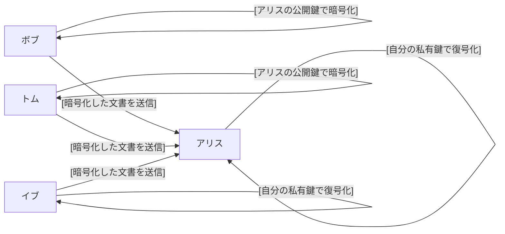
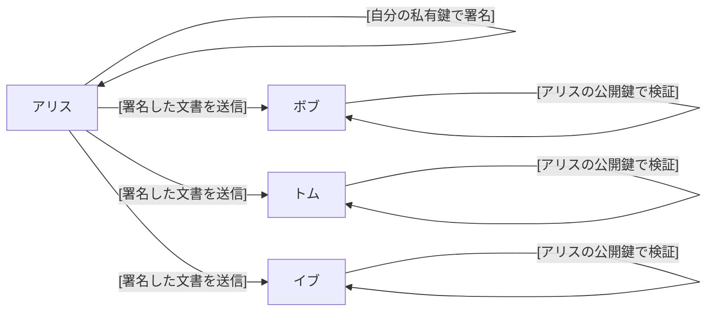

# 暗号化とデジタル署名の関係

公開鍵暗号方式の利用方法

公開鍵暗号方式は、セキュリティが必要な通信で広く使用されている技術です。この方式では、主に「暗号化」と「デジタル署名」の 2 つの用途で利用されます。ここではそれぞれについて簡単に説明します。

## 暗号化

公開鍵暗号化では、各ユーザーは「公開鍵（暗号化鍵）」と「私有鍵（複合化鍵）」という二つの鍵を持ちます。公開鍵は他人と共有することができる鍵で、私有鍵は個人が秘密に保持する鍵です。

### 暗号化の目的と主体

メッセージは安全に受信者に送信され、第三者による読取りが防がれます。

- 目的: メッセージを安全に送信し、第三者に読まれることを防ぐ。
- 主体: 任意の人が受信者の公開鍵を用いて暗号化を実行し、受信者のみが自身の私有鍵でメッセージを解読できる。

#### 暗号での公開鍵暗号の利用手法

暗号化の利用では、受信者の公開鍵で暗号化する。  
よってこの私有鍵を持っている受信者しか解読できない。  
暗号化は公開鍵を持っている人なら誰でも暗号化できる。

- 使用する鍵: 受信者の公開鍵で暗号化。
- 解読できる人: その私有鍵を持っている受信者のみ。
- 実行できる人: 公開鍵を知っている誰でも。

#### ここでのポイントは

- 公開鍵を持っているどの誰もがメッセージを暗号化して送ることができます。
- 暗号化されたメッセージを読むことができるのは私有鍵を持っている受信者のみです。

## デジタル署名

デジタル署名は、文書やメッセージが改ざんされていないことを確認し、送信者が本人であることを証明するために使用されます。

公開鍵暗号では、暗号化の手法と逆に私有鍵で暗号化することで実現します

### 署名の目的と主体

メッセージが改ざんされずに送信されたこと、およびそのメッセージが特定の送信者によって送られたことを保証します。

- 目的: メッセージの真正性と送信者の身元を証明する。
- 主体: 送信者が自分の私有鍵を使ってメッセージの署名を行い、誰でも送信者の公開鍵で署名の検証が可能。

#### 署名での公開鍵暗号の利用手法

デジタル署名の利用では、自分の私有鍵を使用してメッセージのハッシュ（要約）を暗号化し、
公開鍵を持っている誰もが解読することが可能です。  
ただし暗号化は本人は私有鍵を持っている本人しかできない。

- 使用する鍵: 自分の私有鍵を使用してメッセージのハッシュを暗号化（署名を生成）。
- 解読できる人: その公開鍵を知っている誰でも（署名を検証）。
- 実行できる人: 私有鍵を持っている本人のみ。

#### ここでのポイントは

- 署名を行えるのは、私有鍵を持っている送信者のみです。
- 署名を検証できるのは、送信者の公開鍵を持っているどの誰もが署名の検証を行えます。

## 公開鍵暗号とデジタル署名の鍵の使い方

|              | プライベート（秘密）鍵   | 公開鍵                         |
| ------------ | ------------------------ | ------------------------------ |
| 公開鍵暗号   | 受信者が複合化に使う     | 送信者たちが暗号化に使う       |
| デジタル署名 | 署名者が署名の作成に使う | 検証者たちが署名の検証に使う   |
| 鍵の書流者   | 個人が持つ               | 必要な人は誰でも持っていて良い |

## 公開鍵暗号とデジタル署名の証明書の使い方
