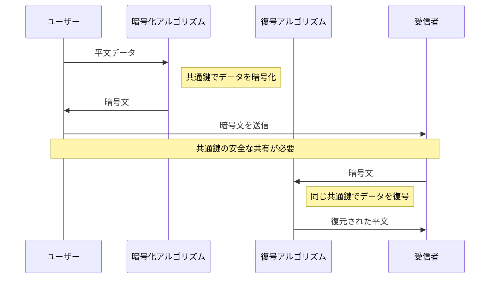
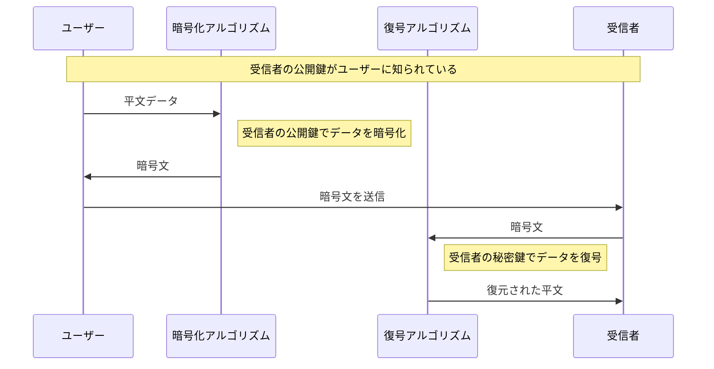

# 代表的な暗号化方式
暗号方式には様々なものが存在します。  
暗号化の方法には、暗号アルゴリズムと暗号鍵を利用するものがあり、
それぞれの利用方法と目的に合わせて利用します。  

ここでは、さまざまな暗号方式の簡単な紹介と、暗号鍵を利用した最も代表的な2つの暗号方式を紹介します。

## 暗号方式と鍵の種類

以下は、それぞれの暗号技術がどのような目的で使用されるか、そしてどのように機能するかを示します。

|暗号方式|鍵の種類|目的|利用方法|
|---|---|---|---|
|共通鍵暗号方式（対称鍵暗号方式）|共通鍵|データの暗号化と復号|暗号化と復号に同じ鍵を使用します。 鍵の共有が必要であり、その鍵管理がセキュリティの重要な要素となります|
|公開鍵暗号方式（非対称鍵暗号方式）|秘密鍵と公開鍵|データの暗号化と復号、デジタル署名の生成と検証|暗号化と復号に異なる鍵（公開鍵と秘密鍵）を使用します<dl><dt>暗号化:</dt><dd>公開鍵でデータを暗号化し、対応する秘密鍵でデータを復号</dd><dt>デジタル署名:</dt><dd>秘密鍵でデータに署名し、公開鍵で署名を検証</dd></dl>公開鍵は誰でもアクセス可能ですが、復号に使用する秘密鍵は受信者だけが保持し公開しません。|
|ハイブリット暗号方式|秘密鍵、公開鍵、共通鍵|安全な鍵交換と効率的なデータ暗号化のバランスを取る|公開鍵暗号方式を使用してセッション鍵（共通鍵）を安全に交換し、その後のデータ通信は高速な共通鍵暗号方式で暗号化します。|
|ハッシュ関数|(鍵を使用しない)|データの整合性検証、デジタル署名の一部としての利用|データから一定長のハッシュ値を生成し、データが変更されていないことを確認 ただし、鍵を使用するハッシュ関数の変種であるHMAC（Keyed-Hash Message Authentication Code）では、データの認証と整合性の検証に鍵が使用されます。|
|ワンタイムパッド|ランダムな鍵|完全な秘匿性の提供|一度きりのランダム鍵を用いてデータを暗号化し、同じ鍵を使ってデータを復号|
|ステガノグラフィ|任意（鍵を使う場合と使わない場合がある）|情報の隠蔽|データを他のメディアファイル内に隠し、存在自体を秘匿します。 この隠蔽プロセスは鍵を必要としない場合が多いですが、セキュリティを強化するためにパスワードや暗号化キーを使用して隠蔽データをさらに保護する方法もあります。|
|同型暗号|秘密鍵と公開鍵|暗号化されたデータ上での計算|暗号化されたデータに対して直接計算を行い、計算結果も暗号化された状態で出力|
|量子暗号|量子ビット|絶対的なセキュアな通信|量子ビットの重ね合わせや絡み合いの性質を利用して鍵を生成し、任何の盗聴行為も物理的に検出可能にします。|
|認証鍵交換(AKE)|秘密鍵、公開鍵または共通鍵|通信する双方の身元を確認しつつ、セキュアな通信チャンネルを確立する|Diffie-Hellman鍵交換やRSAなどの公開鍵暗号技術を利用して、共通鍵を生成し、その鍵で通信を暗号化します。|

これらの暗号技術は、それぞれ特定のセキュリティ要件を満たすように設計されており、データ保護、認証、通信の安全性向上など、広範な用途に利用されています。

## 共通鍵暗号方式（Common key cryptography：CKC）
共通鍵暗号方式は対称鍵暗号方式(symmetric key cryptography)とも言われ、暗号化と復号に同じ鍵を使用します。
さまざまな目的で利用されますが、主にデータの暗号化と復号に使用されます。
その基本的な機能を応用して他のセキュリティ関連の目的にも利用することができます。  

### 特徴
- **高速な処理:** 対称鍵暗号は計算量が少なく、非対称鍵暗号に比べて高速です。
- **鍵の共有が必要:** 暗号化と復号に同じ鍵を使用するため、安全な方法で鍵を共有する必要があります。
- **スケーラビリティの問題:** 多くの参加者がいる場合、鍵の管理と配布が複雑になります。

### 利用用途
- **データの暗号化:**  
データベースの内容やファイルの暗号化など、大量のデータを高速に暗号化する必要がある場面で使用されます。
- **内部ネットワークのセキュリティ:**  
組織内部でのデータ転送や内部通信の保護に使用されることが多いです。
- **ストリーミングメディア:**  
ビデオやオーディオストリーミングなど、リアルタイムでのデータ転送に適しています。

### 共通鍵の利用方法と目的
共通鍵暗号方式はデータの暗号化と復号に使用されるだけでなく、他のセキュリティ関連の目的にも応用されます。

|利用用途|目的|利用方法|
|---|---|---|
|暗号化|データの機密性を確保|共通鍵を使用してデータを暗号化し、同じ鍵でデータを復号します。この方式では、鍵が安全に保管されている限り、データの機密性が保たれます。|
|データの整合性と認証|データの整合性を保証し、送信者の正当性を確認|共通鍵を使用してメッセージ認証コード（MAC）を生成し、データと共に送信します。受信者は同じ共通鍵を使用してMACを再計算し、送信されたMACと比較することで、データが途中で改ざんされていないことを確認します。|

共通鍵の利用は、特に大量データの暗号化や内部通信のセキュリティ強化、ネットワークセキュリティの保護など、多岐にわたる用途で広く使用されています。その効率性と高速処理能力により、リアルタイム通信や大規模なデータ処理に特に適しています。適切な鍵管理を行うことで、共通鍵暗号方式はデジタル環境における信頼性と機密性の確保に貢献します。

### 暗号と復号以外の利用例
共通鍵暗号方式（対称鍵暗号方式）は主にデータの暗号化と復号に使用されますが、その基本的な機能を応用して他のセキュリティ関連の目的にも利用することができます。その効率性と柔軟性から、多くのセキュリティ要件を満たすために幅広く利用されています。以下に、暗号化と復号以外のいくつかの利用例を挙げます。

|利用例|目的|方法|
|---|---|---|
|認証|ネットワークやデバイス間の正当性を証明するために使用されます。|特定のデータを共通鍵で暗号化し、受信者がそのデータを正常に復号できれば、送信者の正当性が証明されます。|
|データの整合性と認証コード（MAC）|データの整合性を保証し、送信者の認証を提供するために使用されます。|共通鍵を使用してメッセージ認証コード（MAC）を生成し、データと一緒に送信します。受信者は同じ共通鍵でMACを再計算し、送信されたMACと比較します。|
|セッション鍵の生成|セキュアな通信のために一時的なセッション鍵を生成します。|セキュアな通信プロトコルで共通鍵暗号方式を使用してランダムなセッション鍵を生成し、セッション中のデータ暗号化と復号に利用します。|
|セキュアなデータの削除|データを安全に削除し、未承認アクセスを防ぐために使用されます。|データを暗号化した後、暗号鍵を破棄することで、データへのアクセスを不可能にします。|

## 公開鍵暗号方式（Public key cryptography:PKC）
公開鍵暗号方式は、非対称鍵暗号方式(asymmetric key cryptography)とも言われ、暗号化と復号に異なる鍵（公開鍵と秘密鍵）を使用する暗号技術です。鍵配送問題を解決するために考案されました。この方式はデータの暗号化、デジタル署名の生成と署名の検証、認証など、多岐にわたる用途で利用されます。公開鍵は誰でもアクセス可能で、秘密鍵は鍵の所有者のみが保持します。

### 特徴
- **鍵の配布が容易:** 公開鍵は安全に共有することができ、秘密鍵は所有者のみが保持します。

- **計算コストが高い:** 対称鍵暗号に比べて、暗号化と復号に多くの計算資源を必要とします。

- **デジタル署名:** データの整合性と認証を保証するデジタル署名の生成と検証に使用されます。

### 利用用途
- **インターネット通信のセキュリティ:**  
HTTPSなどのセキュアなウェブ通信で広く使用されています。

- **デジタル署名:**  
電子メールの署名、ソフトウェアの配布、電子契約書など、送信者の身元とデータの未改ざんを保証するために使用されます。

- **セキュアな鍵交換:**  
共通鍵暗号方式で使用する鍵を安全に交換するために、公開鍵暗号方式が用いられることがあります。

### 公開鍵と秘密鍵の利用方法と目的 
この鍵ペアは、公開鍵暗号方式にて暗号化や複合、署名や署名の検証などで様々な目的に使用されます。  
公開鍵と秘密鍵の利用は、インターネット上での安全なデータ交換、電子商取引、セキュアな通信、デジタル認証など、多岐にわたるセキュリティ要求を満たすために利用されています。これらの鍵を適切に管理し、使用することで、デジタル環境における信頼性と機密性が保証されます。

#### 公開鍵
|利用用途|目的|利用方法|
|---|---|---|
|暗号化|情報の機密性を保持|誰でもアクセス可能な公開鍵を用いて情報を暗号化し、その情報を秘密鍵を持つ特定の受信者だけが解読できるようにします。|
|署名の検証|データの整合性と送信者の認証を確認|送信者が秘密鍵で生成したデジタル署名を、公開鍵を使って検証します。これにより、データが改ざんされずに送信されたことと、正当な送信者から来たことが確認されます。|

#### 秘密鍵
|利用用途|目的|利用方法|
|---|---|---|
|復号|公開鍵で暗号化された情報を解読|秘密鍵の所有者だけが公開鍵で暗号化されたデータを解読できます。これにより、データの機密性が保たれ、安全に情報を受け取ることができます。|
|署名生成|デジタル署名を通じてデータの整合性と認証を提供|データに対して秘密鍵を使用して署名を生成し、この署名を公開鍵を持つ人なら誰でも検証できるようにします。これにより、データが送信者によって署名され、その後改ざんされていないことが証明されます。|

### 暗号と復号以外の利用例
公開鍵暗号方式は暗号化と復号以外にもいくつかの重要な用途があります。特にデジタル署名の生成と検証など、多様なセキュリティ要求に応じて広く利用されています。データのセキュリティとプライバシーを保護するための強力なツールとして機能します。特にインターネットのようなオープンネットワーク環境での使用に適しています。以下にその主な利用目的を紹介します。

|利用例|目的|方法|
|---|---|---|
|デジタル署名|メッセージやデジタルドキュメントの真正性、整合性、および発信者の認証を保証するために使用されます。|送信者はメッセージに対して自分の秘密鍵を使用して署名を生成し、受信者は送信者の公開鍵を使用してその署名を検証します。署名が正しい場合、メッセージが途中で改ざんされていないこと、およびメッセージが指定された送信者から来たことが証明されます。|
|認証|ユーザーやデバイスが本物であることを確認するために使用されます。|ユーザーは自分の秘密鍵を使用して認証リクエストに署名し、サーバーや他のシステムは公開鍵を使用してこの署名を検証します。署名が正しい場合、ユーザーの身元が確認されます。|
|鍵交換|安全な方法でセッション鍵などの共通鍵を交換するために使用されます。|例えば、Diffie-Hellman鍵交換プロトコルでは、参加者がそれぞれの秘密鍵と公開鍵を使用して共有の秘密を計算し、この秘密をセッション鍵の生成に利用します。この方法により、第三者が公開鍵から秘密鍵を推測することは困難です。|
|暗号化メールとファイル|電子メールやファイルを安全に送信するために使用されます。|送信者は受信者の公開鍵を使用してメールやファイルを暗号化し、受信者は自分の秘密鍵でこれを復号します。|

> [!NOTE]
> 暗号アルゴリズム、暗号化アルゴリズム、復号アルゴリズム、それぞれ異なったの対称鍵暗号では暗号化アルゴリズムと復号化アルゴリズムは本質的には同じであり、非対称鍵暗号では、異なる鍵を使用し時には全く異なる数学的処理が伴います。
