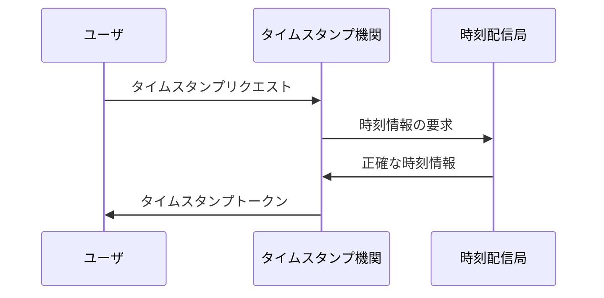
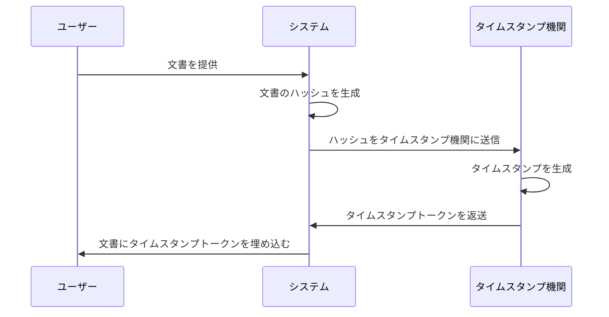
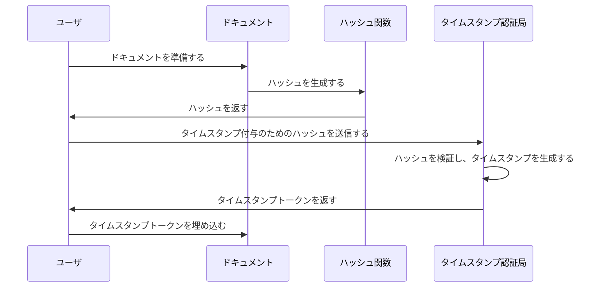
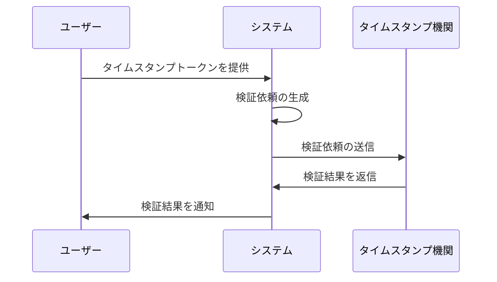
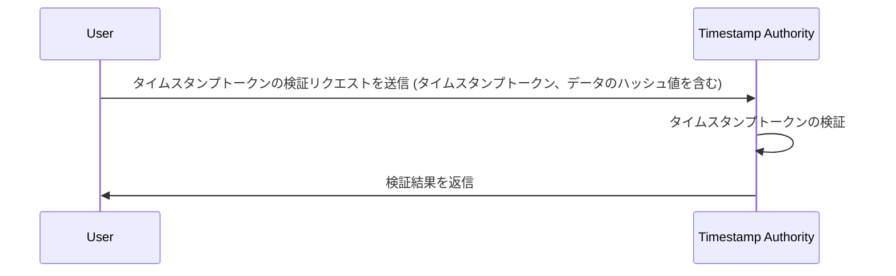

# タイスタンプ

ここでは、タイムスタンプサービス（TSA）を利用し、電子文書やデータに付与するタイムスタンプを対象としています。
一般的な意味のタイムスタンプ（ファイルなどの作成日時や、更新日時、通信ログ、ログイン、アクセス試行、権限昇格などセキュリティイベントの記録など）ではないこと留意して下さい。

## タイムスタンプとは

タイムスタンプは、その施された文書やデータに対して、以下の 2 つを証明するものです。

- **存在証明**:
  - タイムスタンプに刻印されている時刻以前、その電子文書が存在していたことを証明する
- **非改ざん証明**:
  - タイムスタンプに刻印されている時刻以降、当該文書が改ざんされていないことを証明する

つまり、タイムスタンプを文書やデータに施すことで、以下の 2 つを保証します。

- 「いつ」その文書やデータが作成または変更されたかを証明
- 「何に」その文書やデータにが含まれているかを証明

これにより、タイムスタンプを施された文書やデータは、その文書やデータの信頼性や完全性を確保し、後での紛争や訴訟の際に有益な証拠となりえます。

## タイムスタンプサービスとは

時刻認証サービスは、電子文書の存在した日時を証明するサービスです。  
「過去のある時点に間違いなく存在していた」ことを証明すると同時に「それ以降変更がされていない」ことを証明することができます。

## 時刻認証局　(TSA:Time-Stamping Authority)

タイムスタンプを発行する機関を、時刻認証局(TSA:Time-Stamping Authority)といいます。  
信頼できる第 3 者(TTP:Trusted Third Party)であることが重要です。

### 厳格な時刻保証

TSA（時刻認証局）は、厳格な時刻を保証するためにそのシステム上で時刻を管理しています。TSA は、信頼できる時間源（例えば、原子時計や GPS 衛星など）を使用して、正確な時刻情報を取得し、それを基にしてタイムスタンプを生成します。

具体的には、TSA は次のような方法で厳格な時刻を保証しています。

1. **信頼できる時間源の使用**: TSA は、原子時計や GPS 衛星などの高精度な時間源を使用して、正確な時刻情報を取得します。これにより、TSA が提供するタイムスタンプには高い信頼性があります。
2. **時刻同期プロトコルの適用**: TSA のシステムは、標準的な時刻同期プロトコル（例えば、Network Time Protocol：NTP）を使用して、外部の時間源と同期します。これにより、TSA のシステム時刻が外部の正確な時間源と一致するように調整されます。
3. **厳格な時刻管理ポリシーの遵守**: TSA は、厳格な時刻管理ポリシーを遵守し、時刻の正確性を維持するための適切な手順やプロセスを実施します。これには、時刻の適切な監視、調整、および記録が含まれます。
4. **セキュリティ対策の実施**: TSA のシステムは、外部からの不正アクセスや改ざんから時刻情報を保護するための適切なセキュリティ対策が実施されています。これにより、時刻情報の信頼性と完全性が確保されます。

以上のような方法により、TSA は厳格な時刻を保証し、そのシステム上で正確なタイムスタンプを生成します。これにより、タイムスタンプが付与されたデータや文書の時刻情報が信頼できるものとなり、後での解釈や証明に使用されます。

### 時刻配信局　(TAA：Time Assessment Authority)

サーバー群を用いたサービスを提供している企業など、高精度で高信頼の時刻を必要としている企業に信頼できる時刻情報を配信する機関です。

TAA（時刻配信局）は TSA の以下の部分を担っています。

1. **信頼性の高い時刻情報源からの情報取得**: TAA は、原子時計や GPS などの信頼性の高い時刻情報源から時刻情報を取得します。これにより、TAA は正確な時刻情報を提供できるようになります。

2. **時刻情報の配信**: TAA は、取得した正確な時刻情報をネットワークを通じて配信します。これにより、TSA や他のシステムが正確な時刻情報を利用できるようになります。

TAA が提供する正確な時刻情報は、TSA がタイムスタンプを生成する際の基準となります。TAA が正確な時刻情報を提供することで、TSA はタイムスタンプを厳密に生成し、厳格な時刻保証を行うことができます。

また、TSA は認定を受けた TAA から時刻の配信・監査を受けることが義務付けられており、TAA は、TSA に UTC(NICT)に同期した時刻を配信するとともに、TSA 時計が UTC(NICT)と規定の精度以内で同期しているかの時刻監査を行います。

### TSA(時刻認証局)、TAA（時刻配信局）、ユーザとの関係



### タイムスタンプ事業者のデジタル署名

タイムスタンプサービス事業者も、第三者によるデジタル署名の信頼性と完全性を担保しています。

デジタル署名が担保される主な方法には、以下のようなものがあります

1. **公開鍵暗号方式**: TSA 事業者は、公開鍵暗号方式を使用してデジタル署名を生成します。これにより、データの送信者が秘密鍵を使用してデジタル署名を生成し、データの受信者が公開鍵を使用して署名を検証できるようになります。

2. **証明書の使用**: TSA 事業者は、信頼できる認証機関（Certification Authority：CA）から取得したデジタル証明書を使用してデジタル署名を行います。この証明書には、TSA 事業者の公開鍵とその信頼性を保証する情報が含まれています。

3. **証明書の更新と管理**: TSA 事業者は、定期的に証明書を更新し、信頼できる CA から発行されたものを使用します。また、証明書の管理を適切に行い、有効期限切れや不正使用のリスクを最小限に抑えます。

4. **デジタル署名の検証プロセス**: デジタル署名の検証プロセスは、公開鍵暗号方式を使用して行われます。受信者は、TSA 事業者の公開鍵を使用してデジタル署名を検証し、証明書の信頼性を確認します。これにより、デジタル署名が信頼できるものであることを確認します。

これらの方法により、TSA 事業者のデジタル署名は信頼性と完全性が担保され、データのタイムスタンプが正確で信頼性の高いものであることが確保されます。

## タイムスタンプの時刻

タイムスタンプの時刻は、正確性と信頼性を保つため、協定世界時(UTC)に一定の精度で同期しています。
タイムスタンプの時刻は、NICT(国立研究開発法人 情報通信研究機構)が供給する協定世界時 UTC(NICT)と 1 秒以内で合っている(同期している)ように規定されています。

TSA は認定を受けた TAA から時刻の配信・監査を受けることが義務付けられています。TSA は、タイムスタンプに時刻情報を与える TSA 時計の時刻を、TAA からの配信時刻に同期するように補正します。

TAA は、配信源となる自局の基準時計(通常は原子時計を用います)を GPS コモンビュー法という技術を用いて、UTC(NICT)と精密に同期させ、この時計を基準にして TSA 時計の UTC(NICT)に対する時刻差を測定しています。

## タイムスタンプの方式

タイムスタンプサービスにはいくつか方式がある。ここでは、代表的なものを挙げる

### デジタル署名を用いるタイムスタンプ

この方式は、PKI(公開鍵基盤)を必須とします。

最も一般的な方式で、IETF の RFC3161 および ISO/IEC18014-2 で標準化されています。ISO/IEC18014-2 は RFC3161 の後方互換(backward compatible)となっています。本認定制度の「デジタル署名を使用する方式」は、この方式に準拠しています。

#### タイムスタンプトークン(TST)

以下のタイムスタンプトークンをユーザに返送する方式です。

- 対象電子文書のメッセージダイジェストであるハッシュ値
- 受付時刻
- TSA のデジタル署名

#### 検証

検証には以下を用い TSA を必要としません。

- 発行された TST
- TSA デジタル署名に使用する鍵の公開鍵証明書

### アーカイビングを用いるタイムスタンプ

この方式では、PKI を必要としません。

#### タイムスタンプトークン(TST)

以下のタイムスタンプトークンをユーザに返送する方式です。

- 対象電子文書のメッセージダイジェストであるハッシュ値
- 受付時刻

TSA は、タイムスタンプが正しいことを検証するための十分な情報を保管(アーカイブ)します。
この方式は、不正を検出する外部エビデンスがないため、TSA は完全に信頼されていなければならない方式です。また、

この方式は、ISO/IEC18014-2 で標準化されており、本認定制度の「アーカイビング方式」は、この方式に準拠しています。

#### 検証

検証に TSA が必要です。

検証には、以下を参照し一致することを確認します。

- 保管した（ハッシュ値と受付時刻）アーカイブ

### リンクトークン方式

この方式は、PKI を必要としませんが、リンク情報を保管するための追加的なデータベースが必要になります。

TSA が複数の利用者のメッセージダイジェストを相互に関連付けるリンク情報を生成し、各 TST がそれまでに発行された全ての TST に依存する(リンクする)ように生成するプロトコルです

#### タイムスタンプトークン(TST)

#### 検証

検証には TSA が必要です。

リンク情報を保管するための追加的なデータベースが必要になります。
この方式は、ISO/IEC18014-3 で標準化されており、本認定制度の「リンキング方式」は、この方式に準拠しています。

## タイムスタンププロトコル

## RFC3161

RFC 3161 は、タイムスタンププロトコルの標準を定義する RFC（Request for Comments）の 1 つです。この RFC は、インターネット上での電子文書のタイムスタンプに関する要件や手順を規定しています。以下に、RFC 3161 の主な特徴と内容について説明します。

1. **タイムスタンププロトコルの定義**:

   - RFC 3161 は、タイムスタンプの生成や検証に関するプロトコルを定義しています。これにより、インターネット上でのタイムスタンプの標準化が促進され、異なるシステム間での相互運用性が確保されます。

2. **タイムスタンプトークンの構造**:

   - RFC 3161 は、タイムスタンプトークンの構造や形式に関する規定を含んでいます。タイムスタンプトークンには、タイムスタンプの生成時刻や証明書、署名などの情報が含まれており、これらの要素の取り扱い方法が定義されています。

3. **タイムスタンプサーバの役割**:

   - RFC 3161 は、タイムスタンプサーバの役割や機能についても規定しています。タイムスタンプサーバは、クライアントからのタイムスタンプリクエストを受け取り、適切な手順に従ってタイムスタンプを生成し、クライアントに返送する役割を担います。

4. **セキュリティ要件**:

   - RFC 3161 は、タイムスタンプのセキュリティに関する要件や手順も規定しています。タイムスタンププロトコルは、データの改ざん防止やタイムスタンプの信頼性確保のために、適切なセキュリティメカニズムを使用する必要があります。RFC 3161 は、これらのセキュリティ要件を詳細に記述しています。

5. **拡張性と柔軟性**:
   - RFC 3161 は、タイムスタンププロトコルの拡張性と柔軟性を重視しています。これにより、将来の変更や追加機能の導入が容易になり、プロトコルの進化や改良が促進されます。

RFC 3161 は、タイムスタンプに関する標準化の重要な基盤となっており、多くのシステムやサービスで広く利用されています。

## RFC3161 以外のタイムスタンププロトコル

RFC 3161 以外にも、さまざまなタイムスタンププロトコルが存在します。これらのプロトコルは、様々な用途や要件に応じて設計されています。一部の代表的なタイムスタンププロトコルには以下のものがあります：

1. **RFC 5816 - Simple Public Key Infrastructure (SPKI) Certificate Management Protocol (CMP)**: この RFC では、SPKI 証明書を管理するためのプロトコルである CMP が定義されています。CMP は、電子データにタイムスタンプを付与するために使用されることがあります。

2. **ISO/IEC 18014-6 - Trusted Timestamping**: この標準は、電子データに信頼できるタイムスタンプを付与するための手順や要件を定義しています。ISO/IEC 18014-6 は、RFC 3161 と同様に、タイムスタンププロトコルの標準化に貢献しています。

3. **ANSI X9.95 - Financial Services - Trusted Time Stamps**: この規格は、金融サービス業界向けのタイムスタンププロトコルを定義しています。金融取引や証券取引などの重要な業務において、信頼性の高いタイムスタンプが必要とされるため、この規格は金融業界で広く使用されています。

これらのプロトコルは、様々な業界や用途に応じて設計されており、それぞれ異なる特性や要件を持っています。適切なタイムスタンププロトコルを選択する際には、用途やセキュリティ要件、規制要件などを考慮する必要があります。

## タイムスタンプ取得のプロセス

タイムスタンプの取得プロセスをシーケンス図で表現したものです。



1. **ユーザーが文書を提供**:
   - ユーザーはシステムに文書を提供します。
2. **システムが文書のハッシュを生成**:
   - システムは提供された文書からハッシュ値を生成します。
3. **ハッシュを TSA に送信**:
   - システムは生成したハッシュ値をタイムスタンプオーソリティに送信します。
4. **TSA がタイムスタンプを生成**:
   - タイムスタンプオーソリティは受け取ったハッシュ値に基づいてタイムスタンプを生成し、それをトークンとして包装します。
5. **タイムスタンプトークンをシステムに返送**:
   - TSA は生成したタイムスタンプトークンをシステムに返送します。
6. **タイムスタンプトークンを文書に埋め込む**:
   - システムは受け取ったタイムスタンプトークンを文書に埋め込みます。

ユーザーが文書やデータのハッシュを生成し、それをタイムスタンプオーソリティ（TSA）に送信して、タイムスタンプトークンを受け取り、文書に埋め込むプロセスを示しています。

### タイムスタンプトークンの生成要求

TSA へタイムスタンプトークンの生成要求をシーケンス図で表現したものです。



1. **ユーザーがドキュメントを準備**:

   - ユーザーはタイムスタンプを付けたいドキュメントを準備します。

2. **ハッシュ生成**:

   - ドキュメントの内容からハッシュ値を生成します。ハッシュはドキュメントの一意の指紋のようなもので、少しの変更でもハッシュ値は大きく変わります。

3. **タイムスタンプリクエスト**:

   - 生成されたハッシュをタイムスタンピングオーソリティ（TSA）に送信します。TSA は、信頼できる第三者機関です。

4. **タイムスタンプの生成と返送**:

   - TSA はハッシュを検証し、現在の日時を記録したタイムスタンプトークンを生成します。このトークンは、ドキュメントのハッシュ値とタイムスタンプが正式に認証された証拠として機能します。

5. **タイムスタンプの組み込み**:
   - 受け取ったタイムスタンプトークンをドキュメントに埋め込みます。これにより、ドキュメントが指定された時点で存在し、変更されていないことが証明されます。

#### 具体的な curl コマンドの例

```bash
curl -X POST \
  -H "Content-Type: application/timestamp-query" \
  -d '{
        "data": "base64_encoded_data_to_timestamp",
        "nonce": "random_nonce_value",
        "cert_req": "yes"
      }' \
  https://timestamp.example.com/tsa
```

- `-X POST`: HTTP POST メソッドを使用してリクエストを送信します。
- `-H "Content-Type: application/timestamp-query"`: リクエストの Content-Type を指定します。
- `-d '{ ... }'`: リクエストボディに JSON 形式のデータを含めます。データ、nonce（ランダムな値）、cert_req（オプションの証明書要求）が含まれています。
- `https://timestamp.example.com/tsa`: タイムスタンプ機関のエンドポイントを指定します。

##　タイムスタンプ検証のプロセス

タイムスタンプの検証プロセスをシーケンス図で表現したものです。



1. **タイムスタンプトークンの提供**: ユーザーはタイムスタンプトークンを提供します。

2. **検証依頼の生成**: システムは、タイムスタンプトークンを含む検証依頼を生成します。この依頼には、タイムスタンプ機関の識別子やその他のセキュリティ情報が含まれます。

3. **検証依頼の送信**: システムは、生成された検証依頼をタイムスタンプ機関に送信します。

4. **検証結果の返信**: タイムスタンプ機関は、検証結果を生成し、システムに返信します。検証結果には、タイムスタンプトークンが有効であるかどうかの情報が含まれます。

5. **検証結果の通知**: システムは、ユーザーに検証結果を通知します。結果には、タイムスタンプトークンが有効であるかどうかや、検証に関するその他の情報が含まれる場合があります。

ユーザーはタイムスタンプトークンを提供し、システムはそれを含む検証依頼を生成してタイムスタンプ機関に送信します。そして、タイムスタンプ機関は検証結果を生成し、システムはそれをユーザーに通知します。

### タイムスタンプトークンの検証要求

TSA へタイムスタンプトークンの検証要求をシーケンス図で表現したものです。



#### 具体的な curl コマンドの例

```bash
curl -X POST \
  -H "Content-Type: application/timestamp-query" \
  -d '{
        "timestamp_token": "base64_encoded_timestamp_token_to_verify",
        "nonce": "random_nonce_value"
      }' \
  https://timestamp.example.com/tsa
```

この例では、次のような要素が含まれています：

- `-X POST`: HTTP POST メソッドを使用してリクエストを送信します。
- `-H "Content-Type: application/timestamp-query"`: リクエストの Content-Type を指定します。
- `-d '{ ... }'`: リクエストボディに JSON 形式のデータを含めます。タイムスタンプトークンと nonce（ランダムな値）が含まれています。
- `https://timestamp.example.com/tsa`: タイムスタンプ機関のエンドポイントを指定します。

---

最後に、ここで取り上げた TSA を利用したタイムスタンプとではなく、冒頭で記載している「一般的なタイムスタンプ」とは何かを、一応以下に記載します。

## 一般的なタイムスタンプとは

タイムスタンプは、特定の事象やデータの発生時刻や処理時刻を示すための情報です。文字通り、時間に関する印です。タイムスタンプは、何がいつ起こったかを記録するために使用されます。

タイムスタンプは様々な形式で表現されますが、一般的には日付と時刻の組み合わせで示されます。例えば、次のような形式が一般的です：

- YYYY-MM-DD HH:MM:SS (ISO 8601 形式)
- MM/DD/YYYY HH:MM:SS AM/PM (アメリカ式)
- DD/MM/YYYY HH:MM:SS (ヨーロッパ式)

タイムスタンプは、さまざまなコンテキストで使用されます。例えば、次のような場面でタイムスタンプが重要な役割を果たします：

1. **ログ記録**: システムやアプリケーションが実行した操作やイベントの発生時刻を記録するために使用されます。これにより、後で問題のトラブルシューティングや解析が行われる際に、事象が発生した時間を正確に特定することができます。

2. **データベース管理**: データベース内のレコードが作成または更新された時刻を記録するために使用されます。これにより、データの変更履歴を追跡し、特定の時点でのデータの状態を確認することができます。

3. **セキュリティ監査**: システムやネットワークのセキュリティイベントが発生した時間を記録するために使用されます。これにより、セキュリティ侵害の追跡や解析が行われます。

4. **データ同期**: 異なるシステム間でデータを同期する際に、データの更新時刻を比較して同期するために使用されます。

5. **法的証拠**: 法的な契約や取引の証拠として、特定のイベントがいつ発生したかを証明するために使用されます。

タイムスタンプは、さまざまな情報システムやプロセスにおいて、時間に関する情報を正確に記録し、追跡するために重要な役割を果たします。
