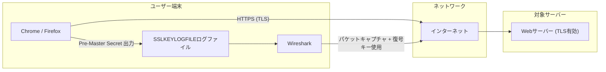
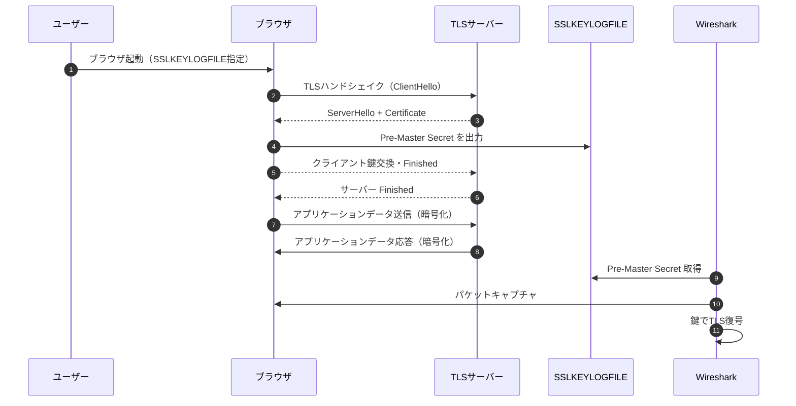

# SSLKEYLOGFILE を用いた TLS 通信の復号と Wireshark の活用法

## ✅ 概要：SSLKEYLOGFILEとは？

`SSLKEYLOGFILE` は、TLS通信に使われる「Pre-Master Secret（鍵素材）」をログファイルに書き出すための **環境変数** です。

### 主な目的
- 通信内容の**復号（Wiresharkなどで）**
- **TLSハンドシェイク失敗**などのデバッグ
- 暗号スイートの動作検証や互換性調査

## 🔐 出力される内容の例

```txt
CLIENT_RANDOM 6e5080ff3250b0aa56e... 2d8f1ce4a385e7e24a7...
```

- `CLIENT_RANDOM`：クライアントランダムに対応する秘密鍵
- この情報で Wireshark などは TLS 通信を復号可能


## 🤔 なぜ SSLKEYLOGFILE が必要なのか？

TLS通信はセキュアな通信のため、すべてのデータが暗号化されており、通常のパケットキャプチャでは中身を確認することができません。  
しかし、開発やテストの現場では以下のようなケースで中身を確認したい場面が発生します。

| 状況 | 必要となる理由 |
|------|----------------|
| アプリやブラウザが送っている内容を確認したい | WebアプリのデバッグやAPI仕様の確認のため、暗号化された通信内容を復号したい |
| TLSハンドシェイクの失敗原因を調べたい | ハンドシェイクエラーの詳細を確認するためには、鍵情報が必要となる |
| 暗号スイートの選択やTLSバージョンの挙動を検証したい | TLSライブラリの検証や互換性調査の際、実際の通信ログを復号する必要がある |

このようなニーズに応えるために、開発者自身が「セッション鍵を間接的に取得できる」手段として `SSLKEYLOGFILE` 環境変数が導入されています。  
Wiresharkなどのツールと併用することで、TLS通信を安全に復号して観察することができます。


## ⚠️ セキュリティ上の注意

### ❗ よくある誤解：「漏洩してもさほど問題ないのでは？」という疑問について

一見すると、Pre-Master Secret は「その接続1回限りで使われる」ため、たとえ漏洩しても大きな問題ではないように思えます。しかし、以下の理由により、SSLKEYLOGFILE の漏洩は重大なリスクを伴います。

| 誤解と現実 | 解説 |
|------------|------|
| セッションごとの一時的な鍵だから大丈夫 | 確かにPre-Master Secretはセッション限定ですが、**その通信の中にパスワードや個人情報などが含まれている可能性**があります。セッションが復号されれば、それらの情報も平文で漏洩します。 |
| 再利用されないなら問題ない | 一部のTLS実装ではセッション再開（Session Resumption）機構により、**鍵が再利用されたり再導出される可能性もある**ため、同じログで複数通信が復号されるリスクもあります。 |
| 通信がキャプチャされていなければ安心 | 通信内容が記録されていない限りは実害は出ませんが、**SSLKEYLOGFILEが漏洩するような環境ではパケットも収集されている可能性が高い**ため、安全とは言い切れません。 |
| 鍵生成アルゴリズムに関係ない | 複数のPre-Master Secretが大量に漏洩した場合、**ライブラリ実装の偏りや欠陥を推測される攻撃**（いわゆる「サイドチャネル分析」的なアプローチ）も否定できません。 |

### ✅ 結論

> `SSLKEYLOGFILE` に記録される情報は「単なる一時的な鍵情報」ではなく、**通信内容を平文に復元可能にするクリティカルな素材**です。

そのため、開発時・デバッグ時のみ限定して利用し、使用後は速やかに安全に破棄する必要があります。

| 注意点 | 理由 |
|--------|------|
| ログファイルには **復号可能な情報** が含まれる | Pre-Master Secret を含むため、第三者がアクセスすれば TLS 通信の内容をすべて復号可能になります |
| **本番環境では絶対に使用禁止** | 万が一ログファイルが漏洩した場合、ユーザーの機密情報（認証情報や個人データなど）が漏洩する恐れがあります |
| 開発・テスト目的でのみ使用すること | セキュリティ上のリスクを最小限にするため、検証環境でのみ使用すべきです |


## 🌐 対応アプリケーションの例

| アプリケーション | 対応状況 | 設定方法 |
|------------------|----------|----------|
| Chrome / Firefox | ✅ 対応 | 環境変数で自動対応 |
| Node.js | ⭕ 条件付き | `--enable-ssl-keylog` オプションでビルド |
| curl (OpenSSLビルド) | ⭕ 条件付き | OpenSSL側の設定で対応可 |
| OpenSSL CLI | ❌ 非対応 | パッチ or ライブラリ改修が必要 |


## 🧪 使用手順（Chrome + Wireshark 編）

### 1. 環境変数 `SSLKEYLOGFILE` を設定

#### Windows (PowerShell)
```powershell
$env:SSLKEYLOGFILE="C:\Temp\sslkeys.log"
```

#### macOS / Linux (bash/zsh)
```bash
export SSLKEYLOGFILE=~/sslkeys.log
```


### 2. Chrome / Firefox を **このターミナルから**起動

```bash
google-chrome https://example.com
```


### 3. Wireshark 側の設定

#### 手順：

1. **Wiresharkを起動**
2. `Edit > Preferences > Protocols > TLS` を開く
3. `Pre-Master-Secret log filename` に `sslkeys.log` のパスを指定
4. 通信をキャプチャ（TCPポート443など）
5. 復号された内容が表示される（HTTPのように）


### ✅ 確認できること

- HTTPの中身（GET, POST, JSON など）
- サーバ証明書、TLSバージョン、暗号スイート
- セッションの再利用可否（Session Resume）


## 📌 応用用途

- TLS1.2/1.3の違いの解析
- セキュリティテスト時の挙動観察
- 自作TLSライブラリの検証


## 🧼 ログファイルの取り扱いに注意

| 対応 | 理由 |
|------|------|
| 使用後は速やかに削除 | ログファイルが残っていると、後から復号に悪用されるリスクがあります |
| 他者と共有しない | 意図せず鍵情報を共有すると、悪意ある第三者に通信内容を知られる可能性があります |
| Gitなどに誤ってアップロードしない | 公開リポジトリに鍵情報を含めると、世界中の誰でも復号できる状態になってしまいます |


## 🖼️ 復号フローの可視化

### 🧩 構成図（Component風）



### ⏱️ シーケンス図（通信と復号の流れ）



### 💬 シーケンス図の説明

このシーケンス図は、SSLKEYLOGFILE を用いた TLS 通信の復号までの一連の流れを時系列で表しています。以下に各ステップの説明を示します。


|順番|イベント|説明|
|---|---|---|
|1|**ブラウザ起動<br>（SSLKEYLOGFILE指定）**|環境変数 `SSLKEYLOGFILE` を指定してブラウザを起動することで、TLS鍵がファイルに出力されるようになります|
|2, 3|**TLSハンドシェイク<br>（ClientHello / ServerHello）**|クライアントとサーバー間で TLS ハンドシェイクが開始され、証明書や鍵交換の準備が進みます|
|4|**Pre-Master Secret を出力**|TLSの Pre-Master Secret（鍵素材）が `SSLKEYLOGFILE` に記録されます。これは後の復号に使用されます|
|5, 6|**鍵交換完了後、暗号化通信の開始**|クライアントとサーバーが Finished メッセージを交換し、安全な通信チャネルが確立されます|
|7, 8|**アプリケーションデータの送受信（暗号化）**|実際のデータ通信（HTTPリクエストやレスポンス）は TLS により暗号化されて送られます|
|9|**Pre-Master Secret の取得**|Wireshark は `SSLKEYLOGFILE` を参照し、通信を復号するための鍵を読み込みます|
|10|**パケットキャプチャ**|ブラウザが行っているTLS通信をローカルでキャプチャします（同一端末内）|
|11|**TLS復号の実行**|鍵とパケットの内容を突き合わせることで、Wiresharkは暗号化された通信を復号し、平文の内容を表示可能にします|


このようにして、Wireshark はSSLKEYLOGFILEを活用してTLS通信の中身を可視化することができます。


## 参考

- Wireshark公式TLS復号ガイド: [https://wiki.wireshark.org/TLS](https://wiki.wireshark.org/TLS)